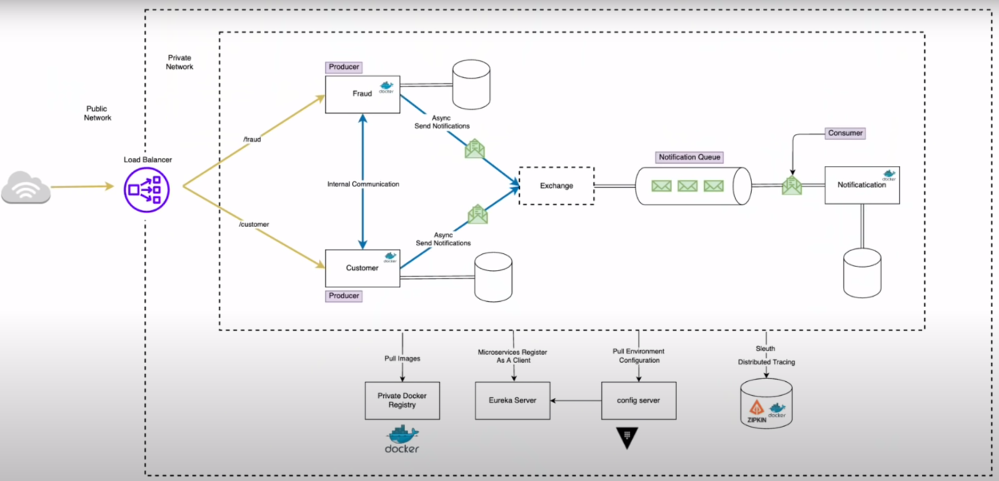
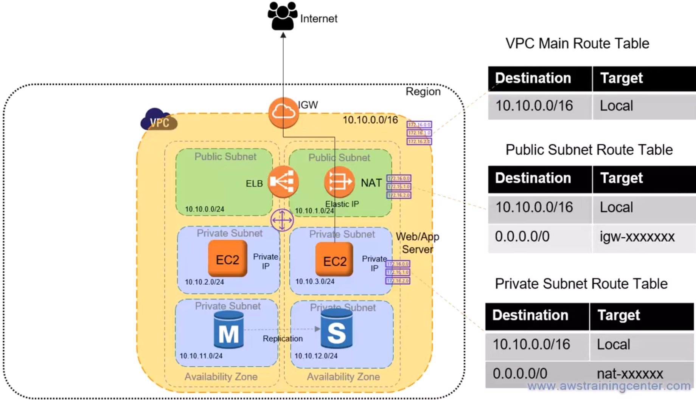

= AWS
Author Name Mehmood-ur-Rehman
:sectnumlevels: 4
:toclevels: 4
:sectnums: 4
:toc: left
:icons: font
:toc-title: Table of contents
:doctype: article

== How does the INTERNET work?

.*How does the INTERNET work?*
+++
<iframe width="560" height="315" src="https://www.youtube.com/embed/x3c1ih2NJEg" title="YouTube video player" frameborder="0" allow="accelerometer; autoplay; clipboard-write; encrypted-media; gyroscope; picture-in-picture; web-share" allowfullscreen></iframe>
+++

=== Understanding Routing!
.*Understanding Routing!*
+++
<iframe width="560" height="315" src="https://www.youtube.com/embed/gQtgtKtvRdo" title="YouTube video player" frameborder="0" allow="accelerometer; autoplay; clipboard-write; encrypted-media; gyroscope; picture-in-picture; web-share" allowfullscreen></iframe>
+++

=== Circuit switching & Packet switching
.*Circuit switching & Packet switching*
+++

+++

=== TCP vs UDP Comparison

.*TCP vs UDP Comparison*
+++
<iframe width="560" height="315" src="https://www.youtube.com/embed/uwoD5YsGACg" title="YouTube video player" frameborder="0" allow="accelerometer; autoplay; clipboard-write; encrypted-media; gyroscope; picture-in-picture; web-share" allowfullscreen></iframe>
+++

=== Optical fiber cables, how do they work?
.*Optical fiber cables, how do they work?*
+++
<iframe width="560" height="315" src="https://www.youtube.com/embed/jZOg39v73c4" title="YouTube video player" frameborder="0" allow="accelerometer; autoplay; clipboard-write; encrypted-media; gyroscope; picture-in-picture; web-share" allowfullscreen></iframe>
+++

== *Introduction to AWS Services*
.*Introduction to AWS Services*
+++
<iframe width="560" height="315" src="https://www.youtube.com/embed/Z3SYDTMP3ME" title="YouTube video player" frameborder="0" allow="accelerometer; autoplay; clipboard-write; encrypted-media; gyroscope; picture-in-picture; web-share" allowfullscreen></iframe>
+++

== AWS VPC Basics - Understanding what is VPC and Calculating #CIDR# for VPC and Subnets

====
. *Classless Inter-Domain Routing* (is #CIDR#)
. *Classless* means (no A, B, C & D *class* like we have in #IPV-4#, its #32-bit#)

* *Region* = independent geographic area

** *Region* contains at least 2-availability zones (except for Osaka region)

* *Availability zone* = Multiple isolated location /data-centers within a region

*Networking* is the thing which decides the security of your application architecture as well as whether your application can scale and how do you design the traffic the security groups or say firewalls and the routing decisions you take.
====

https://www.youtube.com/watch?v=O3fgul-fJCk&t=5s[Networking in AWS]

https://www.youtube.com/watch?v=O3fgul-fJCk&t=516s[The VPC components]

https://www.youtube.com/watch?v=O3fgul-fJCk&t=622s[Route table]
 
https://www.youtube.com/watch?v=O3fgul-fJCk&t=652s[firewalls]

https://www.youtube.com/watch?v=O3fgul-fJCk&t=745s[internet gateway]

https://www.youtube.com/watch?v=O3fgul-fJCk&t=801s[virtual private gateway]

https://www.youtube.com/watch?v=O3fgul-fJCk&t=887s[VPC addressing]

https://www.youtube.com/watch?v=O3fgul-fJCk&t=928s[classless inter-domain routing]

https://www.youtube.com/watch?v=O3fgul-fJCk&t=969s[IPV-4]

https://www.youtube.com/watch?v=O3fgul-fJCk&t=1105s[Modern addressing with CIDR notation]

.*AWS VPC Basics - Understanding what is VPC and Calculating #CIDR# for #VPC and Subnets#*
+++
<iframe width="560" height="315" src="https://www.youtube.com/embed/O3fgul-fJCk" title="YouTube video player" frameborder="0" allow="accelerometer; autoplay; clipboard-write; encrypted-media; gyroscope; picture-in-picture; web-share" allowfullscreen></iframe>
+++

== *Introduction to AWS Networking*
.*Introduction to AWS Networking*
+++
<iframe width="560" height="315" src="https://www.youtube.com/embed/XZbvQWkpJTI" title="YouTube video player" frameborder="0" allow="accelerometer; autoplay; clipboard-write; encrypted-media; gyroscope; picture-in-picture; web-share" allowfullscreen></iframe>
+++

.this is the level of detail a *developer* has about AWS when they create architecture diagram

.this is the level of detail a *DevOps engineer* has about AWS when create diagram or infrastructure for the application or create different environment (dev, qa, stage, production)image::img_1.png[]

.there is yet anohter level of detail for the system administrator wwho knows even more than DevOps guy

== *AWS Site To Site VPN - New video with improved steps*
.*AWS Site To Site VPN - New video with improved steps*
+++
<iframe width="560" height="315" src="https://www.youtube.com/embed/5YvcyBecQts" title="YouTube video player" frameborder="0" allow="accelerometer; autoplay; clipboard-write; encrypted-media; gyroscope; picture-in-picture; web-share" allowfullscreen></iframe>
+++

== *AWS Storage - EBS vs S3 vs EFS*
.*AWS Storage - EBS vs S3 vs EFS*
+++
<iframe width="560" height="315" src="https://www.youtube.com/embed/6vNC_BCqFmI" title="YouTube video player" frameborder="0" allow="accelerometer; autoplay; clipboard-write; encrypted-media; gyroscope; picture-in-picture; web-share" allowfullscreen></iframe>
+++

== *AWS VPC Beginner to Pro - Virtual Private Cloud Tutorial*
.*AWS VPC Beginner to Pro - Virtual Private Cloud Tutorial*
+++
<iframe width="560" height="315" src="https://www.youtube.com/embed/g2JOHLHh4rI" title="YouTube video player" frameborder="0" allow="accelerometer; autoplay; clipboard-write; encrypted-media; gyroscope; picture-in-picture; web-share" allowfullscreen></iframe>
+++

== *Top 50+ AWS Services Explained in 10 Minutes*
.*Top 50+ AWS Services Explained in 10 Minutes*
+++
<iframe width="560" height="315" src="https://www.youtube.com/embed/JIbIYCM48to" title="YouTube video player" frameborder="0" allow="accelerometer; autoplay; clipboard-write; encrypted-media; gyroscope; picture-in-picture; web-share" allowfullscreen></iframe>
+++

.*Top 50+ AWS Services Explained in 10 Minutes*
. https://www.youtube.com/watch?v=JIbIYCM48to&t=0s[00:00] AWS Origin

. https://www.youtube.com/watch?v=JIbIYCM48to&t=34s[00:34] RoboMaker

. https://www.youtube.com/watch?v=JIbIYCM48to&t=40s[00:40] IoT Core

. https://www.youtube.com/watch?v=JIbIYCM48to&t=46s[00:46] Ground Station

. https://www.youtube.com/watch?v=JIbIYCM48to&t=53s[00:53] Quantum Computing

. https://www.youtube.com/watch?v=JIbIYCM48to&t=60s[01:00] EC2

. https://www.youtube.com/watch?v=JIbIYCM48to&t=86s[01:26] Load Balancer

. https://www.youtube.com/watch?v=JIbIYCM48to&t=99s[01:39] Cloud Watch

. https://www.youtube.com/watch?v=JIbIYCM48to&t=107s[01:47] Auto Scale

. https://www.youtube.com/watch?v=JIbIYCM48to&t=116s[01:56] Beanstalk

. https://www.youtube.com/watch?v=JIbIYCM48to&t=141s[02:21] Lightsail

. https://www.youtube.com/watch?v=JIbIYCM48to&t=160s[02:40] Lambda

. https://www.youtube.com/watch?v=JIbIYCM48to&t=187s[03:07] Serverless Repos

. https://www.youtube.com/watch?v=JIbIYCM48to&t=196s[03:16] Outposts

. https://www.youtube.com/watch?v=JIbIYCM48to&t=205s[03:25] Snow

. https://www.youtube.com/watch?v=JIbIYCM48to&t=219s[03:39] ECR

. https://www.youtube.com/watch?v=JIbIYCM48to&t=236s[03:56] ECS

. https://www.youtube.com/watch?v=JIbIYCM48to&t=249s[04:09] EKS

. https://www.youtube.com/watch?v=JIbIYCM48to&t=255s[04:15] Fargate

. https://www.youtube.com/watch?v=JIbIYCM48to&t=267s[04:27] App Runner

. https://www.youtube.com/watch?v=JIbIYCM48to&t=281s[04:41] S3

. https://www.youtube.com/watch?v=JIbIYCM48to&t=299s[04:59] Glacier

. https://www.youtube.com/watch?v=JIbIYCM48to&t=306s[05:06] Block Storage

. https://www.youtube.com/watch?v=JIbIYCM48to&t=319s[05:19] EFS

. https://www.youtube.com/watch?v=JIbIYCM48to&t=332s[05:32] SimpleDB

. https://www.youtube.com/watch?v=JIbIYCM48to&t=348s[05:48] DynamoDB

. https://www.youtube.com/watch?v=JIbIYCM48to&t=359s[05:59] DocumentDB

. https://www.youtube.com/watch?v=JIbIYCM48to&t=373s[06:13] ElasticSearch

. https://www.youtube.com/watch?v=JIbIYCM48to&t=381s[06:21] RDS

. https://www.youtube.com/watch?v=JIbIYCM48to&t=396s[06:36] Aurora

. https://www.youtube.com/watch?v=JIbIYCM48to&t=418s[06:58] Neptune

. https://www.youtube.com/watch?v=JIbIYCM48to&t=426s[07:06] ElasticCache

. https://www.youtube.com/watch?v=JIbIYCM48to&t=436s[07:16] TimeStream

. https://www.youtube.com/watch?v=JIbIYCM48to&t=448s[07:28] QLDB

. https://www.youtube.com/watch?v=JIbIYCM48to&t=458s[07:38] Redshift

. https://www.youtube.com/watch?v=JIbIYCM48to&t=485s[08:05] Lake Formation

. https://www.youtube.com/watch?v=JIbIYCM48to&t=501s[08:21] Kinesis

. https://www.youtube.com/watch?v=JIbIYCM48to&t=511s[08:31] EMR

. https://www.youtube.com/watch?v=JIbIYCM48to&t=523s[08:43] MSK

. https://www.youtube.com/watch?v=JIbIYCM48to&t=532s[08:52] Glue

. https://www.youtube.com/watch?v=JIbIYCM48to&t=556s[09:16] Data Exchange

. https://www.youtube.com/watch?v=JIbIYCM48to&t=571s[09:31] Sagemaker

. https://www.youtube.com/watch?v=JIbIYCM48to&t=593s[09:53] Rekognition

. https://www.youtube.com/watch?v=JIbIYCM48to&t=602s[10:02] Lex

. https://www.youtube.com/watch?v=JIbIYCM48to&t=610s[10:10] Deep Racer

. https://www.youtube.com/watch?v=JIbIYCM48to&t=618s[10:18] IAM

. https://www.youtube.com/watch?v=JIbIYCM48to&t=633s[10:33] Cognito

. https://www.youtube.com/watch?v=JIbIYCM48to&t=645s[10:45] Notifications

. https://www.youtube.com/watch?v=JIbIYCM48to&t=652s[10:52] SES

. https://www.youtube.com/watch?v=JIbIYCM48to&t=656s[10:56] CloudFormation

. https://www.youtube.com/watch?v=JIbIYCM48to&t=668s[11:08] Amplify #https://www.youtube.com/watch?v=JIbIYCM48to&t=680s[11:20] Budget#

(00:00) amazon web services launched in 2006 with a total of three products _**#storage buckets compute instances and a messaging queue#**_ today it offers a mind-numbing 200 and something services and what's most confusing is that many of them appear to do almost the exact same thing it's kind of like shopping at a big grocery store where you have different aisles of product categories filled with things to buy that meet the needs of virtually every developer on the planet in today's video we'll walk down these aisles to gain an

(00:26) understanding of over 50 different aws products so first let's start with a few that are above my paygrade that you may not know exist if you're building robots you can use *#robomaker#* to simulate and test your robots at scale then once your robots are in people's homes you can use *#iot core#* to collect data from them update their software and manage them remotely if you happen to have a satellite orbiting earth you can tap into amazon's global network of antennas to connect data through its *#ground#*

(00:52) *#station service#* and if you want to start experimenting and researching the future of computing you can use bracket to interact with a *#quantum computer#* but most developers go to the cloud to solve more practical problems and for that let's head to the compute aisle one of the original aws products was elastic compute cloud it's one of the most fundamental building blocks on the platform and allows you to create a virtual computer in the cloud choose your operating system memory and computing power then you can rent that space in the

(01:19) cloud like you're renting an apartment that you pay for by the second a common use case is to use an instance as a server for web application but one problem is that as your app grows you'll likely need to distribute traffic across multiple instances in 2009 amazon introduced elastic load balancing which allowed developers to distribute traffic to multiple instances automatically in addition the *#cloudwatch service#* can collect logs and metrics from each individual instance the data collected from cloudwatch can then be passed off to

(01:48) auto scale in which you define policies that create new instances as they become needed based on the traffic and utilization of your current infrastructure these tools were revolutionary at the time but developers still wanted an easier way to get things done and that's where elastic bean stock comes in most developers in 2011 just wanted to deploy a ruby on rails app elastic beanstalk made that much easier by providing an additional layer of abstraction on top of *#ec2#* and other auto scaling features choose a template deploy your code and

(02:17) let all the auto scaling stuff happen automatically this is often called a platform as a service but in some cases it's still too complicated if you don't care about the underlying infrastructure whatsoever and just want to deploy a wordpress site lightsail is an alternative option where you can point and click at what you want to deploy and worry even less about the underlying configuration in all these cases you are deploying a static server that is always running in the cloud but many computing jobs are ephemeral

(02:42) which means they don't rely on any persistent state on the server so why bother deploying a server for code like that in 2014 lambda came out which are functions as a service or serverless computing with lambda you simply upload your code then choose an event that decides when that code should run traffic scaling and networking are all things that happen entirely in the background and unlike a dedicated server you only pay for the exact number of requests and computing time that you use now if you don't like writing your own

(03:09) code you can use the serverless application repository to find pre-built functions that you can deploy with the click of a button but what if you're a huge enterprise with a bunch of its own servers outpost is a way to run aws apis on your own infrastructure without needing to throw your old servers in the garbage in other cases you may want to interact with aws from remote or extreme environments like if you're a scientist in the arctic snow devices are like little mini data centers that can work without internet and hostile

(03:36) environments so that gives us some fundamental ways to compute things but many apps today are standardized with docker containers allowing them to run on multiple different clouds or computing environments with very little effort to run a container you first need to create a docker image and store it somewhere elastic container registry allows you to upload an image allowing other tools like elastic container service to pull it back down and run it ecs is an api for starting stopping and allocating virtual machines

(04:05) to your containers and allows you to connect them to other products like *#load balancers#* some companies may want more control over how their app scales in which case eks is a tool for running kubernetes but in other cases you may want your containers to behave in a more automated way fargate is a tool that will make your containers behave like serverless functions removing the need to allocate ec2 instances for your containers but if you're building an application and already have it containerized the easiest way to deploy it to aws

(04:32) is app runner this is a new product in 2021 where you simply point it to a container image while it handles all the orchestration and scaling behind the scenes but running an application is only half the battle we also need to store data in the cloud simple storage service or s3 was the very first product offered by aws it can store any type of file or object like an image or video and is based on the same infrastructure as amazon's ecommerce site it's great for general purpose file storage but if you don't access your

(05:01) files very often you can archive them in glacier which has a higher latency but a much lower cost on the other end of the spectrum you may need storage that is extremely fast and can handle a lot of throughput elastic block storage is ideal for applications that have intensive data processing requirements but requires more manual configuration by the developer now if you want something that's highly performant and also fully managed elastic file system provides all the bells and whistles but at a much higher

(05:27) cost in addition to raw files developers also need to store structured data for their end users and that brings us to the database aisle which has a lot of different products to choose from the first ever database on aws was simpledb a general purpose no sql database but it tends to be a little too simple for most people everybody knows you never go full it was followed up a few years later with dynamodb which is a document database that's very easy to scale horizontally it's inexpensive and provides fast read

(05:55) performance but it isn't very good at modeling relational data if you're familiar with mongodb another document database option is documentdb it's a controversial option that's technically not mongodb that has a one-to-one mapping of the mongodb api to get around restrictive open source licensing speaking of which amazon also did a similar thing with elasticsearch which itself is a great option if you want to build something like a full text search engine but the majority of developers out there will

(06:23) opt for a traditional relational sql database amazon relational database service rds supports a variety of different sql flavors and can fully manage things like backups patching and scale but amazon also offers its own proprietary flavor of sql called aurora it's compatible with postgres or mysql and can be operated with better performance at a lower cost in addition aurora offers a new serverless option that makes it even easier to scale and you only pay for the actual time that the database is in use relational databases are a great general

(06:56) purpose option but they're not the only option neptune is a graph database that can achieve better performance on highly connected data sets like a social graph or recommendation engine if your current database is too slow you may want to bring in elastic cache which is a fully managed version of redis an in-memory database that delivers data to your end users with extremely low latency if you work with time series data like the stock market for example you might benefit from time stream a time series database with built-in

(07:24) functions for time-based queries and additional features for analytics yet another option is the quantum ledger database which allows you to build an immutable set of cryptographically signed transactions very similar to decentralized blockchain technology now let's shift gears and talk about analytics to analyze data you first need a place to store it and a popular option for doing that is redshift which is a data warehouse that tries to get you to shift away from oracle warehouses are often used by big enterprises to dump multiple data

(07:54) sources from the business where they can be analyzed together when all your data is in one place it's easier to generate meaningful analytics and run machine learning on it data in a warehouse is structured so it can be queried but if you need a place to put a large amount of unstructured data you can use aws lake formation which is a tool for creating data lakes or repositories that store a large amount of unstructured data which can be used in addition to data warehouses to query a larger variety of data sources

(08:21) if you want to analyze real-time data you can use kinesis to capture real-time streams from your infrastructure then visualize them in your favorite business intelligence tool or you can use a stream processing framework like apache spark that runs on elastic mapreduce which itself is a service that allows you to operate on massive datasets efficiently with a parallel distributed algorithm now if you don't want to use kinesis for streaming data a popular alternative is apache kafka it's open source and amazon msk is a

(08:50) fully managed service to get you started but for the average developer all this data processing may be a little too complicated glue is a serverless product that makes it much easier to extract transform and load your data it can automatically connect to other data sources on aws like aurora redshift and s3 and has a tool called glue studio so you can create jobs without having to write any actual source code but one of the biggest advantages of collecting massive amounts of data is that you can use it to help predict

(09:18) the future and aws has a bunch of tools in the machine learning aisle to make that process easier but first if you don't have any high quality data of your own you can use the data exchange to purchase and subscribe to data from third-party sources once you have some data in the cloud you can use sagemaker to connect to it and start building machine learning models with tensorflow or pi torch it operates on multiple levels to make machine learning easier and provides a managed jupyter notebook that can connect to a gpu instance to train a

(09:46) machine learning model then deploy it somewhere useful that's cool but building your own ml models from scratch is still extremely difficult if you need to do image analysis you may as well just use the recognition api it can classify all kinds of objects and images and is likely way better than anything that you would build on your own or if you want to build a conversational bot you might use lex which runs on the same technology that powers alexa devices or if you just want to have fun and learn how machine learning works you

(10:12) might buy a deep racer device which is an actual race car that you can drive with your own machine learning code now that's a pretty amazing way to get people to use your cloud platform but let's change direction and look at a few other essential tools that are used by a wide variety of developers for security we have im where you can create rules and determine who has access to what on your aws account if you're building a web or mobile app where users can log into an account cognito is a tool that enables them to

(10:39) log in with a variety of different authentication methods and manages the user sessions for you then once you have a few users logged into your app you may want to send them push notifications sns is a tool that can get that job done or maybe you want to send emails to your users ses is the tool for that now that you know about all these tools you're going to want an organized way to provision them cloud formation is a way to create templates based on your infrastructure in yaml or json allowing you to enable

(11:06) hundreds of different services with the single click of a button from there you'll likely want to interact with those services from a front-end application like ios android or the web amplify provides sdks that can connect to your infrastructure from javascript frameworks and other front-end applications now the final thing to remember is that all this is going to cost you a ton of money which goes directly to getting jeff's rocket up so make sure to use aws cost explorer and budgets if you don't want to pay for these big bulging

(11:32) rockets that's the end of the video it took a ton of work so please like and subscribe to support the channel or become a pro member at fireship io to get access to more advanced content about building apps in the cloud thanks for watching and i will see you in the next one
