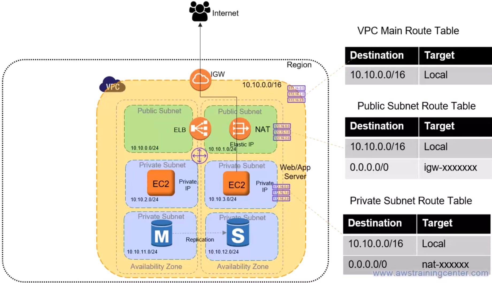
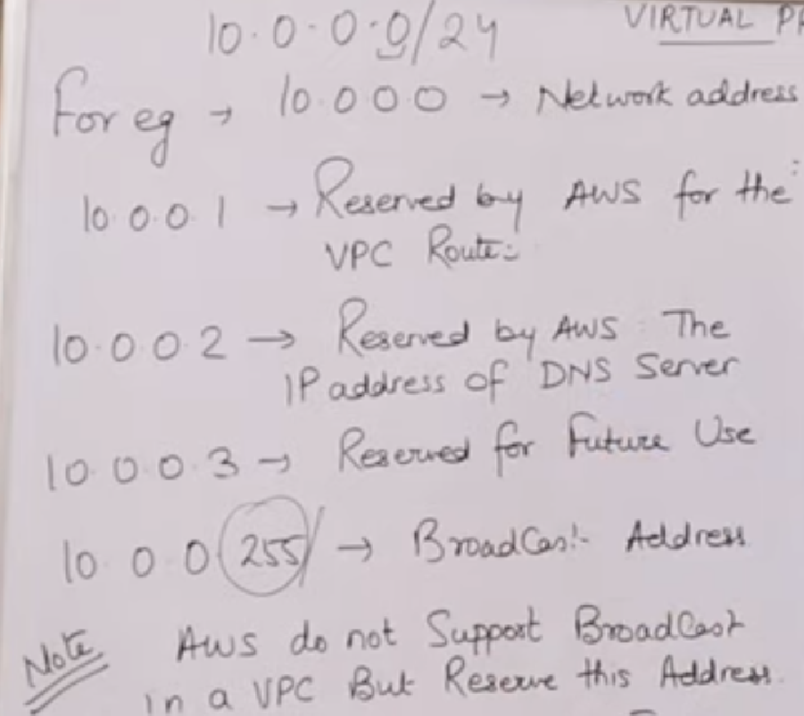
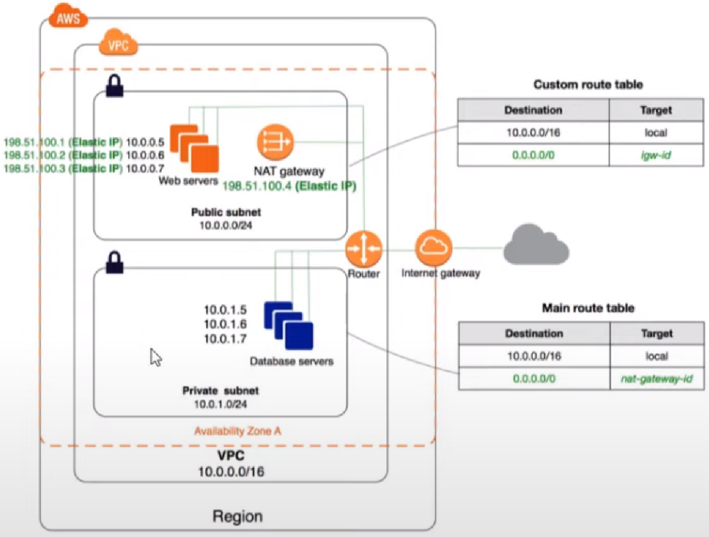
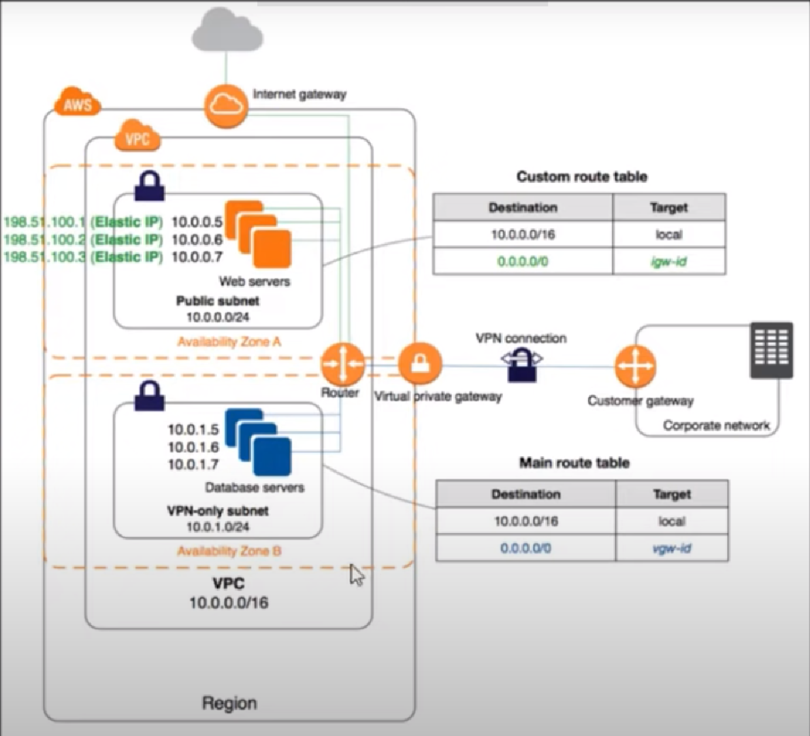
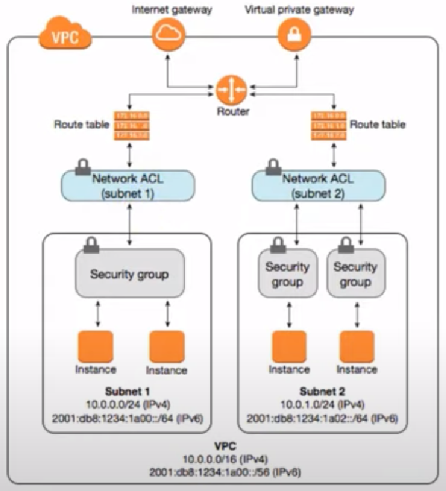
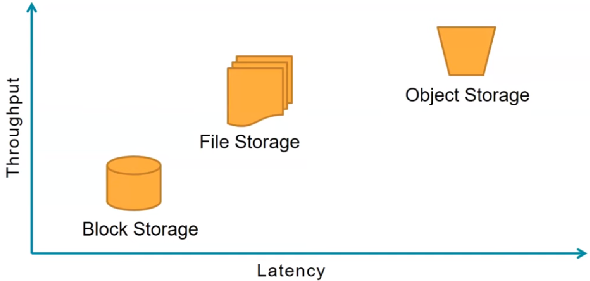

=  AWS Solution Architect (associate)

== How cloud works
== how to create AWS free account

. IaaS
. PaaS
. SaaS

== Types of instances ec2 (elastic compute cloud)

*#_Kubernetes_# is a container  orchestration tool, while #_auto-scaling_# (in #_AWS_#) is a tool used for scaling a #_virtual machine image:../../3-devops/images/vmware.png[width=80]_#*. #_Containers_#  are different from a *virtual machine*, #*_EC2_*# is a *virtual machine* image:../../3-devops/images/vmware.png[width=80].

.https://aws.amazon.com/ec2/instance-types/ follow the link for updated information. each of them has different features and different use cases.

. general purpose
. compute optimized
. Memory optimized
. Storage optimized
. accelerated computing (GPU/FGPU)
. high memory
. previous generation

== Ec2 purchasing options

https://docs.aws.amazon.com/AWSEC2/latest/UserGuide/instance-purchasing-options.html follow the link for latest information.

.https://www.youtube.com/watch?v=dG11IG2WfxA&list=PLBGx66SQNZ8a_y_CMLHchyHz_R6-6i-i_&index=11&ab_channel=TechnicalGuftgu very important

. on-demand
. dedicated instance
. dedicated host
. spot instance
. schedule instance
. reserved instance
** standard reserved instance
** convertible reserved instance
** schedule reserved instance

====
* ec2 access
* ec2 status check
** terminate
** starting
** running
** shutdown
** healthy

* volume
** EBS backed ec2 instance
** instance store backed ec2 instance
====

https://www.youtube.com/watch?v=EDyLhse2pw0&list=PLBGx66SQNZ8a_y_CMLHchyHz_R6-6i-i_&index=12&ab_channel=TechnicalGuftgu

* when you stop an ebs backed ec2 instance

* ec2 instance termination
* ec2 instance metadata
* ec2 instance user data
* ec2 bare metal instances
* ec2 instance storage (*DAS* or direct attach storage) and elastic block storage (*NAT* or network attach storage)

** DAS is faster while NAT is slower

== What is VPC and how it works | Types of VPC -1
max 5-vpc and max 200 subnets can be created in one vpc. 5-vpc in one aws-account. You can submit a request to the aws if you need more than 5-vpc.

*once a vpc is created then DHCP, NACL and security groups will be created automatically.*

.VPC (Virtual Private Cloud)

https://docs.aws.amazon.com/vpc/latest/userguide/what-is-amazon-vpc.html link to the latest information on *VPC components*

== What is VPC and how it works | Types of VPC -2

.*2-Types of VPC*
. *Default VPC:* default internet gateway is available hence can communicate to internet

. *Custom VPC:* default internet gateway is not available hence cannot communicate to internet. but you can create internet gateway and talk to internet.

.*IPs* which you cannot use in your *VPC*

.*4-most important steps in creating VPC*
. create a *VPC*
. create *subnet*
** *public subnet:* connected to *#internet gateway#* hence can communicate to #internet#
** *private subnet:* is not connected to *#internet gateway#* hence cannot communicate to #internet#.
** *CIDR block range* can be only between 16-28 (actual is 0-31)
. create *internet gateway*
. create *route table*

.How to access internet via NAT Gateway

.*4-most important steps in creating VPC*
. create a *VPC*
. create *subnet*
** *public subnet:* connected to *#internet gateway#* hence can communicate to #internet#
** *private subnet:* is not connected to *#internet gateway#* hence cannot communicate to #internet#.
** *CIDR block range* can be only between 16-28 (actual is 0-31)
. create *internet gateway*
. create *route table*

.AWS-VPC Peering- Concept & Demo | LEC 24| 2 VPC within a Region, technical guftgu

.AWS Network ACL's inside my VPC LEC-26

== What is VPC and how it works

.implied router and route table

.aws associate cheat-sheet, it is draw.io file you can open it
image::Concise-AWS-Sol-Arch-Revision.drawio-1.png[]

== AWS Storage - EBS vs S3 vs EFS

.AWS Storage - EBS vs S3 vs EFS
+++
<iframe width="560" height="315" src="https://www.youtube.com/embed/6vNC_BCqFmI" title="YouTube video player" frameborder="0" allow="accelerometer; autoplay; clipboard-write; encrypted-media; gyroscope; picture-in-picture; web-share" allowfullscreen></iframe>
+++

.performance comparison of storage types

== AWS Solutions Architect Associate Cheat Sheet

.*AWS Solutions Architect Associate Cheat Sheet* #excellent cheat-sheet#
https://www.devopsmadness.com/aws_solutions_architect_associate_cheat_sheet/

.History of the AWS Certified Solutions Architect Associate Exam (SAA-C03)
https://tutorialsdojo.com/whats-new-with-the-saa-c03-aws-certified-solutions-architect-associate-exam-this-2022/

https://github.com/alozano-77/AWS-SAA-C02-Course

The focus for most of the exam was S3 hands down. There was a lot that focused on Storage Classes and Lifecycle policies. There were a few on VPC's, Load Balancing, but the thing to remember is the 5 pillars: #Operational Excellence, Security, Reliability, Performance Efficiency, and Cost Optimization# because regardless of the question, it always comes down to these 5 things. The question will ask *_MOST cost-efficient, or FASTEST to transfer_*. Take this into consideration when determining your answer.

== AWS-mindmap

[[aws-visual-notes]]
https://github.com/notcuder/aws-mindmap[*_AWS-mindmap_*] best visualization notes on GitHub

https://www.linkedin.com/pulse/aws-well-architected-framework-mind-map-carlos-betancourt/?trackingId=nmi%2FZA8%2FTqOx4ScUfHriYA%3D%3D[*_AWS Well-Architected Framework Mind Map_*] on linked visualization, *pdf* file is also available

.AWS-cloud-mindmaps
https://github.com/wquiles/aws-cloud-mindmaps[*AWS cloud-mindmaps*] GitHub repository, excellent and unique resource. helpful when interacting with clients or want to explain some concepts related to AWS to others. *_##This repository is read-only.##_*

link:Software_Architecture_Mindmap.png[Software_Architecture_Mindmap] click and open the file

.Software_Architecture_Mindmap
image::Software_Architecture_Mindmap.png[]

https://github.com/skeletonKim/software-architect-mindmap[Software Architecture Mindmap]

