= Technology Agnostic Cloud Computing Course
Author Name Mehmood-ur-Rehman
:sectnumlevels: 4
:toclevels: 4
:sectnums: 4
:toc: left
:icons: font
:toc-title: Technology Agnostic Cloud Computing
:doctype: book

I work as a Cloud Solution Architect at Microsoft, and I help our customers build applications using the Azure Cloud.
So I'm going to guess that a Cloud Solution Architect does a lot of architecture.
Yes, you are right, Actually this is a word which is always confusing because it means different things to different people,
absolutely yeah, it can be basic for some people, or it can be a larger enterprise in nature.
So, when you do architecture, what do you mean by architecture?
Okay for me, it is helping customers understand what are the pieces they have today & they can bring in new technologies that we are offering in the cloud, how to make those things work interchangeably, so when people have an application that may exist today, they may say we want to Azure, but we do not know how to make those pieces fit with technologies that Microsoft had offered.
So we use visual tools like whiteboard,
discussion or presentation to help customers understand what is an actual road map.
Some people have existing applications that they want to migrate & some people are doing green field kind of deployment.
they ask how we best align the way
people are building applications today instead of doing it the way they were doing it 10-years ago
& then again updating it.

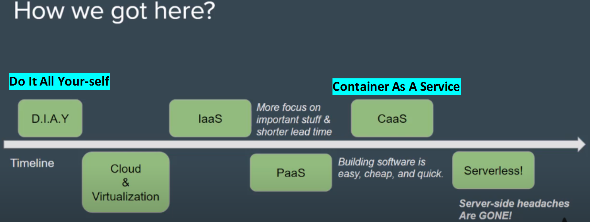

====
*Server-less* is an even advanced concept:

NOTE: *Container image:../3-devops/images/docker.svg[width=40]* #---># *_Kubernetes_* #---># *_server-less_* #---># *(Future ?)*

*_##Server-less [.underline]#the program# does auto-scaling (vertically & horizontally)##_*

*Serverless computing* is a *cloud computing model* which enables *developers* to build and run applications without the need to manage or provision servers. Some key attributes of serverless computing are *#scalability, cost efficiency, flexibility, and simplified development and deployment.#* It offers a pay-as-you-go model, allowing developers to only pay for the resources they use, and it also offers *near-instant scalability, allowing applications to scale up and down automatically as needed*. Additionally, serverless computing eliminates the need to manage server infrastructure, as all the servers are managed by the cloud provider, and makes development and deployment simpler and faster.
====

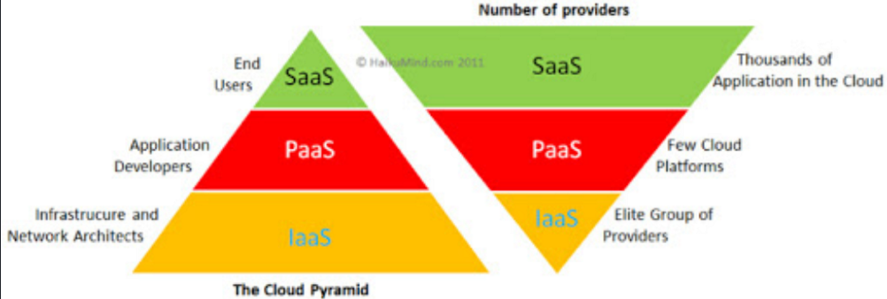
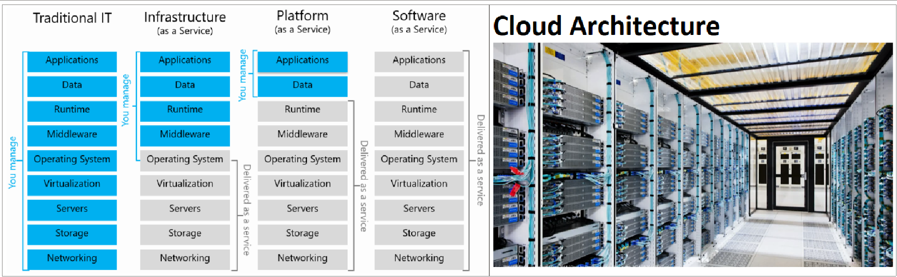

.*_How PaaS, IaaS, SaaS, CaaS & FaaS (Server-less) are separated at service level_* In this section, we are going to learn about how we can separate *_##IaaS, PaaS, and SaaS##_* at the service level:

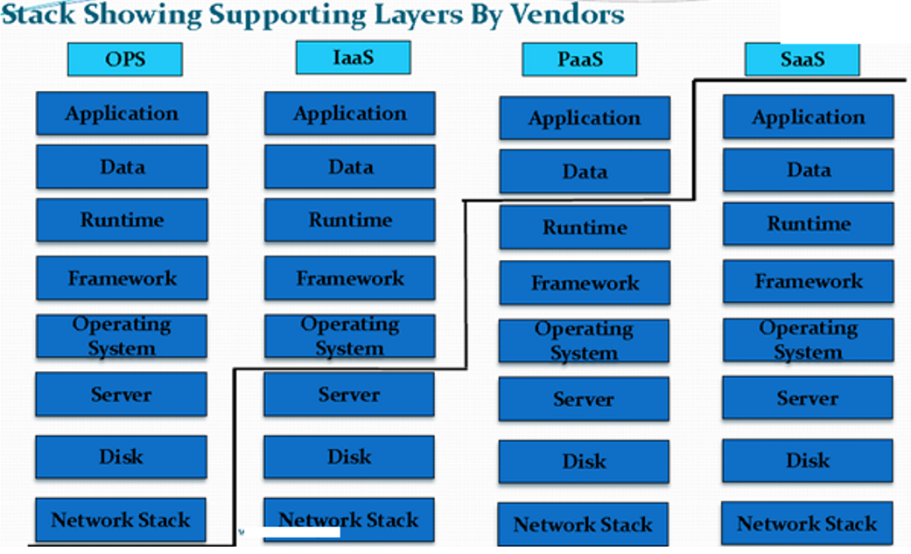

As the previous diagram suggests, we have the first column as *OPS*, which stands for *operations*. [.underline]#That means the bare minimum requirement for any typical server. When we are going with a server to buy, we should consider the preceding features before buying.#

*_##It includes Application, Data, Runtime, Framework, Operating System, Server, Disk, and Network Stack.##_*

When we move to cloud and decide to go with #*IaaS*#—in this case we are not bothered about *server, disk, and network stack*. Thus, the headache of handling hardware part is no more with us. That's why it is called Infrastructure as a Service.

Now if we think of *#PaaS#*, we should not be worried about *runtime, framework, and operating system* along with the components in IaaS. Things that we need to focus on are only application and data.

And the last deployment model is *SaaS—Software* as a Service. In this model we are not concerned about literally anything. The only thing that we need to work on is the code and just a look at the bill. It's that simple!

== Phases of Cloud Adoption

. https://youtu.be/IBTpNptxYF4[*_Phases of Cloud Adoption_*]
. https://rescale.com/blog/cloud-3-0-the-rise-of-big-compute/[*_Cloud 1.0 ---is-> SaaS, Cloud 2.0 ---is-> Big Data, Cloud 3.0 ---is-> Big #Compute_#*]
    ** *Cloud 1.0:* SaaS (In this model we are not concerned about literally anything. The only thing that we need to work on is the *code* and just a look at the *bill*.)
    ** *Cloud 2.0:* Big Data (removed constraints on *#data#* and transformed major enterprise software categories)
    ** *Cloud 3.0:* Big Compute (eliminates constraints on *#compute hardware#* and provides the ability to scale computational workloads seamlessly on workload-optimized infrastructure configurations without sacrificing performance.)

.IaasS,PaaS,SaaS
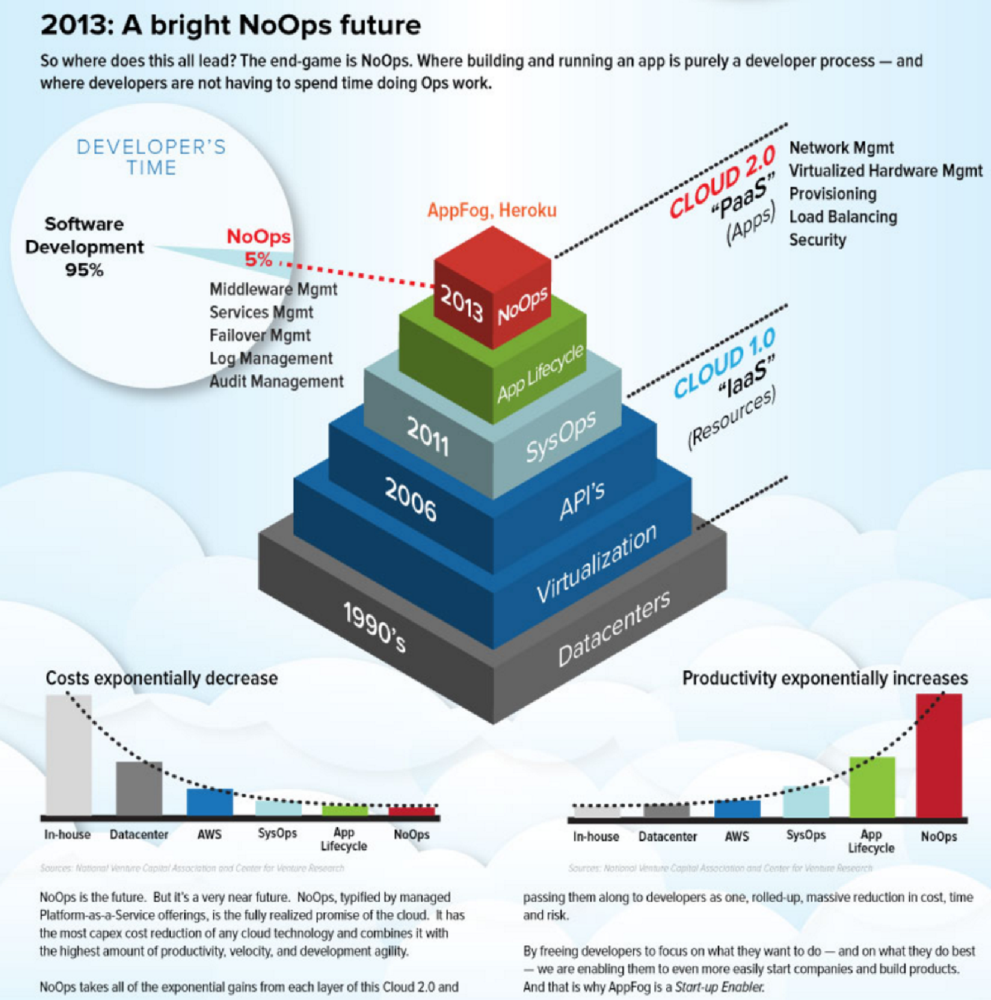
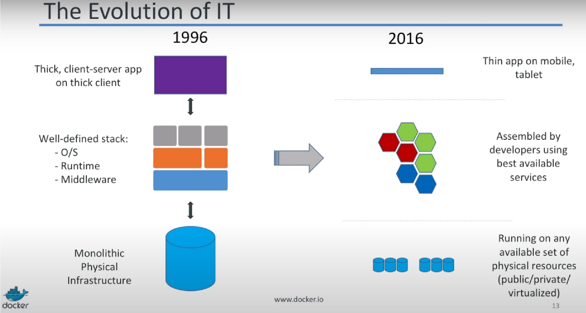
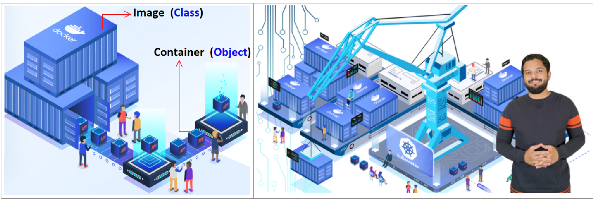
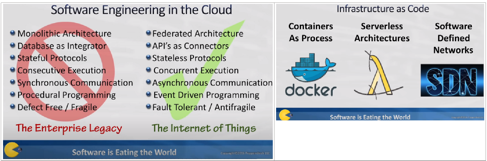
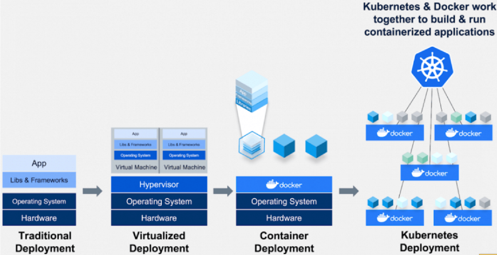

When your *software architecture* is about *microservices*, then *containers* are a good choice. When you are using old *monolithic applications* then *VMs* are not a bad option. So it always depends on the context what you need to learn specifically. The topic is rather broad to summarize it. A book might help with that, but sadly I cannot suggest a good broad one. "Kubernetes in Action" gives you a good start in Kubernetes though.

== Understanding Cloud Computing
=== https://dzone.com/refcardz/getting-started-cloud[Amazon EC2, Google App Engine, and Microsoft Azure]

== Introduction https://www.youtube.com/playlist?list=PL9XzOCngAkqs0Q8ZRdafnSYExKQurZrBY[click me] YouTube link

*#Cloud applications#* are fundamentally different than #traditional applications# that run on the *desktop, in a browser, or on a mobile device*. This master class from Wintellect cofounder and Microsoft Software Architect Jeffrey Richter offers a deep dive into cloud architecture that is independent of platform. Whether you are designing applications for Microsoft Azure, Amazon Web Services, or other cloud platforms, watching this series — and absorbing the principles contained therein — is a MUST before writing the first line of code.

[cols="3,1,1"]
|===
|Course Title |Author |Duration

|https://www.wintellectnow.com/Videos/Watch?videoId=architecting-distributed-cloud-applications-part-1-fundamentals[Architecting Distributed Cloud Applications, Part 1: #Fundamentals#] |https://www.wintellectnow.com/Home/Instructor?instructorId=JeffreyRichter[Jeffrey Richter] |01:45:11

|https://www.wintellectnow.com/Videos/Watch?videoId=architecting-distributed-cloud-applications-part-2-networking-communication[Architecting Distributed Cloud Applications, Part 2: #Networking Communication#] |https://www.wintellectnow.com/Home/Instructor?instructorId=JeffreyRichter[Jeffrey Richter] |01:18:46

|https://www.wintellectnow.com/Videos/Watch?videoId=architecting-distributed-cloud-applications-part-3-messaging[Architecting Distributed Cloud Applications, Part 3: #Messaging#] |https://www.wintellectnow.com/Home/Instructor?instructorId=JeffreyRichter[Jeffrey Richter] |00:31:11

|https://www.wintellectnow.com/Videos/Watch?videoId=architecting-distributed-cloud-applications-part-4-versioning-services[Architecting Distributed Cloud Applications, Part 4: #Versioning Services#] |https://www.wintellectnow.com/Home/Instructor?instructorId=JeffreyRichter[Jeffrey Richter] |00:33:33

|https://www.wintellectnow.com/Videos/Watch?videoId=architecting-distributed-cloud-applications-part-5-leader-election[Architecting Distributed Cloud Applications, Part 5: #Leader Election#] |https://www.wintellectnow.com/Home/Instructor?instructorId=JeffreyRichter[Jeffrey Richter] |00:13:12

|https://www.wintellectnow.com/Videos/Watch?videoId=architecting-distributed-cloud-applications-part-6-data-storage[Architecting Distributed Cloud Applications, Part 6: #Data Storage#] |https://www.wintellectnow.com/Home/Instructor?instructorId=JeffreyRichter[Jeffrey Richter] |02:03:16
|===

Learn how to architect distributed cloud apps with the right developer mindset, the finest cloud technologies, and the best cloud patterns.

[.underline]#_This +++ <mark> <b> technology-agnostic </b></mark> +++ video course begins by explaining the benefits of distributed cloud applications with an emphasis on maintaining high-availability and scalability in a cost-effective way while also dealing with inevitable hardware and software failures._#

Then, the course moves on to:

• Microservices and containers

• Networking communication

• Messaging communication

• Versioning, upgrading and configuration

• Data storage services

• Disaster recovery

This course is for anyone considering or actively working on a distributed cloud application. It is designed to provide you with a thorough understanding of these concepts, the various pros and cons of specific technologies, and the resilient patterns that are heavily used by distributed cloud applications. This knowledge will help you to easily build cost-efficient and fault-tolerant systems.

You can download slides and reuse them from link:++https://www.youtube.com/redirect?event=video_description&redir_token=QUFFLUhqbTJjUTNiUVFuRFFpVDhOSnpOVjlub0pRSXZod3xBQ3Jtc0trRkZhSDRkVDU4Q1JGVjNzS1BveHVzNjVIelJSR1dfY2RCZ2phSU5QUnBRQWI4Szlkd2ZTLU9IZG1Qb3h1NWhqRlVsTUw3RWtDZ1h0NnJkZzdzZlpJTFdHaVExeGVTOHpSZWtVUk9PLWZrWG00UFp0dw&q=https%3A%2F%2Fdocs.google.com%2Fpresentation%2Fd%2F0B9OeL9w7mYN2Nl9LX1BIRjFVeGs%2Fedit%3Fusp%3Dsharing%26ouid%3D104335109910971826063%26resourcekey%3D0--9WnRGKB_SSA2SZE3WN4EA%26rtpof%3Dtrue%26sd%3Dtrue&v=xJMbkZvuVO0++[https://docs.google.com/presentation/...]. If you use the slides, please point people to the original video series at

== Fundamentals

=== Description

In Part 1 of this landmark series, Wintellect cofounder and Microsoft Software Architect Jeffrey Richter presents the basic principles of cloud architecture. Learn about services, microservices, failure and fault tolerance, auto-scaling, containers, 12-factor applications, and more, and build an understanding of how distributed cloud applications work and the building blocks that make them up.

[width="100%",cols="5%,50%",]
|===
|https://www.wintellectnow.com/Videos/Watch?videoId=architecting-distributed-cloud-applications-part-1-fundamentals#[00:00:00] |Introduction

|https://www.wintellectnow.com/Videos/Watch?videoId=architecting-distributed-cloud-applications-part-1-fundamentals#[00:02:48] |Why Cloud Applications?
|https://www.wintellectnow.com/Videos/Watch?videoId=architecting-distributed-cloud-applications-part-1-fundamentals#[00:15:03] a|
#Embracing Failure#

|https://www.wintellectnow.com/Videos/Watch?videoId=architecting-distributed-cloud-applications-part-1-fundamentals#[00:23:56] a|  #Orchestrators#

|https://www.wintellectnow.com/Videos/Watch?videoId=architecting-distributed-cloud-applications-part-1-fundamentals#[00:32:25] a|

*_Regions, Availability Zones, and Fault Domains_*

<1> __**Distributed cloud applications are largely about  **__
. #Scalability (auto-scaling)#
. #High availability#

|https://www.wintellectnow.com/Videos/Watch?videoId=architecting-distributed-cloud-applications-part-1-fundamentals#[00:38:52] |Services and Service-Based Architectures
|https://www.wintellectnow.com/Videos/Watch?videoId=architecting-distributed-cloud-applications-part-1-fundamentals#[00:42:48] a|
Monoliths vs. Microservices

4-Reasons to split monolith into microservices

[arabic]
. Scale independently (balance cost with speed)
. Different technology stack
. 2-plus clients (clients adopt new features at will)
. Conflicting dependencies

|https://www.wintellectnow.com/Videos/Watch?videoId=architecting-distributed-cloud-applications-part-1-fundamentals#[00:57:29] |#Service-Level Agreements (SLAs) and Dependent Services#
|https://www.wintellectnow.com/Videos/Watch?videoId=architecting-distributed-cloud-applications-part-1-fundamentals#[01:01:35] |Auto-Scaling (has 3-techniques)
|https://www.wintellectnow.com/Videos/Watch?videoId=architecting-distributed-cloud-applications-part-1-fundamentals#[01:07:46] |12-Factor Services and Applications
|https://www.wintellectnow.com/Videos/Watch?videoId=architecting-distributed-cloud-applications-part-1-fundamentals#[01:19:22] |*Containers* image:../3-devops/images/docker.svg[width=40], *image* once created then becomes  *immutable*
|https://www.wintellectnow.com/Videos/Watch?videoId=architecting-distributed-cloud-applications-part-1-fundamentals#[01:24:24] |

*Why Containers? #Isolation# vs.   #_Density_#*
|https://www.wintellectnow.com/Videos/Watch?videoId=architecting-distributed-cloud-applications-part-1-fundamentals#[01:30:55] |Containers and Operating Systems
|https://www.wintellectnow.com/Videos/Watch?videoId=architecting-distributed-cloud-applications-part-1-fundamentals#[01:31:42] |Orchestrators and Containers
|https://www.wintellectnow.com/Videos/Watch?videoId=architecting-distributed-cloud-applications-part-1-fundamentals#[01:39:28] |Continuous Integration and Deployment
|===

<1> What is *orchestration vs automation*?

* *Automation* refers to automating a single process or a small number of related tasks, (e.g., deploying an app).
* *Orchestration* refers to managing multiple automated tasks to create a dynamic workflow (e.g., deploying an app, connecting it to a network, and integrating it with other systems).
<2> The purpose of an *Orchestrator*:

Infrastructure/PIatform/Containers/Functions as a Service
(aka Orchestrators)

• Manage a cluster's (set of PC/VMs) lifecycle, networking,
health, upgrades, scaling, & deploys/runs service code.

.observe the diagram carefully
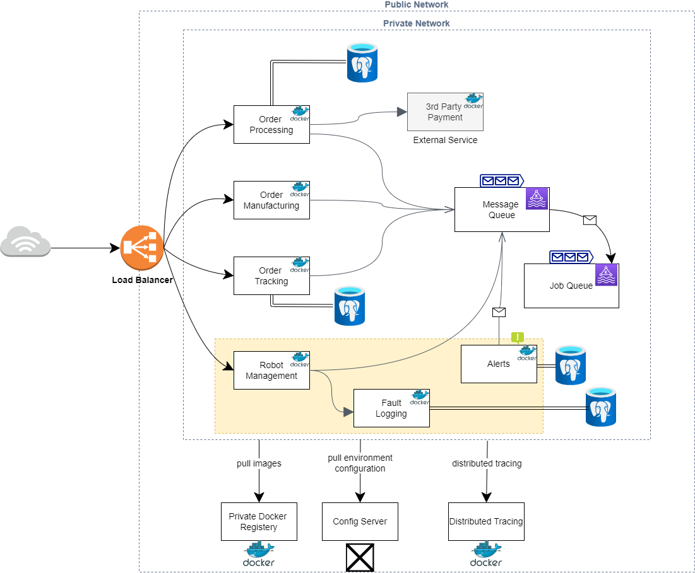

== Networking Communication

=== Description
Microservices use networking to communicate with each other, but architecting a robust microservice-based application is not as simple as replacing function calls with network calls. In this session, Jeffrey introduces important concepts such as API versioning, client retries, and idempotence, and explains why they are critical to distributed cloud architectures.

[cols="5%,50%",]

|===
|https://www.wintellectnow.com/Videos/Watch?videoId=architecting-distributed-cloud-applications-part-2-networking-communication#[00:00:00]

|Introduction
|https://www.wintellectnow.com/Videos/Watch?videoId=architecting-distributed-cloud-applications-part-2-networking-communication#[00:00:41] |*_##Eight Fallacies of Distributed Computing##_*

|https://www.wintellectnow.com/Videos/Watch?videoId=architecting-distributed-cloud-applications-part-2-networking-communication#[00:08:42] |Service Endpoints

|https://www.wintellectnow.com/Videos/Watch?videoId=architecting-distributed-cloud-applications-part-2-networking-communication#[00:16:45] |Proxies

|https://www.wintellectnow.com/Videos/Watch?videoId=architecting-distributed-cloud-applications-part-2-networking-communication#[00:25:41] |*#Putting It All Together#*
|https://www.wintellectnow.com/Videos/Watch?videoId=architecting-distributed-cloud-applications-part-2-networking-communication#[00:32:05] |*#Orchestration and Load Balancing#*
|https://www.wintellectnow.com/Videos/Watch?videoId=architecting-distributed-cloud-applications-part-2-networking-communication#[00:36:14] |Connecting Microservices
|https://www.wintellectnow.com/Videos/Watch?videoId=architecting-distributed-cloud-applications-part-2-networking-communication#[00:49:12] |API Versioning
|https://www.wintellectnow.com/Videos/Watch?videoId=architecting-distributed-cloud-applications-part-2-networking-communication#[00:52:28] |Network API Contracts
|https://www.wintellectnow.com/Videos/Watch?videoId=architecting-distributed-cloud-applications-part-2-networking-communication#[00:58:36] |Leaky RPC-Like Abstractions
|https://www.wintellectnow.com/Videos/Watch?videoId=architecting-distributed-cloud-applications-part-2-networking-communication#[01:03:22] |Retrying Failed Network Operations
|https://www.wintellectnow.com/Videos/Watch?videoId=architecting-distributed-cloud-applications-part-2-networking-communication#[01:07:12] |*Implementing Operations Idempotently*
|===

=== https://www.youtube.com/playlist?list=PL9XzOCngAkqs4m0XdULJu_78nM3Ok3Q65[Designing & Versioning HTTP/REST APIs]
*#_API (OpenAPI or swagger)_#*

.APIs Vs. Events | Can they coexist? | API First or Event First
+++
<iframe width="560" height="315" src="https://www.youtube.com/embed/3t7pMx35Reg" title="YouTube video player" frameborder="0" allow="accelerometer; autoplay; clipboard-write; encrypted-media; gyroscope; picture-in-picture; web-share" allowfullscreen></iframe>
+++

. 7:02 https://www.youtube.com/watch?v=9Ng00IlBCtw&list=PL9XzOCngAkqs4m0XdULJu_78nM3Ok3Q65&index=1[Welcome to the 'Designing & Versioning HTTP/REST APIs' video series]

. https://www.youtube.com/watch?v=kNIRz7pC7og&list=PL9XzOCngAkqs4m0XdULJu_78nM3Ok3Q65&index=2[7:42] https://www.youtube.com/watch?v=kNIRz7pC7og&list=PL9XzOCngAkqs4m0XdULJu_78nM3Ok3Q65&index=2[The Importance of *API Design*]
. https://www.youtube.com/watch?v=zra_YLqxhCA&list=PL9XzOCngAkqs4m0XdULJu_78nM3Ok3Q65&index=3[19:32] https://www.youtube.com/watch?v=zra_YLqxhCA&list=PL9XzOCngAkqs4m0XdULJu_78nM3Ok3Q65&index=3[*#HTTP URLs, Headers, Requests & Responses#*]
. https://www.youtube.com/watch?v=Jv8oe8tPneo&list=PL9XzOCngAkqs4m0XdULJu_78nM3Ok3Q65&index=4[13:35] https://www.youtube.com/watch?v=Jv8oe8tPneo&list=PL9XzOCngAkqs4m0XdULJu_78nM3Ok3Q65&index=4[HTTP Method *#Idempotency#*]
. https://www.youtube.com/watch?v=PFK6RRTwXCg&list=PL9XzOCngAkqs4m0XdULJu_78nM3Ok3Q65&index=5[24:29] https://www.youtube.com/watch?v=PFK6RRTwXCg&list=PL9XzOCngAkqs4m0XdULJu_78nM3Ok3Q65&index=5[*#REST Fundamentals#*]
. https://www.youtube.com/watch?v=SLFwVUsjo4I&list=PL9XzOCngAkqs4m0XdULJu_78nM3Ok3Q65&index=6[9:51] https://www.youtube.com/watch?v=SLFwVUsjo4I&list=PL9XzOCngAkqs4m0XdULJu_78nM3Ok3Q65&index=6[Processing an HTTP Request]
. https://www.youtube.com/watch?v=ycoXRuTdfNo&list=PL9XzOCngAkqs4m0XdULJu_78nM3Ok3Q65&index=7[20:07] https://www.youtube.com/watch?v=ycoXRuTdfNo&list=PL9XzOCngAkqs4m0XdULJu_78nM3Ok3Q65&index=7[*#JSON, The Network Type System#*]
 *What is a #Payload# in an API?* The payload of an API is *the data you are interested in transporting to the server when you make an API request*. Simply put, it is the body of your HTTP request and response message.

. https://www.youtube.com/watch?v=e19sF2jXYnk&list=PL9XzOCngAkqs4m0XdULJu_78nM3Ok3Q65&index=8[4:08] https://www.youtube.com/watch?v=e19sF2jXYnk&list=PL9XzOCngAkqs4m0XdULJu_78nM3Ok3Q65&index=8[Identity, Naming, & Relationships]
. https://www.youtube.com/watch?v=5UHjLTLZ2oE&list=PL9XzOCngAkqs4m0XdULJu_78nM3Ok3Q65&index=9[9:02] https://www.youtube.com/watch?v=5UHjLTLZ2oE&list=PL9XzOCngAkqs4m0XdULJu_78nM3Ok3Q65&index=9[Updating a Resource]

. https://www.youtube.com/watch?v=tY9ECBuqEYs&list=PL9XzOCngAkqs4m0XdULJu_78nM3Ok3Q65&index=10[14:50] https://www.youtube.com/watch?v=tY9ECBuqEYs&list=PL9XzOCngAkqs4m0XdULJu_78nM3Ok3Q65&index=10[Conditional Access]
. https://www.youtube.com/watch?v=MNIHxHqWubw&list=PL9XzOCngAkqs4m0XdULJu_78nM3Ok3Q65&index=11[4:23] https://www.youtube.com/watch?v=MNIHxHqWubw&list=PL9XzOCngAkqs4m0XdULJu_78nM3Ok3Q65&index=11[Performing an Action]
. https://www.youtube.com/watch?v=y4YyqadogQg&list=PL9XzOCngAkqs4m0XdULJu_78nM3Ok3Q65&index=12[11:14] https://www.youtube.com/watch?v=y4YyqadogQg&list=PL9XzOCngAkqs4m0XdULJu_78nM3Ok3Q65&index=12[Service Considerations]
. https://www.youtube.com/watch?v=jI7fTQT1gac&list=PL9XzOCngAkqs4m0XdULJu_78nM3Ok3Q65&index=13[11:56] https://www.youtube.com/watch?v=jI7fTQT1gac&list=PL9XzOCngAkqs4m0XdULJu_78nM3Ok3Q65&index=13[Collections]
. https://www.youtube.com/watch?v=bG984_L6dS0&list=PL9XzOCngAkqs4m0XdULJu_78nM3Ok3Q65&index=14[33:04] https://www.youtube.com/watch?v=bG984_L6dS0&list=PL9XzOCngAkqs4m0XdULJu_78nM3Ok3Q65&index=14[#Versioning HTTP APIs#]
. https://www.youtube.com/watch?v=zmB4W6V2Xrc&list=PL9XzOCngAkqs4m0XdULJu_78nM3Ok3Q65&index=15[4:15] https://www.youtube.com/watch?v=zmB4W6V2Xrc&list=PL9XzOCngAkqs4m0XdULJu_78nM3Ok3Q65&index=15[#Final Thoughts#]

== Messaging
=== Description
*_Queues_* are used to facilitate reliable message-based communication between services. Learn what queues are, why messaging communication with queues is frequently preferable to networking communication, and what implications queues have for the design and implementation of distributed cloud applications.

[cols="5%,50%"]
|===
|https://www.wintellectnow.com/Videos/Watch?videoId=architecting-distributed-cloud-applications-part-3-messaging#[00:00:00] |Introduction
|https://www.wintellectnow.com/Videos/Watch?videoId=architecting-distributed-cloud-applications-part-3-messaging#[00:00:25] |#Messaging Communication#
|https://www.wintellectnow.com/Videos/Watch?videoId=architecting-distributed-cloud-applications-part-3-messaging#[00:04:23] |#Messaging with Queues#
|https://www.wintellectnow.com/Videos/Watch?videoId=architecting-distributed-cloud-applications-part-3-messaging#[00:13:42] |#Fault-Tolerant Message Processing#
|https://www.wintellectnow.com/Videos/Watch?videoId=architecting-distributed-cloud-applications-part-3-messaging#[00:23:11] |More About Queues
|===

== Versioning Services

=== Description
Services inevitably evolve, which means an important consideration when deploying them is how to version them without disrupting service. Learn the ins and outs of versioning the services that comprise cloud applications and how to protect the configuration data that accompanies them.

[cols="5,55"]
|===
|00:00:00 |Introduction
|00:00:24 |#Service-Update Options#
|00:06:14 |#Comparing Service-Update Options#
|00:13:41 |Two-Phase Updates
|00:17:42 |Shutting Down Service Instances
|00:23:33 |Service Configuration and Secrets
|00:30:14 |Cryptographic Message Syntax
|===

== Leader Election
=== Description

Leader election is a pattern that is commonly used in distributed cloud applications. The purpose is to allow one service instance to coordinate tasks among other service instances, and to easily be replaced if it goes down. Learn about the leader-election pattern and understand how and why to implement it.

[cols="5,55"]
|===
|00:00:00 |Introduction
|00:00:20 |What is Leader Election, and Why Would I Use It?
|00:03:45 |Leader Election Using Leases
|00:10:41 |Leader Election Using Queue Messages
|===

== Data Storage

Description

Building reliable and scalable services that manage state is exponentially more difficult than building stateless services. This epic video presents the problems that you will encounter, the solutions to those problems, and the patterns that will help you implement them.

[cols="5,55"]
|===
|00:00:00 |Introduction
|00:00:20 |*#Data-Storage Considerations#* <<storage_size_calculation>>
 |00:03:55 |Data Temperature
|00:09:29 |Caching
|00:12:47 |#File and Object Storage# <<how_to_choose_a_right_database_for_your_application>>

*➢* Object (blob) storage services for documents, pictures, images, and videos.

*➢* How to improve performance of client's accessing these documents by using a Content Delivery Network (CDN).

|00:22:18 |#Database Storage#

*➢ SQL* (table or entities have relationship with each other)

*➢ NoSQL* (table or entities do not have relationship with each other), scalability is easy. Not good for working with data that has relationship with each other.

How you partition your data is your choice and its super important.

|00:33:58 |#*_Data Partitioning_*#

*➢* _Data is *partitioned* for ##size, speed or both##_

*➢* _Each *partition's* data is *replicated* for ##reliability##_
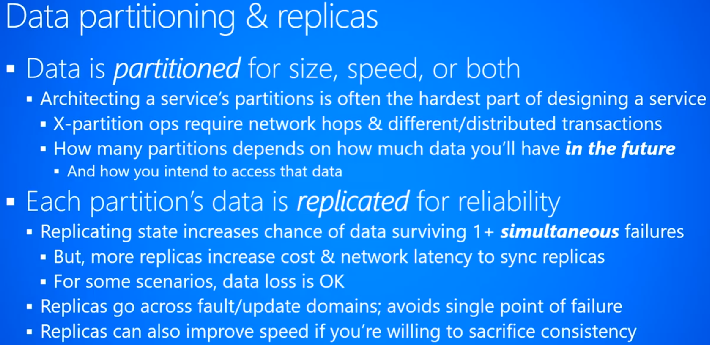

|00:48:15 |Data Consistency:
The concept of strong & weak data consistency, the CAP theorem, and apology-based computing.
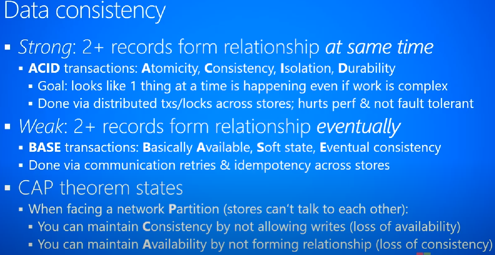

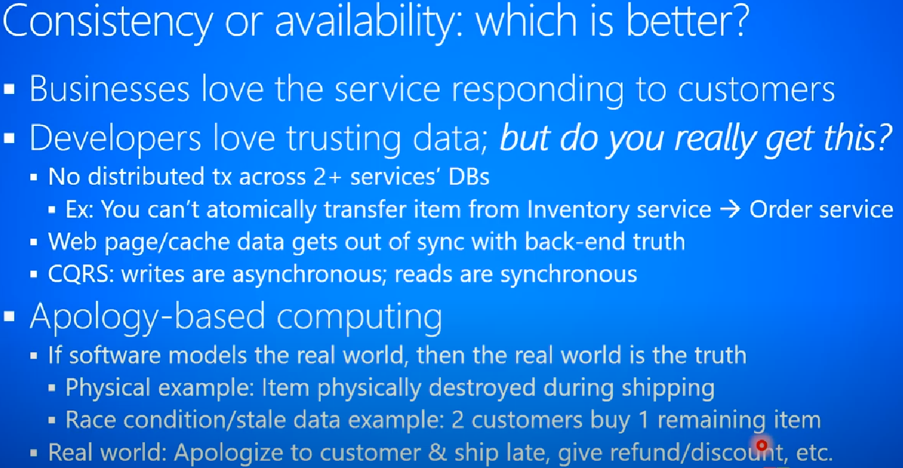

|01:05:34 |#The CQRS Pattern#
The Command Query Responsibility Segregation (CQRS) pattern which separates data modifications (commands) from data queries.

|01:10:06 |#The Event-Sourcing Pattern#
The Event sourcing pattern as a way of storing *#immutable (big)#* data and then producing *#views#* over this data.
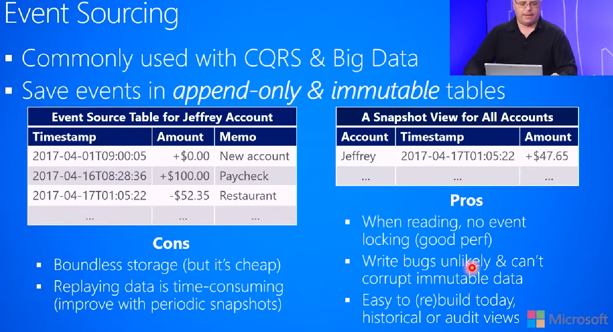
|
01:16:59 |#Eventual Consistency:#
Some patterns and tips for how to deal with and implement eventual consistency.
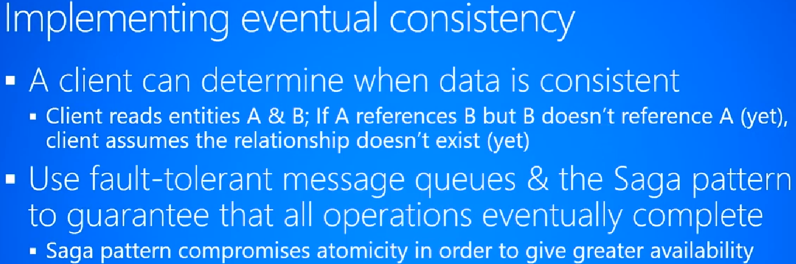

|01:21:12 |#The Saga Pattern#
The Saga pattern for dealing with eventual consistency which compromises atomicity for availability.

|01:28:17 |Data Concurrency and Versioning
|01:32:46 |Optimistic Concurrency
|01:38:27 |Versioning Data Schemas
|01:45:39 |Backup and Restore
|01:50:49 |Recovery Point and Time Objectives
|01:53:22 |Disaster Recovery
|===

