= Conceptual Modeling E-R Model
:sectnumlevels: 4
:toclevels: 4
:sectnums: 4
:toc: left
:icons: font
:toc-title: DBMS
:doctype: book

* *Entity:* an entity is a distinguishable object of DB.

* *Weak Entity:* is existent dependent that means, it has no primary keys, and it is dependent on another strong Entity For its identification.

* *Entity Set:* collection of entities of the same type

* *Attribute:* specifies part of an entity structure it is a mapping from an entity set to a domain of values. e.g.

* *Relationship:*  an association/mapping b/w entities.

* *Relationship SET:* an association/mapping b/w entity set.

* *Super Key:* a set of one or more attributes which, taken collectively, allows us to Uniquely identify an entity in an entity set.

* *Candidate Key:* a super key for which no  proper subset is also a super key.

* *Primary Key:* a candidate key chosen by the conceptual designer as the chief attribute Set by which an entity is identified in an entity Set.

The main difference between *Class Diagram and Entity Relationship Diagram* is that Class Diagram represents the classes and the associations among them in software, while an Entity Relationship Diagram represents the entities and their relationships between them in a database.

=== From ER to Relational Model

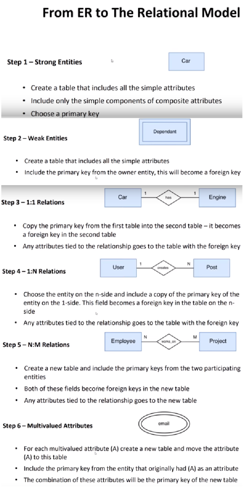

https://www.youtube.com/watch?v=UrYLYV7WSHM&ab_channel=channel5567[*Normalization - 1NF, 2NF, 3NF and 4NF*]

.The above table is not in normalized form we will normalize it.
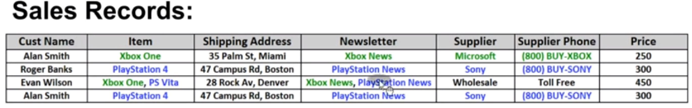
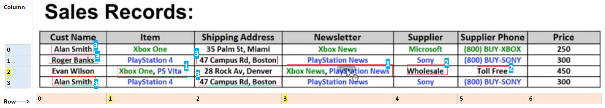

=== *1st Normal Form*
====

. Each cell to be Single valued, (but we've 2 at (2,1), (2,3))
. Entries in a column are the same type (int, char, string, etc. but we've different at (2,4), (2,5))
. Rows uniquely identified - Add Unique ID, or Add more columns to make unique

NOTE: The order of the rows and the order of the columns are irrelevant

====

.Above table after applying 1st normal form
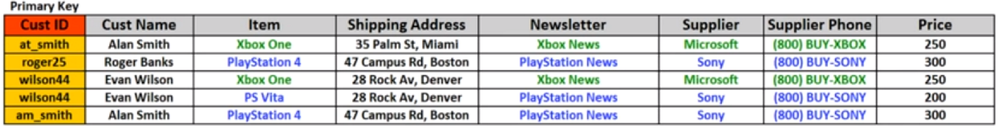

=== *2nd Normal Form*
====
All attributes (Non-Key Columns) dependent on the #*key*# (Primary-Key)
====

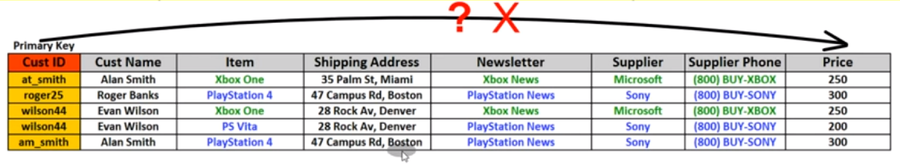

Does not care who buys *(Alan Smith or Evan Wilson)* Xbox One the price will always remain the *same = 250*, so the key *(Primary key)* does not determine the "Price". So all the columns who do not depend on #*key*# have to be separated out. Like shown below.

.table in 2nd normal form
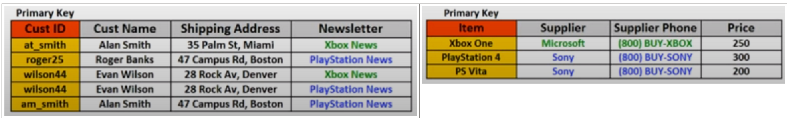

Now the only problem is that we lost the *#transactions#* "we don’t know who bought what". So for that there needs to be a table called #*"junction table"*# like shown below.

.junction table
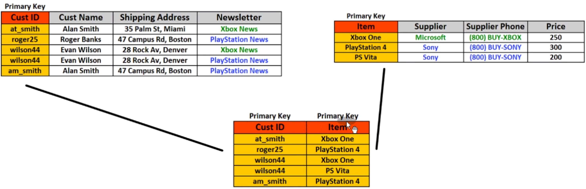

=== 3rd Normal Form
====
All Fields (#*columns*#) can be determined Only by the #*Key*# in the *#table#* and, and no other *#column#*
====

.problem with 2nd Normal Form
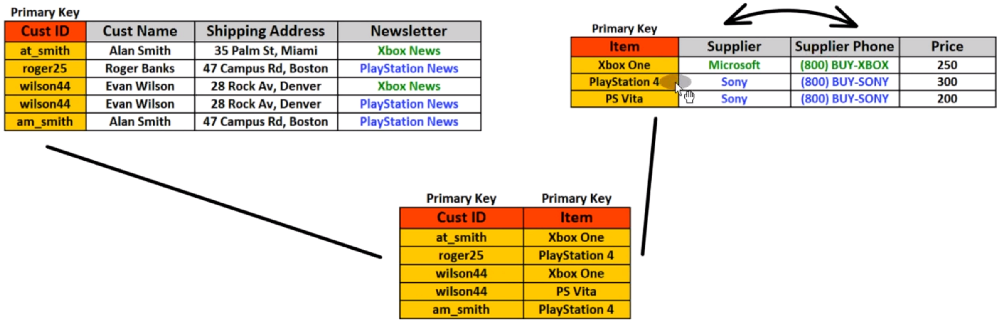

* Supplier phone number is repeated again & again

** As Sony will always have the same "supplier phone"

** As Microsoft will always have the same "supplier phone"

*** So to avoid duplication, do as shown below.

**** Now we will make change only in one place if needed in the future.

* Now this *"junction table"* is called the *#"compound key"#* as it is made of 2-columns.

.the table is in 3-rd normal form
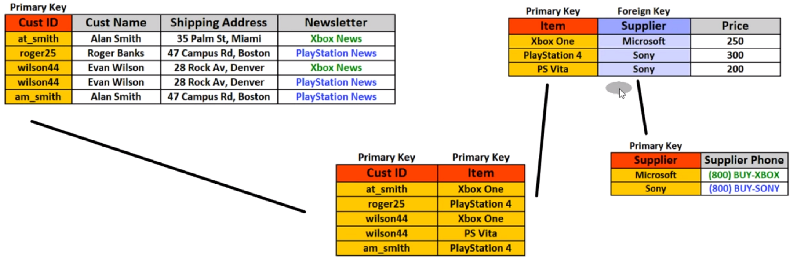

=== 4rth Normal Form
====
No multivalued dependencies

* Multivalued dependencies is a situation where a column like (*Newsletter*) can have different values (or different amount of values than other columns)
====

.problem with 3rd normal form
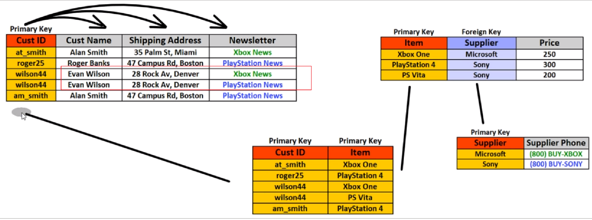

* This is correct, but we've problem with  *Evan Wilson* because his name occurred twice.

** If *Evan Wilson* changes his address, I've to change it at 2-different places.
** What if he unsubscribes from anyone "*Newsletter*"

.the table is in 4rth normal form
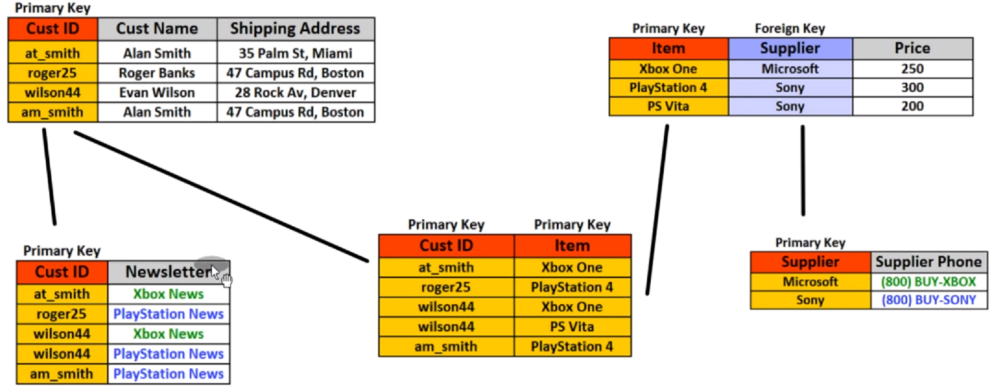

.relationships between the tables & name of tables
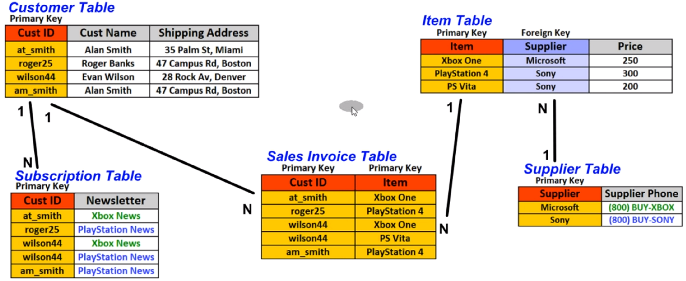

.summary
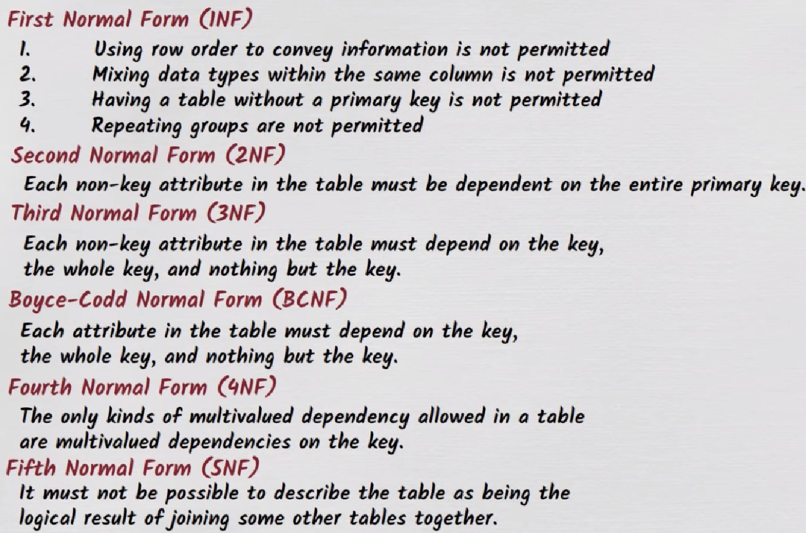

+++
<iframe width="560" height="315" src="https://www.youtube.com/embed/UrYLYV7WSHM" title="YouTube video player" frameborder="0" allow="accelerometer; autoplay; clipboard-write; encrypted-media; gyroscope; picture-in-picture; web-share" allowfullscreen></iframe>
+++

+++
<iframe width="560" height="315" src="https://www.youtube.com/embed/GFQaEYEc8_8" title="YouTube video player" frameborder="0" allow="accelerometer; autoplay; clipboard-write; encrypted-media; gyroscope; picture-in-picture; web-share" allowfullscreen></iframe>
+++

Database normalization is a process of organizing the data in a database to reduce data redundancy and improve data integrity. There are several normalization rules, each with a specific purpose in organizing the data. Violations of these normalization rules can lead to data inconsistencies, update anomalies, and other problems.

=== Database Normalization violations
Here are some common types of database normalization violations, along with examples of each:

[arabic]
. First Normal Form (1NF) violations:

1NF requires that each table in a database has a primary key and that the values in each column of the table are atomic, meaning they cannot be broken down into smaller pieces. Some examples of 1NF violations are:

* Storing multiple values in a single column, such as a comma-separated list of items in an order.
* Creating a table with multiple repeating groups of columns, such as a table with columns for phone1, phone2, phone3, etc.

[arabic, start=2]
. Second Normal Form (2NF) violations:

2NF requires that each non-key column in a table is functionally dependent on the entire primary key. Some examples of 2NF violations are:

* Creating a table with a composite primary key, where some non-key columns depend only on a subset of the primary key.
* Creating a table with non-key columns that are not functionally dependent on the primary key.

[arabic, start=3]
. Third Normal Form (3NF) violations:

3NF requires that each non-key column in a table is dependent only on the primary key or other non-key columns, but not on any other non-key column. Some examples of 3NF violations are:

* Creating a table with transitive dependencies, where a non-key column depends on another non-key column, which in turn depends on the primary key.
* Creating a table with multiple candidate keys, where some non-key columns depend on only one of the candidate keys.

[arabic, start=4]
. Boyce-Codd Normal Form (BCNF) violations:

BCNF requires that each non-trivial functional dependency in a table is a dependency on a superkey. Some examples of BCNF violations are:

* Creating a table with multiple overlapping candidate keys, where some non-key columns depend on only one of the candidate keys.
* Creating a table with functional dependencies that are not fully dependent on a superkey, such as a table with a composite key where some non-key columns depend only on one part of the key.

By identifying and resolving these normalization violations, you can ensure that your database is well-structured, easy to maintain, and efficient in processing data.

=== video course
⭐️ Contents ⭐

⌨️ (#https://www.youtube.com/watch?v=ztHopE5Wnpc&t=0s[0:00:00]#) Introduction

⌨️ (#https://www.youtube.com/watch?v=ztHopE5Wnpc&t=192s[0:03:12]#) What is a Database?

⌨️ (#https://www.youtube.com/watch?v=ztHopE5Wnpc&t=664s[0:11:04]#) What is a Relational Database?

⌨️ (#https://www.youtube.com/watch?v=ztHopE5Wnpc&t=1422s[0:23:42]#) RDBMS

⌨️ (#https://www.youtube.com/watch?v=ztHopE5Wnpc&t=2252s[0:37:32]#) Introduction to SQL

⌨️ (#https://www.youtube.com/watch?v=ztHopE5Wnpc&t=2641s[0:44:01]#) Naming Conventions

⌨️ (#https://www.youtube.com/watch?v=ztHopE5Wnpc&t=2836s[0:47:16]#) What is Database Design?

⌨️ (#https://www.youtube.com/watch?v=ztHopE5Wnpc&t=3626s[1:00:26]#) Data Integrity

⌨️ (#https://www.youtube.com/watch?v=ztHopE5Wnpc&t=4408s[1:13:28]#) Database Terms

⌨️ (#https://www.youtube.com/watch?v=ztHopE5Wnpc&t=5308s[1:28:28]#) More Database Terms

⌨️ (#https://www.youtube.com/watch?v=ztHopE5Wnpc&t=5926s[1:38:46]#) Atomic Values

⌨️ (#https://www.youtube.com/watch?v=ztHopE5Wnpc&t=6265s[1:44:25]#) Relationships

⌨️ (#https://www.youtube.com/watch?v=ztHopE5Wnpc&t=6635s[1:50:35]#) One-to-One Relationships

⌨️ (#https://www.youtube.com/watch?v=ztHopE5Wnpc&t=6825s[1:53:45]#) One-to-Many Relationships

⌨️ (#https://www.youtube.com/watch?v=ztHopE5Wnpc&t=7070s[1:57:50]#) Many-to-Many Relationships

⌨️ (#https://www.youtube.com/watch?v=ztHopE5Wnpc&t=7344s[2:02:24]#) Designing One-to-One Relationships

⌨️ (#https://www.youtube.com/watch?v=ztHopE5Wnpc&t=8020s[2:13:40]#) Designing One-to-Many Relationships

⌨️ (#https://www.youtube.com/watch?v=ztHopE5Wnpc&t=8630s[2:23:50]#) Parent Tables and Child Tables

⌨️ (#https://www.youtube.com/watch?v=ztHopE5Wnpc&t=9042s[2:30:42]#) Designing Many-to-Many Relationships

⌨️ (#https://www.youtube.com/watch?v=ztHopE5Wnpc&t=9983s[2:46:23]#) Summary of Relationships

⌨️ (#https://www.youtube.com/watch?v=ztHopE5Wnpc&t=10482s[2:54:42]#) Introduction to Keys

⌨️ (#https://www.youtube.com/watch?v=ztHopE5Wnpc&t=11244s[3:07:24]#) Primary Key Index

⌨️ (#https://www.youtube.com/watch?v=ztHopE5Wnpc&t=11622s[3:13:42]#) Look up Table

⌨️ (#https://www.youtube.com/watch?v=ztHopE5Wnpc&t=12619s[3:30:19]#) Superkey and Candidate Key

⌨️ (#https://www.youtube.com/watch?v=ztHopE5Wnpc&t=13739s[3:48:59]#) Primary Key and Alternate Key

⌨️ (#https://www.youtube.com/watch?v=ztHopE5Wnpc&t=14194s[3:56:34]#) Surrogate Key and Natural Key

⌨️ (#https://www.youtube.com/watch?v=ztHopE5Wnpc&t=14623s[4:03:43]#) Should I use Surrogate Keys or Natural Keys?

⌨️ (#https://www.youtube.com/watch?v=ztHopE5Wnpc&t=15187s[4:13:07]#) Foreign Key

⌨️ (#https://www.youtube.com/watch?v=ztHopE5Wnpc&t=15915s[4:25:15]#) NOT NULL Foreign Key

⌨️ (#https://www.youtube.com/watch?v=ztHopE5Wnpc&t=16697s[4:38:17]#) Foreign Key Constraints

⌨️ (#https://www.youtube.com/watch?v=ztHopE5Wnpc&t=17390s[4:49:50]#) Simple Key, Composite Key, Compound Key

⌨️ (#https://www.youtube.com/watch?v=ztHopE5Wnpc&t=18114s[5:01:54]#) Review and Key Points....HA GET IT? KEY points!

⌨️ (#https://www.youtube.com/watch?v=ztHopE5Wnpc&t=18628s[5:10:28]#) Introduction to Entity Relationship Modeling

⌨️ (#https://www.youtube.com/watch?v=ztHopE5Wnpc&t=19054s[5:17:34]#) Cardinality

⌨️ (#https://www.youtube.com/watch?v=ztHopE5Wnpc&t=19481s[5:24:41]#) Modality

⌨️ (#https://www.youtube.com/watch?v=ztHopE5Wnpc&t=20114s[5:35:14]#) Introduction to Database Normalization

⌨️ (#https://www.youtube.com/watch?v=ztHopE5Wnpc&t=20388s[5:39:48]#) 1NF (First Normal Form of Database Normalization)

⌨️ (#https://www.youtube.com/watch?v=ztHopE5Wnpc&t=20794s[5:46:34]#) 2NF (Second Normal Form of Database Normalization)

⌨️ (#https://www.youtube.com/watch?v=ztHopE5Wnpc&t=21300s[5:55:00]#) 3NF (Third Normal Form of Database Normalization)

⌨️ (#https://www.youtube.com/watch?v=ztHopE5Wnpc&t=21672s[6:01:12]#) Indexes (Clustered, Nonclustered, Composite Index)

⌨️ (#https://www.youtube.com/watch?v=ztHopE5Wnpc&t=22476s[6:14:36]#) Data Types

⌨️ (#https://www.youtube.com/watch?v=ztHopE5Wnpc&t=23155s[6:25:55]#) Introduction to Joins

⌨️ (#https://www.youtube.com/watch?v=ztHopE5Wnpc&t=23963s[6:39:23]#) Inner Join

⌨️ (#https://www.youtube.com/watch?v=ztHopE5Wnpc&t=24888s[6:54:48]#) Inner Join on 3 Tables

⌨️ (#https://www.youtube.com/watch?v=ztHopE5Wnpc&t=25661s[7:07:41]#) Inner Join on 3 Tables (Example)

⌨️ (#https://www.youtube.com/watch?v=ztHopE5Wnpc&t=26633s[7:23:53]#) Introduction to Outer Joins

⌨️ (#https://www.youtube.com/watch?v=ztHopE5Wnpc&t=26986s[7:29:46]#) Right Outer Join

⌨️ (#https://www.youtube.com/watch?v=ztHopE5Wnpc&t=27333s[7:35:33]#) JOIN with NOT NULL Columns

⌨️ (#https://www.youtube.com/watch?v=ztHopE5Wnpc&t=27760s[7:42:40]#) Outer Join Across 3 Tables

⌨️ (#https://www.youtube.com/watch?v=ztHopE5Wnpc&t=28104s[7:48:24]#) Alias

⌨️ (#https://www.youtube.com/watch?v=ztHopE5Wnpc&t=28333s[7:52:13]#) Self Join

