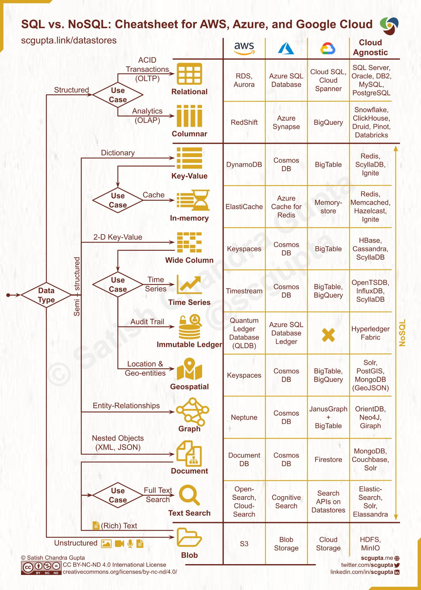

= How to choose a database for your application
:sectnumlevels: 4
:toclevels: 4
:sectnums: 4
:toc: left
:icons: font
:toc-title: How to choose a database
:doctype: book

==== https://www.pingcap.com/blog/how-to-efficiently-choose-the-right-database-for-your-applications/[How to Efficiently Choose the Right Database for Your Applications]

==== https://eoblog.net/2019/05/27/30-days-of-devops-choosing-the-right-db-in-aws/[Choosing the right DB in AWS]

==== https://medium.com/design-microservices-architecture-with-patterns/how-to-choose-a-database-for-microservices-cap-theorem-d1585bf40ecd[How to Choose a Database for Microservices — CAP Theorem]

Picking a database is a long-term commitment, so the decision shouldn’t be made lightly. The important thing to keep in mind is to choose the right database for the right job.

*Data* can be *#structured (SQL), semi-structured (JSON), and unstructured (Blob)#*.

*Common DB categories:*

🔹 Relational

🔹 Columnar

🔹 Key-value

🔹 In-memory

🔹 Wide column

🔹 Time Series

🔹 Immutable ledger

🔹Geospatial

🔹Graph

🔹Document

🔹Text search

🔹Blob

.how to choose a right database for your application

[[how_to_choose_a_right_database_for_your_application]]
_**From performance to programmability, the right database makes all the difference. Here are 12 key questions to help guide your selection>
**_

Picking the “*right*” database can often be critical to the success of an application. Rather than taking the advice of vendors or using a database because you already happen to have it, it’s useful to consider the fundamental purpose and requirements of the data store.

[.underline]#*_These are the most important questions to ask when you are picking a database_:*#

* *How much data* do you expect to store when the application is mature?
* *How many users* do you expect to handle simultaneously at a *peak load*?
* What *availability, scalability, latency, throughput, and data consistency* does your *application need*?
* How often will your *database schemas change*?
* What is the *geographic distribution* of your user population?
* What is the *natural “shape” of your data*?
* Does your *application need* online transaction processing *(OLTP)*, analytic queries *(OLAP)*, or *both*?
* What *ratio of reads to writes* do you expect in production?
* Do you need *geographic queries* and/or *full-text queries*?
* What are your *preferred programming languages*?
* Do you have a *budget*? If so, *will it cover licenses and support contracts*?
* Are there *legal restrictions* on your *data storage*?

Let’s expand on those questions and their implications.

== How much data will you store?

If your estimate is in *gigabytes* or less, then almost any database will handle your data, and in-memory databases are completely feasible. There are still many database options to handle data in the *terabyte* (thousands of gigabyte) range.

If your answer is in *petabytes* (millions of gigabytes) or more, then only a few databases will serve you well, and you need to be prepared for significant data storage costs, either in capital expenditures for on-premises storage or in operating expenditures for *cloud storage*. At that scale you may want tiered storage so that queries on “*live*” data can run *in-memory or against local SSDs* for speed, while the full data set resides on *spinning disks for economy.*

=== Storage needs calculation

*In order to make this possible change in architecture, certain data are necessary to find solutions within the market that fit this scenario. That is why, #knowing that an event is 560 bytes# and that #it needs to be stored for a minimum of two years due to regulatory compliance#, with an average #ingestion rate of 3000 EPS# (events per second), it is necessary to know the disk size required to store this amount of data, assuming a #compression ratio of 10:1#.*

(Here, you are asked to calculate the storage needs for two years, with the given #event rate#.)

==== Calculate disk size required for two years of data storage
To calculate the storage needs for two years with a given *#event rate#*, you will need to follow these steps:

1. *Determine the event rate:* This is the number of #events#, (e.g. log entries, transactions, etc.) per unit of time (e.g. per second, per day, etc.).
2. *Calculate the total number of events over two years:* Multiply the event rate by the number of seconds, minutes, hours, or days in two years, depending on the unit of time used in step 1.
3. *Estimate the size of each event:* Determine the amount of storage required for each event, taking into account factors such as the size of the data, any compression that will be used, and any additional overhead.
4. *Multiply the event size by the total number of events:* This will give you an estimate of the total amount of storage you will need over two years.
5. *Add a safety margin:* It's always a good idea to add a safety margin to account for unexpected growth or other factors. You can add anywhere from 10% to 50% of the total storage requirements, depending on your risk tolerance.

It is important to monitor the storage usage over time to ensure that I have enough storage and to make adjustments if needed.

1. Given event size of 560 bytes
2. Given minimum storage period of two years
3. Given average ingestion rate of 3000 EPS
4. Assume a compression ratio of 10:1

To calculate the storage needs for two years,
with an event size of 560 bytes and an average ingestion rate of 3000 events per second, using a compression ratio of 10:1, I can use the following formula:

[[storage_size_calculation]]
.Storage size calculation
====
The following equation calculates the storage size needed for two years, given an event size of 560 bytes and an average ingestion rate of 3000 events per second, with a compression ratio of 10:1:

latexmath:[
Storage~size = (560 bytes * 3000 events/second * 60 seconds/minute * \\60 minutes/hour * 24 hours/day * 365 days/year * 2 years) / (compression~ ratio~ of~ 10:1)]

latexmath:[= (560 * 3000 * 60 * 60 * 24 * 365 * 2) / 10]

latexmath:[= approximately~ 2.5 ~Terabytes]

This is the minimum storage requirement needed to store the data for two years, assuming the compression ratio of 10:1. It is important to note that this calculation is an estimate and may not account for all factors that can impact storage requirements, such as the growth of data over time, the need for backups, and other factors.
====

== How many simultaneous users?

Estimating the load from many simultaneous users is often treated as a server sizing exercise to be done just before installing your production database. Unfortunately, many databases just can’t handle thousands of users querying terabytes or petabytes of data, because of scaling issues.

Estimating simultaneous users is much easier for a database used by employees than for a public database. For the latter, you may need to have the option of scaling out to multiple servers for unexpected or seasonal loads. Unfortunately, not all databases support horizontal scaling without time-consuming manual sharding of the large tables.

== What are your ‘-ility’ requirements?

In this category I include availability, scalability, latency, throughput, and data consistency, even though not all terms end with “-ility.”

*Availability* is often a key criterion for transactional databases. While not every application needs to run 24/7 with 99.999% availability, some do. A few cloud databases offer “five-nines” availability, as long as you run them in multiple availability zones. On-premises databases can usually be configured for high availability outside of scheduled maintenance periods, especially if you can afford to set up an active-active pair of servers.

*Scalability*, especially horizontal scalability, has historically been better for https://www.infoworld.com/article/3240644/what-is-nosql-databases-for-a-cloud-scale-future.html[NoSQL databases] than https://www.infoworld.com/article/3219795/what-is-sql-the-first-language-of-data-analysis.html[SQL databases], but several SQL databases are catching up. Dynamic scalability is much easier to accomplish in the cloud. Databases with good scalability can handle many simultaneous users by scaling up or out until the throughput is sufficient for the load.

*Latency* refers both to the response time of the database and to the end-to-end response time of the application. Ideally, every user action will have a sub-second response time; that often translates to needing the database to respond in under 100 milliseconds for each simple transaction. Analytic queries can often take seconds or minutes. Applications can preserve response time by running complicated queries in the background.

*Throughput* for an OLTP database is usually measured in transactions per second. Databases with high throughput can support many simultaneous users.

*Data consistency* is usually “strong” for SQL databases, meaning that all reads return the latest data. Data consistency may be anything from “eventual” to “strong” for NoSQL databases. Eventual consistency offers lower latency, at the risk of reading stale data.

*Consistency* is the “C” in the ACID properties required for validity in the event of errors, network partitions, and power failures. The four ACID properties are Atomicity, Consistency, Isolation, and Durability.

== Are your database schemas stable?

If your database schemas are unlikely to change significantly over time, and you want most fields to have consistent types from record to record, then SQL databases would be a good choice for you. Otherwise, NoSQL databases, some of which don’t even support schemas, might be better for your application. There are exceptions, however. For example, https://www.infoworld.com/article/3446026/rockset-review-real-time-sql-for-operational-data.html[Rockset] allows for SQL queries without imposing a fixed schema or consistent types on the data it imports.

== Geographic distribution of users

When your database users are all over the world, the speed of light imposes a lower limit on database latency for the remote users unless you provide additional servers in their regions. Some databases allow for distributed read-write servers; others offer distributed read-only servers, with all writes forced to go through a single master server. Geographic distribution makes the trade-off between consistency and latency even harder.

Most of the databases that support globally distributed nodes and strong consistency use consensus groups to speed up writes without seriously degrading consistency, typically using the http://lamport.azurewebsites.net/pubs/paxos-simple.pdf[Paxos] (Lamport, 1990) or https://raft.github.io/[Raft] (Ongaro and Ousterhout, 2013) algorithms. Distributed NoSQL databases that are eventually consistent typically use non-consensus, peer-to-peer replication, which can lead to conflicts when two replicas receive concurrent writes to the same record, conflicts which are usually resolved heuristically.

== Data shape

SQL databases classically store strongly-typed data in rectangular tables with rows and columns. They rely on defined relations between tables, use indexes to speed up selected queries, and use JOINS to query multiple tables at once. Document databases typically store weakly-typed JSON that may include arrays and nested documents. https://www.infoworld.com/article/3263764/what-is-a-graph-database-a-better-way-to-store-connected-data.html[Graph databases] either store vertexes and edges, or triples, or quads. Other NoSQL database categories include key-value and columnar stores.

Sometimes the data are generated in a shape that will also work for analysis; sometimes it isn’t, and a transformation will be necessary. Sometimes one kind of database is built on another. For example, key-value stores can underlie almost any kind of database.

== OLTP, OLAP, or HTAP?

To unscramble the acronyms above, the question is whether your application needs a database for transactions, analysis, or both. Needing fast transactions implies fast write speed and minimal indexes. Needing analysis implies fast read speed and lots of indexes. Hybrid systems use various tricks to support both requirements, including having a primary transactional store feeding a secondary analysis store through replication.

== Read/write ratio

Some databases are faster at reads and queries, and others are faster at writes. The mix of reads and writes you expect from your application is a useful number to include in your database selection criteria, and can guide your benchmarking efforts. The optimum choice of index type differs between read-heavy applications (usually a B-tree) and write-heavy applications (often a log-structured merge-tree, aka LSM tree).

== Geospatial indexes and queries

If you have geographic or geometric data and you want to perform efficient queries to find objects inside a boundary or objects within a given distance of a location, you need different indexes than you would for typical relational data. An R-tree is often the preferred choice for geospatial indexes, but there are more than a dozen other possible geospatial index data structures. There are a couple of dozen databases that support spatial data; most support some or all of the Open Geospatial Consortium standard.

== Full-text indexes and queries

Similarly, efficient full-text search of text fields requires different indexes than relational or geospatial data. Typically, you build an inverted list index of tokenized words and search that to avoid doing a costly table scan.

== Preferred programming languages

While most databases support APIs for many programming languages, the preferred programming language in your application can sometimes influence your choice of database. For example, JSON is the natural data format for JavaScript, so you may want to choose a database that supports the JSON data type for a JavaScript application. When you use a strongly-typed programming language, you may want to choose a strongly-typed database.

== Budgetary constraints

Databases range in price from free to very expensive. Many databases have both free and paid versions, and sometimes have more than one level of paid offering, for example, offering an Enterprise version and different service response times. In addition, some databases are available in the cloud on pay-as-you-go terms.

If you choose a free, open source database, you may have to forego vendor support. As long as you have expertise in-house, that may be fine. On the other hand, it may be more productive for your people to concentrate on the application and leave database administration and maintenance to vendors or cloud providers.

== Legal restrictions

There are many laws about data security and privacy. In the EU, https://www.csoonline.com/article/3202771/general-data-protection-regulation-gdpr-requirements-deadlines-and-facts.html[GDPR] has wide-ranging implications for privacy, data protection, and the location of data. In the US, HIPAA regulates medical information, and GLBA regulates the way financial institutions handle customers’ private information. In California, the new https://www.csoonline.com/article/3292578/california-consumer-privacy-act-what-you-need-to-know-to-be-compliant.html[CCPA] enhances privacy rights and consumer protection.

Some databases are capable of handling data in a way that complies with some or all of these regulations, as long as you follow best practices. Other databases have flaws that make it very difficult to use them for personally identifiable information, no matter how careful you are.

Honestly, that was a long list of factors to consider when choosing a database, probably more than you would prefer to consider. Nevertheless, it’s worth trying to answer all of the questions to the best of your team’s ability before you risk committing your project to what turns out to be an inadequate or excessively expensive database.
