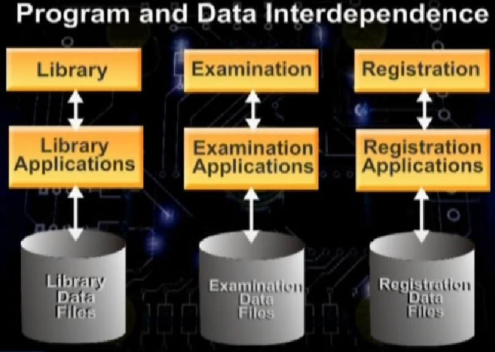
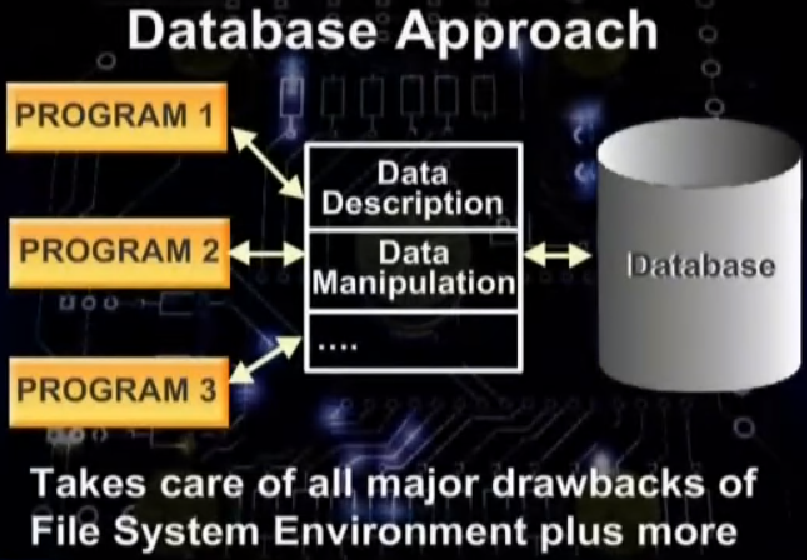
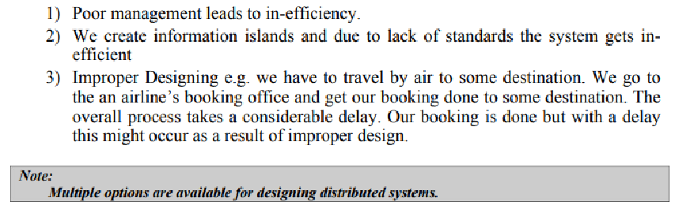
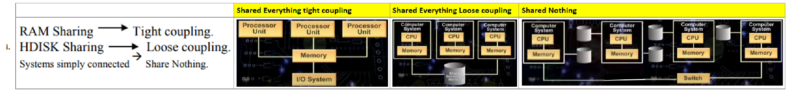
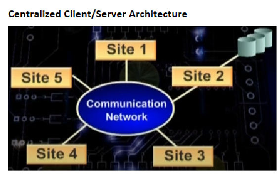
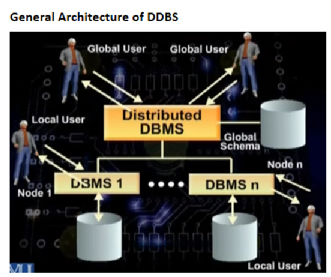
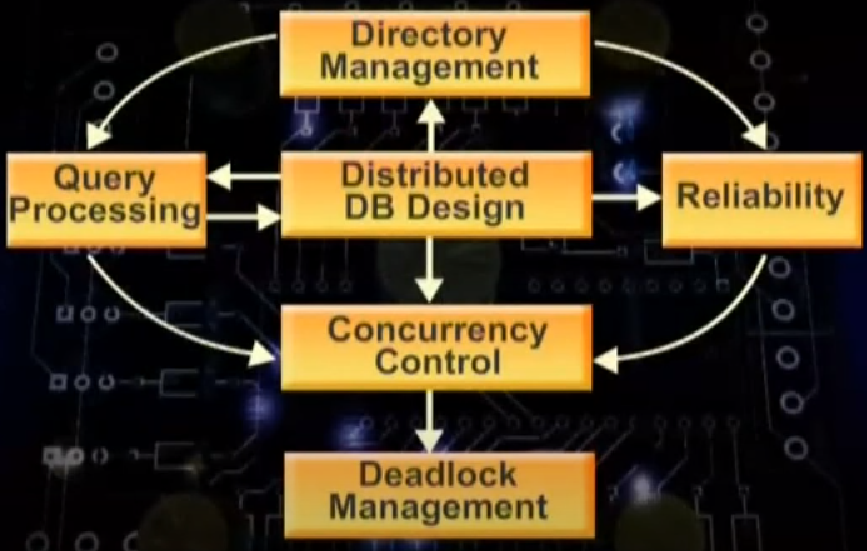
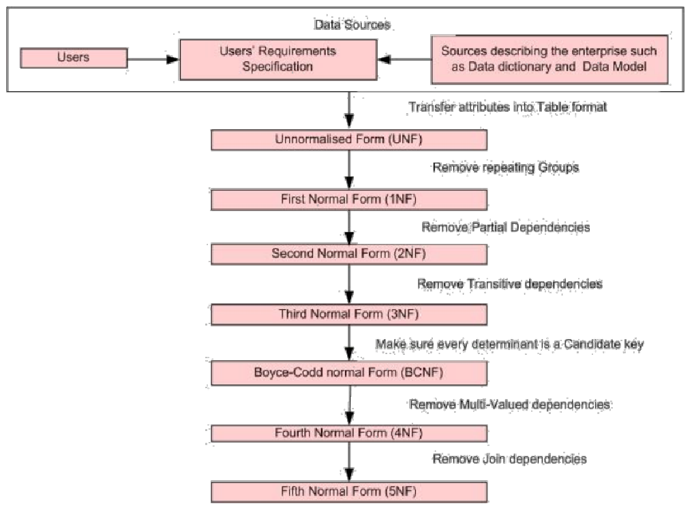

= Distributed Database Management System
:sectnumlevels: 4
:toclevels: 4
:sectnums: 4
:toc: left
:icons: font
:toc-title: DBMS
:doctype: book

== Lecture #1 distributed systems General overview

* *#Introduction#* https://www.youtube.com/watch?v=V7m2AKdASy8&t=240s[4:00]

* It is very important to take a decision that in which environment we must use a distributed database management system.

** These decisions you make early in the development process. It is very difficult to change this later in the development process

* Architecture and design https://www.youtube.com/watch?v=V7m2AKdASy8&t=620s[10:20]

** _**Design strategies**_ for *_##distributed management system##_*

* Technological treatment https://www.youtube.com/watch?v=V7m2AKdASy8&t=820s[13:40]

* Theoretical aspects https://www.youtube.com/watch?v=V7m2AKdASy8&t=890s[14:50]

* Little bit of history https://www.youtube.com/watch?v=V7m2AKdASy8&t=970s[16:10]

** Traditional file processing system

*** The very first form of business data processing
*** Each program contains data description that it manipulates
*** Redundancy of data
*** Problems in maintenance

.program and data interdependence

** Database Approach (definition):  https://www.youtube.com/watch?v=V7m2AKdASy8&t=1320s[22:00] also called centralized database. The database is a shared collection of logically related data.

.database approach

* Distributed computing-system https://www.youtube.com/watch?v=V7m2AKdASy8&t=1435s[23:55]

** A Distributed Computing System can be defined as “A system consisting of a number of autonomous (free) processing elements that are connected through a computer network and that cooperate in performing their assigned task”.

** Three things are important here:

*** *Multiple systems* are involved.
*** These multiple systems are *linked* together through some *network*
*** These multiple systems perform common tasks in which they cooperate with each other.

** The second thing is that *_what is being distributed?_* A few examples are given below: https://www.youtube.com/watch?v=V7m2AKdASy8&t=1680s[28:00]

***  Processing Logic can be distributed
***  We can divide our goal/task into different functions and get them distributed among various systems.
***  *#Data#*
***  Control

* Classification of Distributed Computing Systems: https://www.youtube.com/watch?v=V7m2AKdASy8&t=1930s[32:10]

image::images/image-2023-02-17-14-53-55-527.png[width=650]

Why Distributed Computing Systems: https://www.youtube.com/watch?v=V7m2AKdASy8&t=2250s[*37:30*]

image::images/image-2023-02-17-14-54-52-201.png[width=650]

* Distributed Computing Systems (DCS) *#alerts#* https://www.youtube.com/watch?v=V7m2AKdASy8&t=2460s[41:00]

== Lecture #2

In this lecture:

. Definition of a Distributed Database System (DDBS)
. The candidate applications for a DDBS
. The definition of a Distributed Database Management System (DDBMS)

* https://www.youtube.com/watch?v=Y414VKMj7zQ&t=280s[4:40] (DDS) A collection of logically inter-related databases that are spread physically across multiple locations connected by a data communication link.

* https://www.youtube.com/watch?v=Y414VKMj7zQ&t=700s[11:40] Main characteristics

** Data at multiple site
** Data management at each site independently
** Local requirements
** Global perspective

https://www.youtube.com/watch?v=Y414VKMj7zQ&t=1260s[21:00] where to apply?

* The candidate applications for a DDBS have the following two main characteristics:

** 1- Large number of users
** 2- Users are physically spread across large geographical area

* Example applications: https://www.youtube.com/watch?v=Y414VKMj7zQ&t=1680s[28:00]

** Banking
** Air Ticketing
** Business at multiple locations

* https://www.youtube.com/watch?v=Y414VKMj7zQ&t=2850s[47:30] Distributed Database Management System: A software system that permits the management of distributed database and makes the distribution transparent to the users.

* https://www.youtube.com/watch?v=Y414VKMj7zQ&t=2940s[49:00]  Decentralized database: A collection of Independent databases on non-networked computers. In this environment, the data at multiple computers are related, but these computers are not linked, so whenever data have to be accessed from multiple computers, we need to apply some means of transferring data across these computers.

== Lecture #3

In this lecture: https://www.youtube.com/watch?v=jw9YtW2YSFA&ab_channel=VirtualUniversityofPakistan[https://www.youtube.com/watch?v=jw9YtW2YSFA&ab_channel=VirtualUniversityofPakistan]

Resembling Setups 2:35

* Distributed files: A collection of files stored on differed computers of a network, not a DDBS; Why?

NOTE: *DDBS* is logically related, has common structure among files, and accessed via the same interface.

* Multiprocessor system: Multiple processors that share some common memory.

* Centralized C/S System:

* The Distributed Database System 11:00

* Why to have a DDBS 11:00

** The first *schema* comes into existence, and then a later *database* comes into existence

* Advantages/Promises of DDBS 34:00

** Transparency 35:40

** Data Independence

*** Logical data independence: 39:00
*** Physical data independence:

* *Network transparency: 41:30*

* Replication transparency: 44:30 *Replication and fragmentation* are the two ways to implement a #DDBS#.

** In *replication* same data are stored on multiple sites, example e.g. In case of a bank every branch is holding the data of every other branch. The replication increases the availability of data and reduces the risk of telecom failure. In case of replication, the DDBS hides the replication from the end user, advantage is that the user simply gets the benefits of the system and does not need to know the details or to understand the technical details.

*Fragmentation transparency:* 10:00 A *file* or a *#table#* is broken down into smaller parts/sections called fragments and those fragments are stored at different locations. The fragmentation will be discussed in detail in the later lectures. #However, briefly, a table can be fragmented horizontally (row-wise) or vertically (column-wise). Hence we have two major types of fragmentations, 17#

[arabic]
. *horizontal and*
. *vertical.*

Different fragmentations of a table are placed at different locations. The basic objective of fragmentation and placement at different places is to maximize the local access and to reduce the remote access since the later causes cost and delay. Fragmentation transparency is that a user should not know that the database is fragmented. The concept of fragmentation should be kept hidden from the user.

== Lecture #4

Responsibility of transparency: 19:00

[loweralpha]
. Language/compiler: 19:50
. Operating system: 23:50
. DDBMS 26:40
. Practical Situation: 27:50

Reliability through DDBS 30:00

Performance Improvement: 34:00

[lowerroman]
. Inter-query and intra-query parallelism 35:00

Complicating factors 41:00

[loweralpha]
. Selection of the Copy:
. Failure recovery:
. Complexity:
. Cost
. Distribution of Control:

Problem areas 47:00

[loweralpha]
. Database design
. Query processing
. Concurrency control
. OS Support
. Heterogeneity

.Relationship among various issues of DDBS

The diagram shows that the DDBS design lies at the heart of all issues. It is linked with most of the issues like Directory Management, Reliability etc. It means that the overall performance of a DDBS mainly depends on the database design. If we could do it efficiently, then most of the issues will be working efficiently.

== Lecture #5

In this lecture:

{empty}1. Background topics https://www.youtube.com/watch?v=VkIBwPKkQb0&t=180s[3:00]

{empty}2. Data Models https://www.youtube.com/watch?v=VkIBwPKkQb0&t=360s[6:00]

{empty}3. Relational Data Model

{empty}4. Normalization https://www.youtube.com/watch?v=VkIBwPKkQb0&t=2100s[35:00]

Background topics

[loweralpha]
. Relational Data Model
. Computer networks

Data Models

Record based data model

[lowerroman]
. Network
. Hierarchical and
. Relational Data Models

Semantic data model

[lowerroman]
. Entity-Relationship and
. Object-Oriented data models

Relational Data Model

2-major strengths

[lowerroman]
. Simplicity
. Mathematical foundation

3-components

[lowerroman]
. Structure
. Manipulation language (SQL)
. The support for the integrity constraints:

[width="100%",cols="50%,50%",]
|===
a|
[arabic]
. *Entity* integrity constraint
. *#Referential#* integrity constraint

|Both of these results in the consistency of the database model
|===

*#Normalization#*

Normalization is not essential but recommended, meaning a database which is not normalized will work, but in the future you may have some problems/anomalies  which can be avoided if you do normalization on your database

*4-anomalies*

[arabic]
. Duplication of data
. Insertion anomaly
. Updating anomaly
. Deletion anomaly

*Decomposition (dependency structure)*

*Normalization based on dependencies*

[loweralpha]
. First normal form
. Second normal form
. Third normal form

*Up to BCNF on FDs*

[loweralpha]
. Fourth normal form

*MVD and P-JD*

[loweralpha]
. Fifth normal form

