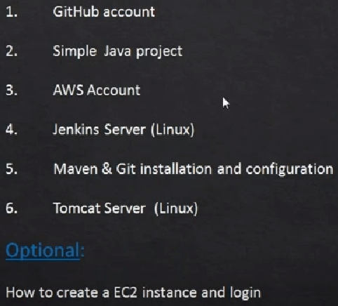

. https://www.youtube.com/watch?v=8D46Pgbz0gg&list=PLxzKY3wu0_FJdJd3IKdiM4Om1hGo2Hsdt&index=2&t=35s&ab_channel=ValaxyTechnologies[Production Ready CI/CD Pipeline Using Jenkins, Ansible, Docker, Kubernetes, etc]

. https://www.youtube.com/watch?v=XZTtTcmPLqU&list=PLxzKY3wu0_FJdJd3IKdiM4Om1hGo2Hsdt&index=2&ab_channel=ValaxyTechnologies[CI/CD setup pre-requisites for Simple pipeline]

.pre-requisites to start with simple  CI/CD

* https://www.youtube.com/watch?v=qpNJeJbVGto&list=PLxzKY3wu0_FJdJd3IKdiM4Om1hGo2Hsdt&index=3&ab_channel=ValaxyTechnologies[How to upload code onto github repository | How to push code from local repo to remote repo]

* https://www.youtube.com/watch?v=uJssXPyMf0s&list=PLxzKY3wu0_FJdJd3IKdiM4Om1hGo2Hsdt&index=4&ab_channel=ValaxyTechnologies[How to Create AWS Free Account]

* https://www.youtube.com/watch?v=YFiwzHyG8Sc&list=PLxzKY3wu0_FJdJd3IKdiM4Om1hGo2Hsdt&index=5&ab_channel=ValaxyTechnologies[Create Linux EC2 instance | AWS EC2 instance | Linux Server]

* https://www.youtube.com/watch?v=jlQ1gDwioCI&list=PLxzKY3wu0_FJdJd3IKdiM4Om1hGo2Hsdt&index=6&ab_channel=ValaxyTechnologies[How to Login to EC2 instance Using without convertion Key with MobaXterm]

* https://www.youtube.com/watch?v=M32O4Yv0ANc&list=PLxzKY3wu0_FJdJd3IKdiM4Om1hGo2Hsdt&index=7&ab_channel=ValaxyTechnologies[Jenkins Installation & Configuration on AWS EC2 instance | Jenkins Installation on AWS EC2]

** use this software https://winscp.net/eng/download.php[*_WinSCP_*] to drag & drop maven files or any other. this software is also has a built-in editor or you can use notepad++ or anyohter as default.

* https://www.youtube.com/watch?v=wgfsVmHnAiM&list=PLxzKY3wu0_FJdJd3IKdiM4Om1hGo2Hsdt&index=8&ab_channel=ValaxyTechnologies[Installing & Configure Maven on AWS EC2 instance | Maven setup & configuration on Jenkins]

* https://www.youtube.com/watch?v=19FmJumnkDc&list=PLxzKY3wu0_FJdJd3IKdiM4Om1hGo2Hsdt&index=9&ab_channel=ValaxyTechnologies[Mini DevOps 03 - Configure Global Jenkins Server Security | Securing Jenkins Server]

* https://www.youtube.com/watch?v=m21nFreFw8A&list=PLxzKY3wu0_FJdJd3IKdiM4Om1hGo2Hsdt&index=10&ab_channel=ValaxyTechnologies[Setup & configure Tomcat on EC2 instance | Tomcat server setup]

* https://www.youtube.com/watch?v=Z9G5stlXoyg&list=PLxzKY3wu0_FJdJd3IKdiM4Om1hGo2Hsdt&index=12&ab_channel=ValaxyTechnologies[Simple DevOps Project-1 | Simple DevOps project for CI/CD | CI/CD through Jenkins]

* []