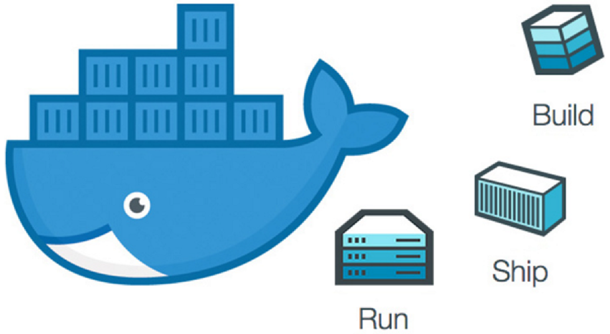
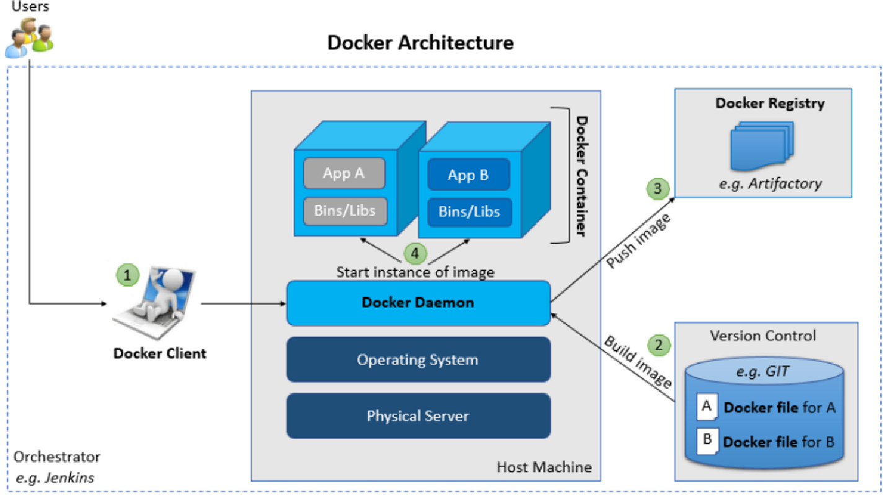
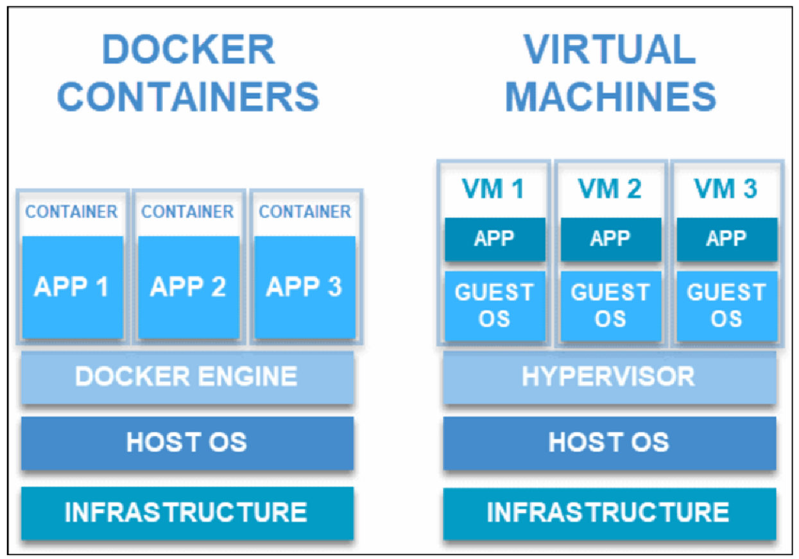
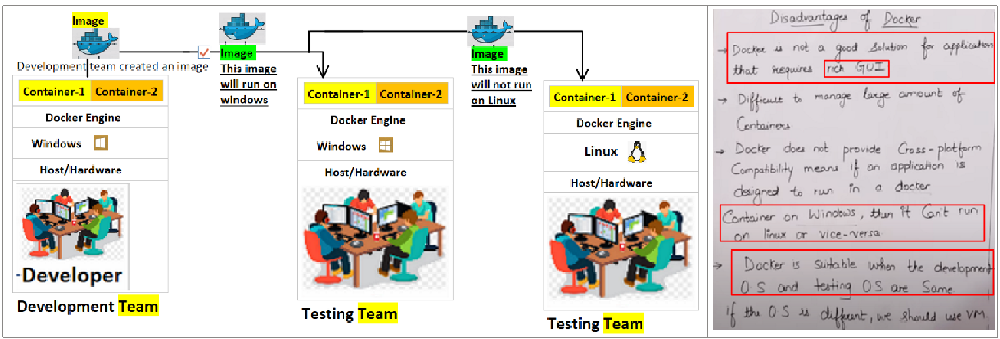

:toc:

= Docker Tutorial for Beginners [FULL COURSE in 3 Hours]

▬▬▬▬▬▬ T I M E S T A M P S ⏰  ▬▬▬▬▬▬

https://www.youtube.com/watch?v=3c-iBn73dDE&t=0s[0:00] - Intro and Course Overview

https://www.youtube.com/watch?v=3c-iBn73dDE&t=118s[01:58] -** What is Docker?**

https://www.youtube.com/watch?v=3c-iBn73dDE&t=656s[10:56] - *What is a Container?*

https://www.youtube.com/watch?v=3c-iBn73dDE&t=1180s[19:40] - *Docker vs Virtual Machine*

https://www.youtube.com/watch?v=3c-iBn73dDE&t=1433s[23:53] - Docker Installation

https://www.youtube.com/watch?v=3c-iBn73dDE&t=2522s[42:02] - *Main Docker Commands*

https://www.youtube.com/watch?v=3c-iBn73dDE&t=3435s[57:15] - Debugging a Container

https://www.youtube.com/watch?v=3c-iBn73dDE&t=3999s[1:06:39] - Demo *_#Project Overview - Docker in Practice#_*

https://www.youtube.com/watch?v=3c-iBn73dDE&t=4208s[1:10:08] - Developing with Containers

https://www.youtube.com/watch?v=3c-iBn73dDE&t=5389s[1:29:49] - Docker Compose - Running multiple services

https://www.youtube.com/watch?v=3c-iBn73dDE&t=6122s[1:42:02] - Dockerfile - Building our own Docker Image

https://www.youtube.com/watch?v=3c-iBn73dDE&t=7476s[2:04:36] - Private Docker Repository - Pushing our built Docker Image into a private Registry on AWS

https://www.youtube.com/watch?v=3c-iBn73dDE&t=8346s[2:19:06] - *Deploy our containerized app*

https://www.youtube.com/watch?v=3c-iBn73dDE&t=8846s[2:27:26] - Docker Volumes - Persist data in Docker

https://www.youtube.com/watch?v=3c-iBn73dDE&t=9183s[2:33:03] - Volumes Demo - Configure persistence for our demo project

https://www.youtube.com/watch?v=3c-iBn73dDE&t=9913s[2:45:13] - Wrap Up

== Why you need containers?

Today’s internet user never accepts downtime. Therefore, developers have to find a method to perform maintenance and update without interrupting their services.

Therefore, containers, which are isolated environments. It includes everything needed for application to run. It makes it easy for a developer to edit and deploy apps. Moreover, containerization has become a preferred method for *packaging, deploying, and update*#** web apps**#.

Docker & cheff both work at the *same level of abstraction,* but they've different *responsibilities*.

.build, ship and run

1. *Docker* image:images/docker.svg[width=40] will create container for you while

2. *Cheff*  will do the *configuration* on that *container*

3. *kubernetes* works at a higher level of abstraction than *Docker* image:images/pod.svg[ width=140]

====
*#Kubernetes#* provide declarative primitives for the *#"desired state"#*

image::images/image-2023-02-02-23-33-52-062.png[width=300,float=right]

. *#Self-healing#* (if you tell I need 3-instances for my "application" it makes sure there are exactly three instances if there is an additional one for some reason, it kills it. If there is one less, it will create one for you)
. *#Auto-restarting#* (automatically restarts a container as well)
. *#Schedule across hosts#* (works across multiple hosts that is you can start up a Kubernetes cluster & run across multiple hosts & it works with multiple VM providers etc. Amazon, Google computer engine VMware, etc.)
. *#Replicating#* (it allows you to replicate those containers as well)
====

.docker architecture

* *Docker client (docker)* is an interface that allows communication between the user and the Docker daemon using REST API (http request).
* *Docker daemon (docker)* is running on host machine handling requests for services, (for example, building and storing images, creating, running and monitoring containers).
* *Docker registry* is backup of Docker container images with public and private access permissions.
* *Docker file* contains instructions to build a Docker image.
* *Docker image* is a read-only template with instructions for creating a Docker container (when the image is built then it is brought to life as a container).
* *Docker container* is running applications. There can be multiple containers running based on the same image. One can *_#create, start, stop, move or delete#_* using Docker API or command line.

It is also important to note that #Docker# uses the below *_#operating system features#_*:

image::images/pod.svg[width=300,float=right]

* *Namespaces* make sure a #*process*# image:images/process.svg[width="40"] running in a *container* cannot see or affect processes running outside the *container*.
* *Control Groups* used for resource accounting and limiting key functionality.
* *UnionFS (FileSystem)* serves as building blocks of containers. It creates layers and enables Docker with lightweight and fast features.

.docker vs virtual machine

== What is Docker and how to Install it | How to start & stop a Container in AWS
1. Docker diff command

2. What is Dockerfile?

3. How to build image from docker file?

4. What are the components of Dockerfile?

5. How to create your own image?

6. What are Docker Volumes

7. How to create volume by https://www.youtube.com/hashtag/dockerfile[#dockerfile] / list / delete volumes

8. How to attach volume to a container

9. How to share volume among containers

how to share host volume to docker volume, Volumes are the preferred mechanism for persisting data generated by and used by Docker containers

== docker port expose

1. Introduction to Docker basics

2. Common Docker Operations & Docker architecture

3. What is Dockerfile?

4. Docker Volumes

5. Breaking the Monolith using Docker

6. What is Docker Compose and Docker hub?

7. what is Docker Containerization & Orchestration?

8. Docker port expose and docker exec

== Top 8 Docker Best Practices for using Docker in Production

.https://www.youtube.com/watch?v=8vXoMqWgbQQ&list=PLy7NrYWoggjwk5fAX1q8gBNYrisYeHRxz&ab_channel=TechWorldwithNana[Top 8 Docker Best Practices for using Docker in Production]

. Use official Docker Images as Base Image whenever available. ✓

* I don't particularly like to use the official images, I prefer to do clean installations from scratch. Three motives:

** no all software provides the -alpine version, so your scripts will depend on whatever distro the vendor chose, in many cases they use old distro versions too

** You may need to install two different software that are distributed on different images. Choosing 1 as base and installing the other with scripts  feels weird

** Many times they are just outdated

. Use specific Image versions.  ✓

. Use small-sized official images *#or#* image based on a leaner and smaller OS distro. ✓

. Optimize caching image layers. *#But#* one thing I would like to add about the caching is that it can sometimes screw over your buiild. It is therefore actually advised by Docker to always test your Dockerfile with the --no-cache flag every once in a while (for example with Github Actions or automatated build testing, a good idea would be to use --no-cache) in case you are for example building external files. In that case, a layer like "git clone ..." can be cached, but if the files in that repository change, it will still use the cached layer because the command did not change. ✓
** Good point! The alternative solution is to use the version references, the same as specifying a docker image tag. For example, when you clone something you should specify a tag or commit hash. Same for installing something with apt or apk, you can specify the version of the package. In this case, you need to manually manage to update all your dependencies, but you have more control over that. If you update something, the command will be changed, and docker will rebuild the cache. That will also avoid situations when something works differently for a few developers because some of them use the old cache, and some of them built their images from scratch.

** One quick note. For Image caching you have to use immuteable tags/layers. Otherwise a for example when a cached latest tag is used and never get updated. To be more precise you can also use the layers/image digest instead of a tag.

** I am surprised that nobody mentioned docker secrets and sensitive data in general; You should NOT run commands that have passwords/api tokens as parameters (as they would show up in the history) and you should also NEVER copy sensitive unnecessary files (e.g. certificates for code signing) into an image during build, as people can revert to that layer and get it out of there; mount a host directory instead and read it from there, this way it never ends up in a layer.

. Order dockerfile commands from least to most frequently changing. ✓

. Use the least privileged user. ✓

. scan your images for vulnerabilities. ✓