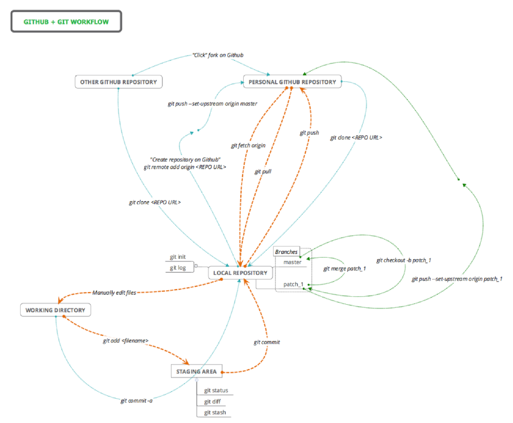
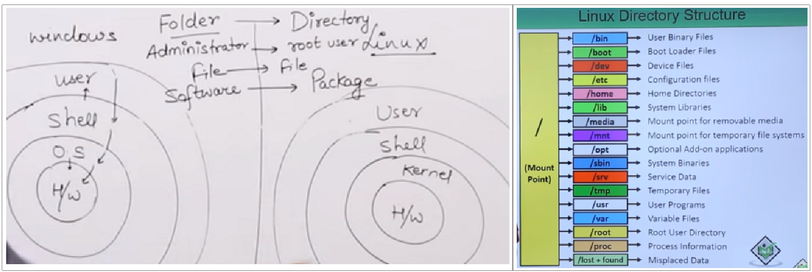
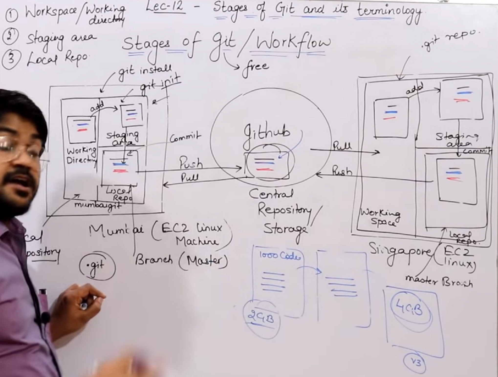
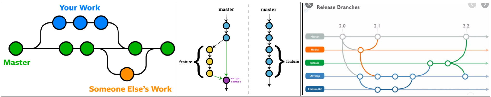
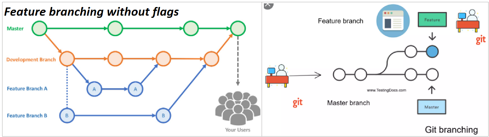
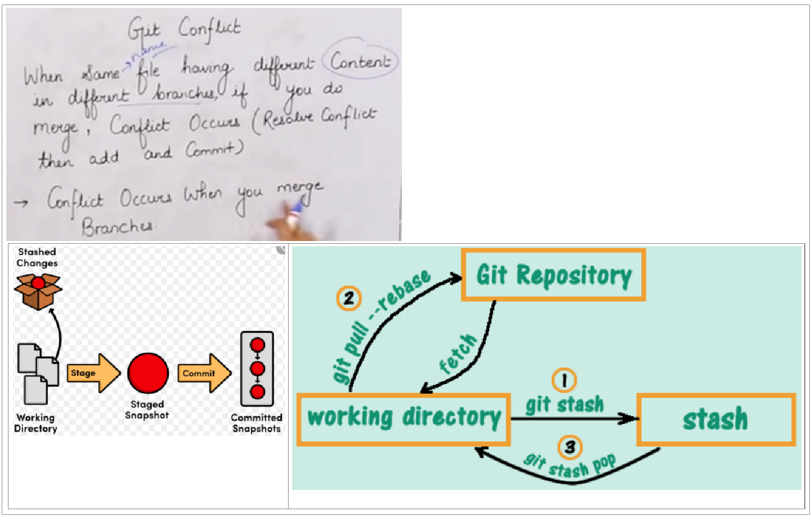
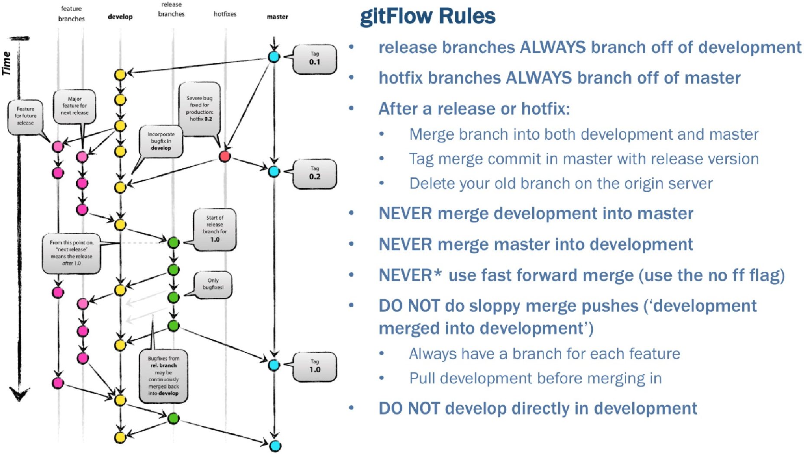

= git
Author Name Mehmood-ur-Rehman
:sectnumlevels: 4
:toclevels: 4
:sectnums: 4
:toc: left
:icons: font
:toc-title: Table of contents

// you can comment the above lines in case you need the clean html output

[[gitops]]
== What is GitOps, How GitOps works and Why it's so useful
+++
<iframe width="560" height="315" src="https://www.youtube.com/embed/f5EpcWp0THw" title="YouTube video player" frameborder="0" allow="accelerometer; autoplay; clipboard-write; encrypted-media; gyroscope; picture-in-picture; web-share" allowfullscreen></iframe>
+++

.basic git commands & workflow

.Windows vs Linux directory structure

.stages of git and its terminology

=== Branch in git

* https://www.youtube.com/watch?v=LPT7v69guVY&ab_channel=AutomationStepbyStep[How To Add Eclipse Project To GitHub | How to Commit, Push, Pull from Eclipse to GitHub]

* https://www.youtube.com/watch?v=eSeSwpUng3E&ab_channel=ELearnTez[Git NonFastForward]

* https://www.youtube.com/watch?v=PUZc-azvqI0&ab_channel=padjisTutorials[Continuous Integration 17 - TDD [dealing with non fast-forward errors with git & eclipse]]

** Before pushing to remote (repository) perform rebase it will bring order in all commits

.git branch

.Feature branching without flags

=== how to create branch, merge & stash

The git stash command *takes your uncommitted changes (both staged and unstaged), saves them away for later use, and then reverts them from your working copy*.

==== git conflict

.git conflict & stash

==== git reset

=== Git flow rules

.Git flow rules

=== Git revert, remove untracked files, what is tag, GitHub clone

