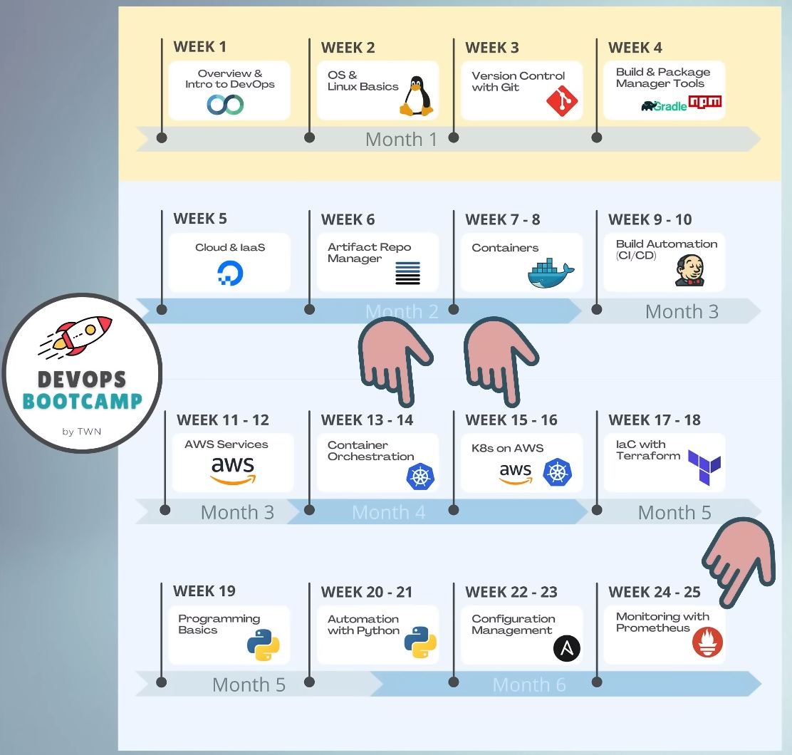

= Kubernetes image:images/kubernetes.svg[width=40] is the O/S  for the Cloud 
Author Name Mehmood-ur-Rehman
:sectnumlevels: 4
:toclevels: 4
:sectnums: 4
:toc: left
:icons: font
:toc-title: Table of contents
:doctype: book

== Devops / Cloud tools and plugins
. kubernetes
* Helm (download)
. kubectl (client)
. go templates
. k9s (interactive command line dashboard) for managing *_kubernetes cluster_*
. Terraform and HCL
* AWS toolkit
* azure
* GCP cloud
. Synk security (check for security in IaC)
. Docker
. git

*Kubernetes* image:images/kubernetes.svg[width=40] is the *O/S*  for the *Cloud* 

.*Platform:* offers 2-things
. Portability
. Extensibility

.Kubernetes: Finally...A True *Cloud Platform*
+++
<iframe width="560" height="315" src="https://www.youtube.com/embed/of45hYbkIZs" title="YouTube video player" frameborder="0" allow="accelerometer; autoplay; clipboard-write; encrypted-media; gyroscope; picture-in-picture; web-share" allowfullscreen></iframe>
+++
[[kuberetes-cloudplatform]]
There's no way to write a *_##single spec or design##_* that goes across different *cloud providers*.*Kubernetes* can help with this if you have design or spec written in kubernetes topology.

▬▬▬▬▬▬ T I M E S T A M P S ⏰ ▬▬▬▬▬▬

https://labs.play-with-k8s.com/[*_Play with Kubernetes ##online## without downloading_*]

https://www.youtube.com/watch?v=X48VuDVv0do&t=0s[0:00] - Course Overview

https://www.youtube.com/watch?v=X48VuDVv0do&t=138s[2:18] - What is K8s

https://www.youtube.com/watch?v=X48VuDVv0do&t=320s[5:20] - Main K8s Components

https://www.youtube.com/watch?v=X48VuDVv0do&t=1349s[22:29] - K8s Architecture

https://www.youtube.com/watch?v=X48VuDVv0do&t=2087s[34:47] - Minikube and kubectl - Local Setup

https://www.youtube.com/watch?v=X48VuDVv0do&t=2692s[44:52] - Main Kubectl Commands - K8s CLI

https://www.youtube.com/watch?v=X48VuDVv0do&t=3723s[1:02:03] - K8s YAML Configuration File

https://www.youtube.com/watch?v=X48VuDVv0do&t=4576s[1:16:16] - Demo Project: MongoDB and MongoExpress

https://www.youtube.com/watch?v=X48VuDVv0do&t=6376s[1:46:16] - Organizing your components with K8s Namespaces

https://www.youtube.com/watch?v=X48VuDVv0do&t=7312s[2:01:52] - K8s Ingress explained

https://www.youtube.com/watch?v=X48VuDVv0do&t=8657s[2:24:17] - Helm - Package Manager

https://www.youtube.com/watch?v=X48VuDVv0do&t=9487s[2:38:07] - *_##Persisting Data in K8s with Volumes##_*

https://www.youtube.com/watch?v=X48VuDVv0do&t=10718s[2:58:38] - _**#Deploying Stateful Apps with StatefulSet#**_

https://www.youtube.com/watch?v=X48VuDVv0do&t=11623s[3:13:43] - K8s Services explained

Kubernetes, also known as K8s, is the most popular platform for container orchestration for automating deployment, scaling, and management of containerized applications.

+++
<iframe width="560" height="315" src="https://www.youtube.com/embed/X48VuDVv0do" title="YouTube video player" frameborder="0" allow="accelerometer; autoplay; clipboard-write; encrypted-media; gyroscope; picture-in-picture; web-share" allowfullscreen ></iframe>
+++

== 🔥 What is Kubernetes image:images/kubernetes.svg[width=40] 🔥

* *#_Kubernetes_# is a container image:images/docker.svg[width=40] orchestration tool, while #_auto-scaling_# (in #_AWS_#) is a tool used for scaling a #_virtual machine _#*. #_Containers_# image:images/docker.svg[width=40] are different from a *virtual machine*, #*_EC2_*# is a *virtual machine* .

** When we needed to scale *application performance,*
what did we use before there was *_eks, AKs and Lambda_*? Well back in the day and
still today it is *_ec2 auto-scaling_* where we took a *_VM_*  and we told *AWS* how many copies of a *VM*  we wanted to run or a threshold for when we needed to deploy additional *VMs (ec2)*  is kind of the *_##old school##_* way of managing *_##capacity in a web application.##_*

*** You have a batch process that needs variable amounts of compute capacity each time it’s run. So, you leverage Lambda, EKS, or another container-based orchestration layer on AWS, right? What if that batch process has to run in a virtual machine instance? Well, there’s EC2 Autoscaling. EC2 Autoscaling is elasticity before we had Kubernetes or Lambda. The concept is a fundament of cloud elasticity.  https://www.youtube.com/watch?v=-HUk1_w6-1k&ab_channel=TheCTOAdvisor[follow the YouTube link]

* *Pods  represent the processes  running on a <<cluster,cluster>>*. By limiting *pods*  to a single *process* , Kubernetes can report on the health of each *process*  running in the <<cluster,*cluster*>>. *Pods*  have: a *unique IP address* (which allows them to *_communicate_* with each other) persistent storage volumes (as required).

* *K8* image:images/kubernetes.svg[width=40] schedules, runs, and <<manages,*manages*>> isolated *containers* image:images/docker.svg[width=40] which are running on *virtual machine*  #or# *phyical machine*  #or# *cloud*  *machine (ec2)*.

.Now we have this smaller *container image* that we can then, *deploy & scale out* into many more *instances*. https://www.youtube.com/watch?v=qasUBr5D9bo[Video on DevOps Process]

=== ► What #*problems*# does Kubernetes image:images/kubernetes.svg[width=40] solve?

* Trend from *monolith* to *microservices*

* Increased usage of *containers* image:images/docker.svg[width=40]

** Demand for a *proper way* of *managing* those hundreds of #containers#

* Open source [.underline]#*container orchestration tool*#

* Developed by *_##Google in "Go" programming language##_*

* Helps you [.underline]#*manage containerized applications*# (docker image) in different [.underline]#*deployment environments*# (GCP, AWS, Azure, Ali baba, Oracle):
** #*Physical machines*# 
** #*Virtual machines*# 
** #*Cloud environments*# 

=== ► What *features/tools* do #"container orchestration tools"# offer?
====

* *#High Availability#* or no downtime
* *#Scalability#* or high performance
** #Horizontal# (increasing *resources: CPU and RAM*) by creating more *pods* 
** #Vertical# (increasing *resources: CPU and RAM*) of existing *pod* 
* *#Disaster recovery#* - backup & restore
====

====
*#Kubernetes#* image:images/kubernetes.svg[width=40] provide declarative primitives for the *#"desired state"#*

image::images/image-2023-02-02-23-33-52-062.png[width=300,float=right]

. *#Self-healing#* (if you tell I need 3-instances for my "application" it makes sure there are exactly three instances if there is an additional one for some reason, it kills it. If there is one less, it will create one for you)
. *#Auto-restarting#* (automatically restarts a container as well)
. *#Schedule across hosts#* (works across multiple hosts that is you can start up a Kubernetes cluster & run across multiple hosts & it works with multiple VM providers etc. Amazon, Google computer engine VMware, etc.)
. *#Replicating#* (it allows you to replicate those containers as well)
====

== 🔥 Main K8s image:images/kubernetes.svg[width=40] Components 🔥

<1>  *Pod*  is #Abstraction# over the *container* image:images/docker.svg[width=40]

<2> Communication through *Service* 

<3> Route traffic into cluster through *ingress* image:images/ingress.svg[width=40]

<4> External configuration
    * #configMap# through *ingress* image:images/ingress.svg[width=40]
* #Secretes# 

<5> *Data persistence* using *#volume#* 

<6> *Pod*  *blueprints* with replica (cloning) mechanism:
    * *Deployment*  
    * *Stateful-Set*  

=== ► *#Node#* & *_Pod_*

* Worker *Node:*  Node (is a #simple server# or *#physical#* 
or *#virtual machine#*  )

* *Pod:* is the smallest unit of Kubernetes

** *Pods  represent the processes  running on a <<cluster,cluster>>*. By limiting *pods*  to a single *process* , Kubernetes can report on the health of each *process*  running in the <<cluster,*cluster*>>. *Pods*  have: a *unique IP address* (which allows them to *_communicate_* with each other) persistent storage volumes (as required).

.pod & container
image::images/pod.svg[width=200,float=right]

** A #"pod"# is basically an *abstraction* over a #"container"#

*** #Pod# is a layer on top of #container#

**** #"*Kubernetes*" image:images/kubernetes.svg[width=40] wants to abstract away the *"container runtime"* or container *_technologies_* (like *docker*) so that you can replace them **(container run-time). **If you want to avoid vendor lock-in.#

**** Usually _##"1-application"##_ *per "#pod#"*

***** Inside one *pod*  you can run more than one *container* image:images/docker.svg[width=40] and those *containers* image:images/docker.svg[width=40] can share the *volume*  with each other, but different *containers* image:images/docker.svg[width=40] running in different *pods*  cannot share the same *volume*  with each other.

**** Each #*pod*# gets its own *_##IP-address##_* (virtual address), or its #"internal IP-address"# meaning it is not exposed to the outer world

***** Two or more different *#pods#* can communicate using there *#IP-address#*

****** *#Pod#* can die/crash (if it happens very often,) then a new pod gets created and a *#"new IP-address"#* is assigned to this newly created pod

******* #IP-address# are *#dynamic#* meaning they keep changing

=== ► Service  & Ingress image:images/ingress.svg[width=40]

* *#Service:#* is also a kind of #IP-address# but it's _**#static/permanent IP-address#**_, service address can be attached to each *#pod#*

** The #lifecycle# of *pod* and *#service#* are not connected if the pod dies the service (address) will stay.

*** Service has two functionalities:

**** Permanent IP (Static address)
**** Load-balancer

* *#Ingress:#* App (our application) should be accessible through the *#browser#*, for this you create:

** *#An external service:#* (the public request *#(http)#* first goes to #"ingress"#, then ingress forwards it to the #"pod"# or (*service-address*)

*** In other words, use *#service#* *(static/permanent)* instead of *#IP-address#* *(dynamic)*

** *#An internal service:#* we do not want our database to be exposed to the outer world, so no direct communication for the databases.

=== ► ConfigMap ( through ingress image:images/ingress.svg[width=40] ) & Secret 

* #*ConfigMap:*# does external configuration of your application

** "Database URL" usually in the *_##built##_* application!

*** In Kubernetes, you connect the "pod" with the "ConfigMap" so that "pod" can read configuration from the outside

**** You can put the database password & user-name in the "ConfigMap" in plain text, but it's insecure, to avoid this we use "Secret"

* #*Secret:*# is just like "ConfigMap" but the difference is it is used to store the secret data (user-name & password) etc.

** The data in secret are stored in a "base64 encoded" format

*** The built-in security mechanism is not enabled by default in Kubernetes

**** Use it (secret & ConfigMap) as an "environment variables" or as a "properties files"

[[cluster]]
.cluster,node, & pod

[[manages]]
.cluster,node, pod, docker, & ec2

== 	The Above mention *#setup#* only gives #RAM, CPU & Networking# but no *#data Storage#*

=== ► *#Volumes#* 

* #*Volumes:*#  is data-storage, it attaches a physical storage to your *"pod"* on the *same/local machine* where your *pod* is located or on a *remote/external machine* meaning outside the *Kubernetes cluster*. e.g. on-premise data-center or another cloud-service

** There is a distinction Kubernetes cluster & all of its components & storage regardless of the storage is local or remote

*** *Kubernetes* does not manages data persistence

=== ► Deployment  & StatefulSet 

* *#Deployment:#,* In order to create replica/clone of pod, you will not create a second pod, but instead you would define a blueprint (like class in OOP) for "my-app pod" and then specify how many replica/clone (like object in OOP) of that pod you would like to run. And deployment is the component of Kubernetes which will help you achieve this goal.

** Blueprint for "my-app pod"

** In practice/real world, you will not create pod instead "you create deployments"

*** Also specify scale-up/down, no. of replicas/clone of pods that you need

** #"Deployment" is another abstraction/layer on top of *"pod"*#

** #*Deployment* can replicate/clone *"compute"* but not *"storage"*#

*#Stateful-Set:#* Databases can't be replicated/cloned or with the help of deployment. Because the database has a state which is its data.

== 🔥 K8s Architecture 🔥
*kuberenetes* works same like *Jenkins* you can add #plugins# to extend its functionality.

.k8s Architecture, this diagram clearly explains which components can communicate with each other.

*Kubelet* does not know about *containers* image:images/docker.svg[width=40] it only creates *pods* . Inside *pod*, we can place container.

.another diagram

.architecture

.architecture

.*Kubernetes Architecture and Components*

Kubernetes has a #*decentralized architecture*# that does not handle tasks *sequentially*. It functions based on a *declarative model* and implements the concept of a ‘*desired state*.’ These steps illustrate the basic Kubernetes process:

. An *#administrator#* creates and places the *#desired state#* of an *#application#* into a *#manifest file#*  like _**.yaml**_ or *_.json_*
. The *file* is provided to the *#Kubernetes API Server#* using a CLI or UI. Kubernetes’ default command-line tool is called *#kubectl#*. In case you need a comprehensive list of kubectl commands, check out our https://phoenixnap.com/kb/kubectl-commands-cheat-sheet[Kubectl Cheat Sheet].
. Kubernetes stores the *#file#* (an application’s desired state) in a *#database#* called the *#Key-Value Store (etcd)#*.
. *Kubernetes* then #implements# the *#desired state#* on all the relevant #applications# within the *#cluster#*.

. https://phoenixnap.com/kb/prometheus-kubernetes-monitoring[Kubernetes continuously monitors the elements of the cluster] to make sure the *#current state#* of the *application* does not vary from the desired**## state##**.

.container vs image vs pod vs manifest-file
image::images/container-image-pod-manifest.svg[]

=== ► Worker Nodes 
* *Worker nodes* are the main components of a Kubernetes cluster that run containerized applications.
* They communicate with the master node to receive instructions and report their status.
* Worker nodes have the necessary components to run pods and containers, including the *#container runtime, kubelet, and kube-proxy.#*

=== ► Master Nodes 
* *Master nodes* are responsible for managing the state of the cluster, including scheduling, scaling, and managing the desired state of the cluster.
* They also act as a control plane, coordinating the work of worker nodes and ensuring the desired state is maintained.
* Components that run on the master node include the *#API server, scheduler, controller manager, and etcd#*.

=== ► API Server 
* The *API server* is the central management component of a Kubernetes cluster.
* It is responsible for exposing the Kubernetes API, which provides the interface for interacting with the cluster.
* The API server processes RESTful API requests and communicates with other components of the cluster to perform actions such as scaling or deploying applications.

=== ► Scheduler 
* The *scheduler* is responsible for scheduling pods on worker nodes.
* It receives requests from the API server and uses various algorithms and policies to determine the best node for each pod.
* The scheduler is responsible
for ensuring that the desired state of the cluster is maintained by assigning pods to nodes as needed.

=== ► Controller Manager 
* The *controller manager* is responsible for managing the *state* of the cluster.
* It watches for changes in the cluster and takes actions to reconcile the _*desired state*_ with the _*actual state*_.
* The controller manager performs tasks such as responding to node failures, adjusting the number of replicas of a deployment, or recovering from failures.

=== ► etcd  the cluster brain
* *etcd* is a distributed key-value store that acts as the "brain" of the Kubernetes cluster.
* It stores the configuration data for the cluster, including the desired state and current state of the cluster.
* etcd is critical to the operation of the cluster and must be highly available to ensure the cluster remains ehealthy.

== 🔥 Minikube and kubectl - Local Setup 🔥

=== ► What is minikube?
Minikube is a tool that makes it easy to run a single-node Kubernetes cluster locally. It is designed for developers and DevOps engineers who want to test their applications and workflows in a local environment before deploying them to a larger cluster.

=== ► What is kubectl?

.How to set up *_kubectl client_* on *_##IntelliJ IDEA##_*
+++
<iframe width="560" height="315" src="https://www.youtube.com/embed/G9MmLUsBd3g" title="YouTube video player" frameborder="0" allow="accelerometer; autoplay; clipboard-write; encrypted-media; gyroscope; picture-in-picture; web-share" allowfullscreen></iframe>
+++

*kubectl* is a command-line tool that allows you to manage your *_##Kubernetes cluster##_*. It allows you to interact with your cluster and deploy, inspect, and manage various components, such as pods, services, and configmaps.

.How to set up *_helm_* on *_##IntelliJ IDEA##_*
+++
<iframe width="560" height="315" src="https://www.youtube.com/embed/ZKAlKoqlWac" title="YouTube video player" frameborder="0" allow="accelerometer; autoplay; clipboard-write; encrypted-media; gyroscope; picture-in-picture; web-share" allowfullscreen></iframe>
+++

=== ► install minikube and kubectl
Installing minikube and kubectl is a straightforward process. You can follow the official installation guide on the Kubernetes website. It provides step-by-step instructions for installing minikube and kubectl on various platforms, such as Windows, macOS, and Linux.

=== ► create and start a minikube cluster
To create and start a minikube cluster, you need to run a few commands in your terminal. First, you need to start minikube using the minikube start command. Then, you can use kubectl to interact with your cluster and deploy your applications. Minikube provides an easy-to-use environment for testing and experimenting with Kubernetes.

== Summary:

* A *Container* image:images/docker.svg[width=40] helps an organization to perform maintenance and update without interrupting services
* Kubernetes is an example of a container management system developed in the Google platform.
* The biggest advantage of using Kubernetes is that it can run on-premises OpenStack, public clouds Google, Azure, AWS, etc.
* Kubernetes offers automated Scheduling and Self-Healing Capabilities.
* Cluster, master, node, and namespace are important basics of kubernetes
* Master node and work nodes are important components of Kubernetes architecture.
* Replication Controllers, Replication sets, Deployments, Stateful Sets, Daemon Sets are other important terms used in Kubernetes.
* Docker swarm does not allow auto-scaling while Kubernetes allows auto-scaling.
* The biggest drawback of Kubernetes is that it’s dashboard is not very useful and effective

== Kubernetes Security Best Practices you need to know | THE Guide for securing your K8s cluster!

https://www.youtube.com/watch?v=oBf5lrmquYI&list=PLy7NrYWoggjwk5fAX1q8gBNYrisYeHRxz&index=3&ab_channel=TechWorldwithNana[Kubernetes Security Best Practices you need to know | THE Guide for securing your K8s cluster!]

. Image scanning
. run container as non-root
. users and permissions
** RBAC = Role Based Access Control, k8 resources that allows you to *regulate access based on roles*.

. Use network policies
* Use define communication rules between pods.
. encrypt communication between pods, by default it is unencrypted.
. secure secret (credentials) data

. secure etcd
. backup and restore
* automated backup and restore.

. configure security policies

. disaster recovery

These practices are related to the operations, that's the reason why:

*#DevOps#*--to-> *#DevSecOps#*

.Pdd lifecycle

.container lifecycle

.process lifecycle

.<<kuberetes-cloudplatform,*Design ★★★ Any Architecture In Kubernetes*>>  image:images/kubernetes.svg[width=40]
+++
<iframe width="560" height="315" src="https://www.youtube.com/embed/S7xAwouFjZE" title="YouTube video player" frameborder="0" allow="accelerometer; autoplay; clipboard-write; encrypted-media; gyroscope; picture-in-picture; web-share" allowfullscreen></iframe>
+++

.Kubernetes cheat-sheet
image::images/kubernetes-cheatsheet.svg[]

These are some main components and services in Kubernetes, but there are many more *features and add-ons* that can be used to *extend and customize the Kubernetes platform* to meet the needs of *specific use cases*.

