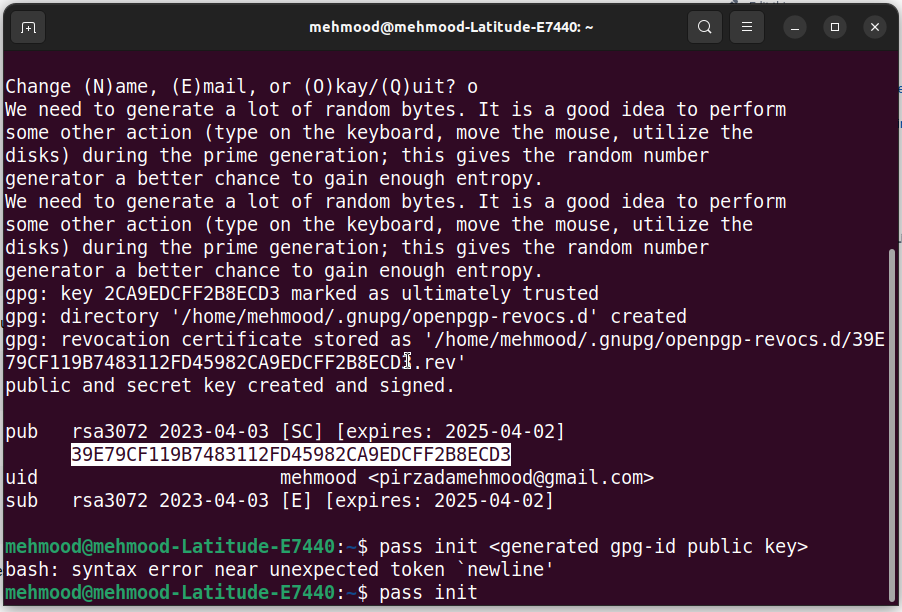

= What are the 3 Linux distributions?

There are three main “*families*” of _**Linux distributions**_: #Debian, Red Hat, and SUSE#. Most other Linux distributions use one of these three distributions as their foundation.

.How to install Docker-desktop on Ubuntu-22.0 LTS release

. https://www.youtube.com/watch?v=Vplj9b0L_1Y&ab_channel=Abstractprogrammer[Youtube Video link]
. https://docs.docker.com/engine/install/ubuntu/[*Download and install docker-engine*]
. https://docs.docker.com/desktop/install/linux-install/[*Now, install docker-desktop on the Linux machine*]
** https://docs.docker.com/desktop/get-started/#credentials-management-for-linux-users[Sign-in in the Docker-desktop]

.Sign-in in the Docker-desktop

.this highlighted key is different each time you sign in, and has to be passed in along with the command as shown in the terminal
