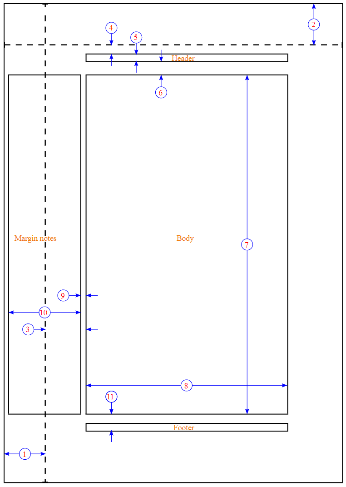

# Page Layout

LaTeX and the document class will normally take care of page layout issues for you. For submission to an academic publication, this entire topic will be out of your hands, as the publishers want to control the presentation. However, for your own documents, there are some obvious settings that you may wish to change: margins, page orientation and columns, to name but three. The purpose of this tutorial is to show you how to configure your pages.

We will often have to deal with TeX lengths in this chapter. You should have a look at Lengths for comprehensive details on the topic.

## Two-sided documents

Documents can be either one- or two-sided. Articles are by default one-sided, books are two-sided. Two-sided documents differentiate the left **(even)** and right **(odd)** pages, whereas one-sided do not. The most notable effect can be seen in page margins. If you want to make the article class two-sided, use `\documentclass[twoside]{article}.`

Many commands and variables in LaTeX take this concept into account. They are referred to as even and odd. For one-sided document, only the odd commands and variables will be in effect.
## [Page dimensions](https://en.wikibooks.org/w/index.php?title=LaTeX/Print_version&printable=yes)

A page in LaTeX is defined by many internal parameters. Each parameter corresponds to the length of an element of the
page, for example, \paperheight is the physical height of the page. Here you can see a diagram showing all the variables
defining the page. All sizes are given in TeX points (pt), there are 72.27pt in an inch or 1pt ≈ 0.3515mm.

The current details plus the layout shape can be printed from a LaTeX document itself. Use the layout package and the
command of the same name: `\usepackage{layout} ... \layout{}`

To render a frame marking the margins of a document you are currently working on,
add `\usepackage{showframe}` to the document.

1. one inch + `\hoffset`
2. one inch + `\voffset`
3. `\oddsidemargin = 31pt`
4. `\topmargin = 20pt`
5. `\headheight = 12pt`
6. `\headsep = 25pt`
7. `\textheight = 592pt`
8. `\textwidth = 390pt`
9. `\marginparsep = 10pt`
10. `\marginparwidth = 35pt`
11. `\footskip = 30pt`

* `\marginparsep = 10pt`
* `\marginparwidth = 35pt`
* `\footskip = 30pt`

##   Page size

It will not have been immediately obvious - because it doesn't really cause any serious problems - that the default page size for all standard document classes is US letter. This is shorter by 18 mm (about 3/4 inch), and slightly wider by 8 mm (about 1/4 inch), compared to A4 (which is the standard in almost all the rest of the world). While this is not a serious issue (most printers will print the document without any problems), it is possible to specify alternative sizes as class option. For A4 format:

`\documentclass[a4paper]{article}`