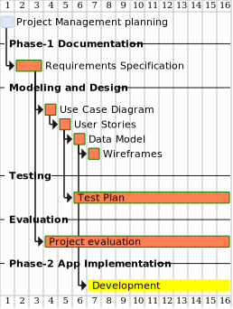

= Privacy Preferences for Electronic Medical Records
Firstname Lastname <author@asciidoctor.org>
3.0, July 29, 2022: AsciiDoc article template
:toc:
:doctype: report
:icons: font
:url-quickref: https://docs.asciidoctor.org/asciidoc/latest/syntax-quick-reference/

== Abstract
This document is the requirements definition of a *_Privacy Preferences for an Electronic Medical Records_* system. The document states the goal and objectives of the system, defines the scope of the system, and analyzed the target user types and their characteristics of digital literacy. It defines the functional requirements for each user type.

== Project Planing
Project management planning involves defining the project's goals, determining the work required to achieve those goals, and creating a plan for completing the work. The requirements specification is an important part of the planning process, as it outlines the specific needs and expectations for the project. It should include details on the project's scope, budget, timeline, and deliverables, as well as any constraints or assumptions that will impact the project. Properly defining these requirements is critical to the success of the project, as it helps to ensure that all stakeholders are aligned and that the project stays on track.

.Gantt chart shows the project plan for the (*PPEMR*)

== Introduction

*_Privacy Preferences for Electronic Medical Records_* (PPEMR) will allow Patients, Doctors, and Healthcare Administrators to access a medical record database. The system will allow Patients to enter decisions about their identifiable data being used for service planning and evaluation, and whether they consent to be contacted for participation in a research study. If they do consent, they will be able to select which organizations they would like to donate their data to for research purposes. The system will also provide basic query facilities for these data, and enable Doctors and Healthcare Administrators to view the Patient's decisions and information, but not to change them.

This document is the requirements definition of *_Privacy Preferences for Electronic Medical Records_*. The document states the goal and objectives of the system, defines the scope of the system, and analyzed the target user types and their characteristics of digital literacy. It defines the functional requirements of the *_Privacy Preferences for Electronic Medical Records_* (for each user type).

=== Proposed PPEMR.footnote:[PPEMR stands for *Privacy Preferences for Electronic Medical Records*]
The proposed application will provide a password-protected login for patients, doctors, and healthcare administrators, enabling patients to enter decisions about the use of their identifiable data for service planning and evaluation, and to consent or decline participation in research studies. If a patient consents to be contacted for a research study, they will be presented with various sharing options and will have the ability to specify which research organizations they are willing to donate their data to. The application will also provide basic query facilities for the recorded data and allow doctors and healthcare administrators to view the decisions and information entered by patients, but not to change them.

The project aims to create a web browser application that allows for the [.underline]#_Privacy Preferences for Electronic Medical Record_# in an automated manner. In order to accomplish this goal, the following objectives must be met by the system:

1. The system must allow the healthcare administrators, doctors & patients to log in to the application with a password.
3. The system must allow the Patient to enter a decision about whether their identifiable data to be used for service planning and evaluation.
4. The system must allow the Patient's Electronic Medical Record to store the patient's decision about the use of their identifiable data.
5. The system must allow the Patient to enter a decision about whether they consent to be contacted for possible participation in a research study.
6. The system must allow the query facilities for the patient to access information in their electronic medical record.
7. The system must allow the doctors to view the decisions and information entered by the Patient
8. The system must allow the healthcare administrators to view the decisions and information entered by the patient

== Use Case Diagram

.use case diagram
image::images/PPEMR use case diagram.svg[]

== Data Model

The data model will live here

====
.Types of Targeted Users
****
The main types of users of the system will be:

1.	*Patient:* anyone who is seeking medical care and has a password-protected login in a system that includes electronic medical records. He is able to make decisions about the use of his identifiable data for service planning and evaluation, and  can also consent or decline to be contacted for possible participation in research studies. If he does, consent, he has the option to choose which organizations they would be willing to donate their data to for research purposes.
2.	*Doctor:* is involved in the use of electronic medical records and  have access to information about a patient's decisions regarding the use of their identifiable data for service planning and evaluation, as well as their consent for possible participation in research studies. He also has the ability to view information that has been entered by a patient in their electronic medical record, but cannot change it.

3.	*Healthcare administers:* a professional who has a password-protected login in a system that includes electronic medical records. He has the ability to view the decisions and information entered by patients in their electronic medical records, but cannot change them. It is not clear from the text what the specific responsibilities or duties of the healthcare administrator are, but they may be involved in managing the use and access of patient data for service planning and evaluation, as well as for research purposes.

4. *Patient's Electronic Medical Record*: a databse server which stores the patient's decision about the use of their identifiable data.
****
====

== User Stories

Here are the user stories that had identified from the problem statement:

1. As a *patient*, I *want* to be able to log in to the application with a password *so that* I can access my electronic medical record.

2. As a *patient*, I *want* to be able to enter a decision about whether my identifiable data can be used for service planning and evaluation *so that* my preferences are recorded in my electronic medical record.
3. As a *patient*, I *want* to be able to enter a decision about whether I consent to be contacted for possible participation in a research study *so that* my preferences are recorded in my electronic medical record.
4. As a *patient*, I *want* to be able to see a screen with various sharing options if I consent to be contacted for a research study *so that* I can choose how my data will be shared.
5. As a *patient*, I *want* to be able to enter the names and types of research organizations to that I am willing to donate my identifiable data to *so that* my preferences are recorded in my electronic medical record.
6. As a *patient*, I *want* to be able to *use* basic query facilities to access information in my electronic medical record.
7. As a *doctor* or *healthcare administrator*, I *want* to be able to view the decisions and information entered by patients, but not be able to change them.

== Test Plan

=== Test Script for User Story 1:
==== User Instructions:
1. Open the application and navigate to the login page.
2. Enter your username and password.
3. Click the login button.

==== Expected Outcomes:
• The application should allow the user to log in successfully with a valid username and password.
• The application should display an error message if an invalid username or password is entered.

=== Test Script for User Story 2:
==== User Instructions:
1. Log in to the application with your username and password.
2. Navigate to the page where you can enter a decision about whether your identifiable data can be used for service planning and evaluation.
3. Select either "Yes" or "No" to indicate your decision.
4. Click the submit button.

==== Expected Outcomes:
• The application should record the user's decision in their electronic medical record.
• The application should display a confirmation message indicating that the decision has been saved.

=== Test Script for User Story 3:
==== User Instructions:
1. Log in to the application with your username and password.
2. Navigate to the page where you can enter a decision about whether you consent to be contacted for possible participation in a research study.
3. Select either "Yes" or "No" to indicate your decision.
4. Click the submit button.

==== Expected Outcomes:
• The application should record the user's decision in their electronic medical record.
• If the user selects "Yes," the application should display a screen with various sharing options.
• The application should display a confirmation message indicating that the decision has been saved.

=== Test Script for User Story 4:
==== User Instructions:
1. Log in to the application with your username and password.
2. Navigate to the page where you can enter a decision about whether you consent to be contacted for possible participation in a research study.
3. Select "Yes" to indicate that you consent to be contacted.
4. Click the submit button.

==== Expected Outcomes:
• The application should display a screen with various sharing options.
• The user should be able to select from the available sharing options.

=== Test Script for User Story 5:
==== User Instructions:
1. Log in to the application with your username and password.
2. Navigate to the page where you can enter the names and types of research organizations that you are willing to donate your identifiable data to.
3. Enter the name of a research organization in the provided field.
4. Select the type of organization from the dropdown menu.
5. Click the submit button.

==== Expected Outcomes:
• The application should record the user's selection in their electronic medical record.
• The application should display a confirmation message indicating that the selection has been saved.

=== Test Script for User Story 6:
==== User Instructions:
1. Log in to the application with your username and password.
2. Navigate to the page where you can access basic query facilities for your electronic medical record.
3. Enter a search query in the provided field.
4. Click the search button.

==== Expected Outcomes:
• The application should return the relevant information from the user's electronic medical record.
• The application should display an error message if no results are found for the search query.

=== Test Script for User Story 7:
==== User Instructions:
1. Log in to the application with your username and password as a doctor or healthcare administrator.
2. Navigate to the page where you can view the decisions and information entered by patients.

== Project Evaluation

still need to be completed.
