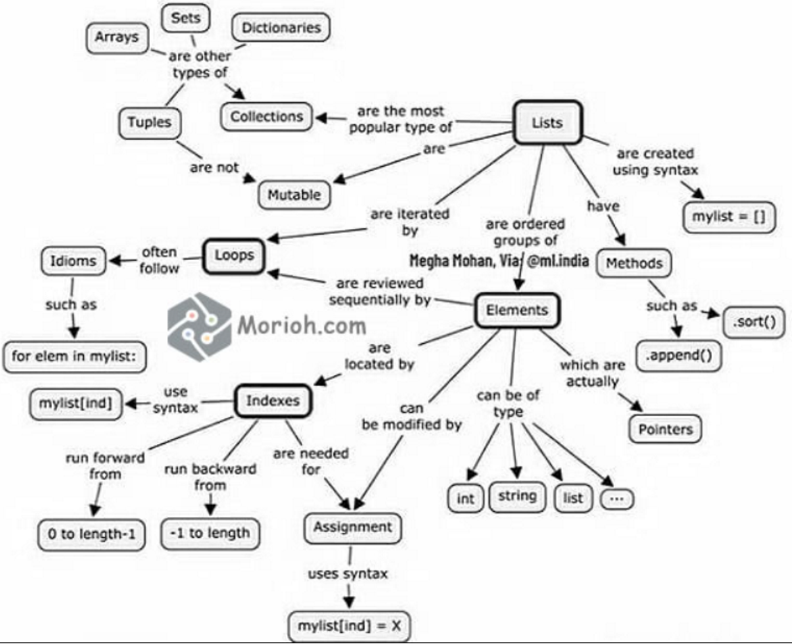

= python

. Python https://www.python.org/downloads/[https://www.python.org/downloads/]

. The Python Standard Library https://docs.python.org/3/library/index.html#the-python-standard-library[https://docs.python.org/3/library/index.html]

. This link is like *_##maven.org (.jars)##_* for the #python# https://pypi.org/[https://pypi.org/]

== Cheat Sheet for all the data-structures in python!

.Cheat Sheet for all the data-structures in python

TABLE OF CONTENT

https://www.youtube.com/watch?v=_uQrJ0TkZlc&t=0s[00:00:00] Introduction

https://www.youtube.com/watch?v=_uQrJ0TkZlc&t=109s[00:01:49] Installing Python 3

https://www.youtube.com/watch?v=_uQrJ0TkZlc&t=370s[00:06:10] Your First Python Program

https://www.youtube.com/watch?v=_uQrJ0TkZlc&t=491s[00:08:11] How Python Code Gets Executed

https://www.youtube.com/watch?v=_uQrJ0TkZlc&t=684s[00:11:24] How Long It Takes To Learn Python

https://www.youtube.com/watch?v=_uQrJ0TkZlc&t=783s[00:13:03] Variables

https://www.youtube.com/watch?v=_uQrJ0TkZlc&t=1101s[00:18:21] Receiving Input

https://www.youtube.com/watch?v=_uQrJ0TkZlc&t=1336s[00:22:16] Python Cheat Sheet

https://www.youtube.com/watch?v=_uQrJ0TkZlc&t=1366s[00:22:46] Type Conversion

https://www.youtube.com/watch?v=_uQrJ0TkZlc&t=1771s[00:29:31] Strings

https://www.youtube.com/watch?v=_uQrJ0TkZlc&t=2256s[00:37:36] Formatted Strings

https://www.youtube.com/watch?v=_uQrJ0TkZlc&t=2450s[00:40:50] String Methods

https://www.youtube.com/watch?v=_uQrJ0TkZlc&t=2913s[00:48:33] Arithmetic Operations

https://www.youtube.com/watch?v=_uQrJ0TkZlc&t=3093s[00:51:33] Operator Precedence

https://www.youtube.com/watch?v=_uQrJ0TkZlc&t=3304s[00:55:04] Math Functions

https://www.youtube.com/watch?v=_uQrJ0TkZlc&t=3497s[00:58:17] If Statements

https://www.youtube.com/watch?v=_uQrJ0TkZlc&t=3992s[01:06:32] Logical Operators

https://www.youtube.com/watch?v=_uQrJ0TkZlc&t=4285s[01:11:25] Comparison Operators

https://www.youtube.com/watch?v=_uQrJ0TkZlc&t=4577s[01:16:17] Weight Converter Program

https://www.youtube.com/watch?v=_uQrJ0TkZlc&t=4843s[01:20:43] While Loops

https://www.youtube.com/watch?v=_uQrJ0TkZlc&t=5047s[01:24:07] Building a Guessing Game

https://www.youtube.com/watch?v=_uQrJ0TkZlc&t=5451s[01:30:51] Building the Car Game

https://www.youtube.com/watch?v=_uQrJ0TkZlc&t=6108s[01:41:48] For Loops

https://www.youtube.com/watch?v=_uQrJ0TkZlc&t=6466s[01:47:46] Nested Loops

https://www.youtube.com/watch?v=_uQrJ0TkZlc&t=6950s[01:55:50] Lists

https://www.youtube.com/watch?v=_uQrJ0TkZlc&t=7305s[02:01:45] 2D Lists

https://www.youtube.com/watch?v=_uQrJ0TkZlc&t=7511s[02:05:11] My Complete Python Course

https://www.youtube.com/watch?v=_uQrJ0TkZlc&t=7560s[02:06:00] List Methods

https://www.youtube.com/watch?v=_uQrJ0TkZlc&t=8005s[02:13:25] Tuples

https://www.youtube.com/watch?v=_uQrJ0TkZlc&t=8134s[02:15:34] Unpacking

https://www.youtube.com/watch?v=_uQrJ0TkZlc&t=8301s[02:18:21] Dictionaries

https://www.youtube.com/watch?v=_uQrJ0TkZlc&t=8781s[02:26:21] Emoji Converter

https://www.youtube.com/watch?v=_uQrJ0TkZlc&t=9031s[02:30:31] Functions

https://www.youtube.com/watch?v=_uQrJ0TkZlc&t=9321s[02:35:21] Parameters

https://www.youtube.com/watch?v=_uQrJ0TkZlc&t=9564s[02:39:24] Keyword Arguments

https://www.youtube.com/watch?v=_uQrJ0TkZlc&t=9885s[02:44:45] Return Statement

https://www.youtube.com/watch?v=_uQrJ0TkZlc&t=10135s[02:48:55] Creating a Reusable Function

https://www.youtube.com/watch?v=_uQrJ0TkZlc&t=10422s[02:53:42] Exceptions

https://www.youtube.com/watch?v=_uQrJ0TkZlc&t=10754s[02:59:14] Comments

https://www.youtube.com/watch?v=_uQrJ0TkZlc&t=10906s[03:01:46] Classes

https://www.youtube.com/watch?v=_uQrJ0TkZlc&t=11266s[03:07:46] Constructors

https://www.youtube.com/watch?v=_uQrJ0TkZlc&t=11681s[03:14:41] Inheritance

https://www.youtube.com/watch?v=_uQrJ0TkZlc&t=11973s[03:19:33] Modules

https://www.youtube.com/watch?v=_uQrJ0TkZlc&t=12612s[03:30:12] Packages

https://www.youtube.com/watch?v=_uQrJ0TkZlc&t=12982s[03:36:22] Generating Random Values

https://www.youtube.com/watch?v=_uQrJ0TkZlc&t=13477s[03:44:37] Working with Directories

https://www.youtube.com/watch?v=_uQrJ0TkZlc&t=13847s[03:50:47] Pypi and Pip

https://www.youtube.com/watch?v=_uQrJ0TkZlc&t=14134s[03:55:34] Project 1: Automation with Python

https://www.youtube.com/watch?v=_uQrJ0TkZlc&t=15022s[04:10:22] Project 2: Machine Learning with Python

