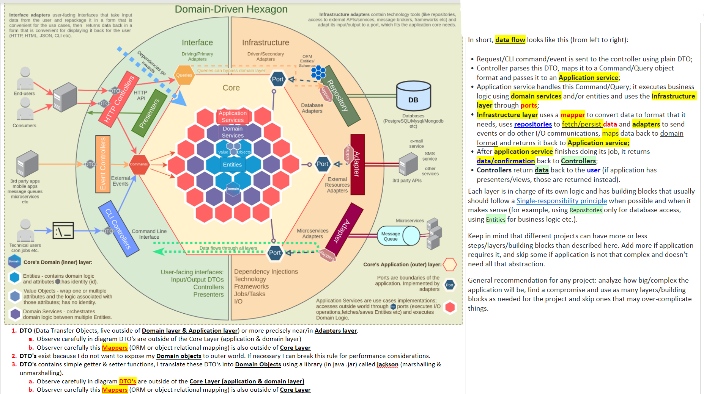
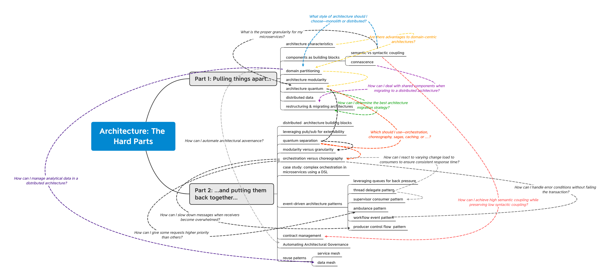
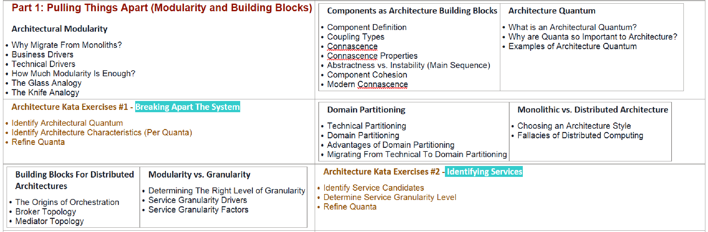

= How to check Onion, Hexagonal, ports & adapter, Clean architecture violations in source code
Author Name Mehmood-ur-Rehman
:sectnumlevels: 4
:toclevels: 4
:sectnums: 4
:toc: left
:icons: font
:toc-title: Table of contents
:doctype: article

One of the things I'm currently doing with a number of software teams is teaching them how to draw pictures. As an industry, we've got really good at visualizing the way that we work using things like Kanban boards and story walls, but we've forgotten how to visualize the software that we're building.

* In a nutshell, many teams are trying to move fast, but they struggle to create a shared vision that the whole team can work from, which ultimately slows them down. And few people use #*UML*# nowadays, which just exaggerates **بڑھا چڑھا کر پیش کرنا **the problem.

** *Mehmood-ur-Rahman:* I've worked on such a project (Where I was hired to document s/w architecture as in the beginning the original team did not document any part of the software & gradually software had become big. Whenever, a new team member joined, he took more time to understand the software. Both Zaid Iqbal and especially Ishtaiq mehmood said our s/w has become very big, and we need someone who can document our s/w architecture so when new people join, they can start easily & can start adding value fast).

=== Cons:

. This is a *#_sophisticated architecture_#* which requires a firm understanding of quality software principles, such as *_##SOLID, Clean/Hexagonal Architecture, Domain-Driven Design, etc.##_* Any team implementing such a solution will almost certainly require an expert to drive the solution and keep it from evolving the wrong way and accumulating technical debt.

. Some practices presented here are not recommended for *small-medium* sized applications with not a lot of business logic. *_##There is added up-front complexity to support all those building blocks and layers, boilerplate code, abstractions, data mapping etc. thus implementing a complete architecture like this is generally ill-suited to simple https://en.wikipedia.org/wiki/Create,_read,_update_and_delete[CRUD] applications and could over-complicate such solutions.##_* [.underline]#_Some described below principles can be used in smaller-sized applications but must be implemented only after analyzing and understanding all pros and cons._#

link:Architecture_and_Design.docx[*_Architecture and Design_*] complete discussion of Onion, Hexagonal, Clean architecture, ports and adapters

== Application layer

=== Application Services

Are also called**## "Workflow Services", "Use Cases", "Interactors" etc.##** These services orchestrate the steps required to fulfill the commands imposed by the client.

* Typically, used to orchestrate how the outside world interacts with your application and performs tasks required by the end users.
* Contain no domain-specific business logic;
* Operate on scalar types, transforming them into Domain types. A scalar type can be considered any type that's unknown to the Domain Model. This includes primitive types and types that don't belong to the Domain.
* Application services declare dependencies on infrastructural services required to execute domain logic (by using ports).
* Are used in order to fetch domain Entities (or anything else) from database/outside world through ports;
* Execute other out-of-process communications through Ports (like event emits, sending emails etc);
* In case of interacting with one Entity/Aggregate, executes its methods directly;
* In case of working with multiple Entities/Aggregates, uses a Domain Service to orchestrate them;
* Are basically a Command/Query handlers;
* Should not depend on other application services since it may cause problems (like cyclic dependencies);

*_##One [.underline]#service# per [.underline]#use case# is considered good practice.##_*

== Interfaces for each use case

Some people prefer having an interface for each use case (Driving Port), which Application Service implements and a Controller depends on. This is a viable option, but this project doesn't use interfaces for every use case for simplicity: it makes sense using interfaces when there are multiple implementations of a workflow, but use cases are too specific and should not have multiple implementations of the same workflow (one service per use case rule mentioned above). Controllers naturally depend on a concrete implementation, thus making interfaces redundant. More on this topic https://stackoverflow.com/questions/62818105/interface-for-use-cases-application-services[here].

=== Local DTOs

Another thing that can be seen in some projects is local DTOs. Some people prefer never to use domain objects (like entities) outside of core (in controllers, for example), and are using DTOs instead. This project doesn't use this technique to avoid extra interfaces and data mapping. Either to use local DTOs or not is a matter of taste.

https://martinfowler.com/bliki/LocalDTO.html[Here] are Martin Fowler's thoughts on local DTOs, in short (quote):

[quote,Martin Fowler's,article]
____
Some people argue for them (DTOs) as part of a Service Layer API because they ensure that service layer clients aren't dependent upon an underlying Domain Model. While that may be handy, I don't think it's worth the cost of all of that data mapping.
____

=== Ports

Ports (for Driven Adapters) are interfaces that define contracts which must be implemented by infrastructure adapters in order to execute some action more related to technology details rather than business logic. Ports act like abstractions for technology details that business logic does not care about.

In *Application Core* #dependencies# point inwards. Outer layers can depend on inner layers, but inner layers never depend on outer layers. Application Core shouldn't depend on frameworks or access external resources directly. Any external calls to out-of-process resources/retrieval of data from remote processes should be done through ports (interfaces), with class implementations created somewhere in infrastructure layer and injected into application's core (https://en.wikipedia.org/wiki/Dependency_injection[Dependency Injection] and https://en.wikipedia.org/wiki/Dependency_inversion_principle[Dependency Inversion]). This makes business logic independent of technology, facilitates testing, allows to plug/unplug/swap any external resources easily making application modular and https://en.wikipedia.org/wiki/Loose_coupling[loosely coupled].

* Ports are basically just interfaces that define what has to be done and don't care about how it is done.
* Ports can be created to abstract I/O operations, technology details, invasive libraries, legacy code etc. from the Domain.
* Ports should be created to fit the Domain needs, not simply mimic the tools APIs.
* Mock implementations can be passed to ports while testing. Mocking makes your tests faster and independent of the environment.
* When designing ports, remember about https://en.wikipedia.org/wiki/Interface_segregation_principle[Interface segregation principle]. Split large interfaces into a smaller ones when it makes sense, but also keep in mind to not overdo it when not necessary.
* Ports can also help to delay decisions. Domain layer can be implemented before even deciding what *#technologies#* (frameworks, database etc) will be used.

NOTE: Since most ports implementations are injected and executed in application service, Application Layer can be a good place to keep those ports. But there are times when Domain Layer's business logic depends on executing some external resources. In that case, those ports can be put in a Domain Layer.

NOTE: Creating ports in smaller applications/APIs may overcomplicate such solutions by adding unnecessary abstractions. Using concrete implementations directly instead of ports may be enough in such applications. Consider all pros and cons before using this pattern.

== Domain Layer

This layer contains application's business rules.

Domain should only operate using domain objects, the most important ones are described below.

=== Entities

*Entities* are the core of the domain. They encapsulate Enterprise wide business rules and attributes. An entity can be an object with properties and methods, or it can be a set of data structures and functions.

Entities represent business models and express what properties a particular model has, what it can do, when and at what conditions it can do it. An example of business model can be a User, Product, Booking, Ticket, Wallet etc.

Entities must always protect it's https://en.wikipedia.org/wiki/Class_invariant[invariant]:

Domain entities should always be valid entities. There are a certain number of invariants for an object that should always be true. For example, an order item object always has to have a quantity that must be a positive integer, plus an article name and price. Therefore, invariant enforcement is the responsibility of the domain entities, (especially of the aggregate root) and an entity object should not be able to exist without being valid.

*Entities:*

* Contain Domain business logic. Avoid having business logic in your services when possible, this leads to https://martinfowler.com/bliki/AnemicDomainModel.html[Anemic Domain Model] (domain services are exception for business logic that can't be put in a single entity).
* Have an identity that defines it and makes it distinguishable from others. It's identity is consistent during its life cycle.
* Equality between two entities is determined by comparing their identificators (usually its id field).
* Can contain other objects, such as other entities or value objects.
* Are responsible for collecting all the understanding of state and how it changes in the same place.
* Responsible for the coordination of operations on the objects it owns.
* Know nothing about upper layers (services, controllers etc.).
* Domain entities data should be modelled to accommodate business logic, not some database schema.
* Entities must protect their invariants, try to avoid public setters - update state using methods and execute invariant validation on each update if needed (this can be a simple validate() method that checks if business rules are not violated by update).
* Must be consistent on creation. Validate Entities and other domain objects on creation and throw an error on first failure. https://en.wikipedia.org/wiki/Fail-fast[Fail Fast].
* Avoid no-arg (empty) constructors, accept and validate all required properties through a constructor.
* For optional properties that require some complex setting up, https://en.wikipedia.org/wiki/Fluent_interface[Fluent interface] and https://refactoring.guru/design-patterns/builder[Builder Pattern] can be used.
* Make Entities partially immutable. Identify what properties shouldn't change after creation and make them read-only (for example id or createdAt).

NOTE: A lot of people tend to create one module per entity, but this approach is not very good. Each module may have multiple entities. One thing to keep in mind is that putting entities in a single module requires those entities to have related business logic, don't group unrelated entities in one module.

=== Aggregates

https://martinfowler.com/bliki/DDD_Aggregate.html[Aggregate] is a cluster of domain objects that can be treated as a single unit. It encapsulates entities and value objects which conceptually belong together. It also contains a set of operations which those domain objects can be operated on.

* Aggregates help to simplify the domain model by gathering multiple domain objects under a single abstraction.

* Aggregates should not be influenced by data model. Associations between domain objects are not the same as database relationships.

* Aggregate root is an entity that contains other entities/value objects and all logic to operate them.
* Aggregate root has global identity. Entities inside the boundary have local identity, unique only within the Aggregate.
* Aggregate root is a gateway to entire aggregate. Any references from outside the aggregate should only go to the aggregate root.
* Any operations on an aggregate must be https://en.wikipedia.org/wiki/Database_transaction[transactional operations]. Either everything gets saved/updated/deleted or nothing.
* Only Aggregate Roots can be obtained directly with database queries. Everything else must be done through traversal.
* Similar to Entities, aggregates must protect their invariants نہ بدلنے والا , مستقل through entire lifecycle. When a change to any object within the Aggregate boundary is committed, all invariants of the whole Aggregate must be satisfied. Simply said, all objects in an aggregate must be consistent, meaning that if one object inside an aggregate changes state, this shouldn't conflict with other domain objects inside this aggregate (this is called Consistency Boundary).
* Objects within the Aggregate can hold references to other Aggregate roots. Prefer references to external aggregates only by their globally unique identity, not by holding a direct object reference.
* Try to avoid aggregates that are too big, this can lead to performance and maintaining problems.
* Aggregates can publish Domain Events (more on that below).

All of this rules just come from the idea of creating a boundary around Aggregates. The boundary simplifies business model, as it forces us to consider each relationship very carefully, and within a well-defined set of rules.

.*Summary*
In summary, if you combine multiple related entities and value objects inside one root Entity, this root Entity becomes an Aggregate Root, and this cluster of related entities and value objects becomes an Aggregate.

=== Domain Events

*Domain event* indicates that something happened in a domain that you want other parts of the same domain (in-process) to be aware of. Domain events are just messages pushed to an in-memory domain event dispatcher.

For example, if a user buys something, you may want to:

* Update his shopping cart;
* Withdraw money from his wallet;
* Create a new shipping order;
* Perform other domain operations that are not a concern of an aggregate that executes a "buy" command.

A typical approach that is usually used involves executing all this logic in a service that performs a buy operation. But this creates coupling between different subdomains.

An alternative approach would be publishing a Domain Event. If executing a command related to one aggregate instance requires additional domain rules to be run on one or more additional aggregates, you can design and implement those side effects to be triggered by Domain Events. Propagation of state changes across multiple aggregates within the same domain model can be performed by subscribing to a concrete Domain Event and creating as many event handlers as needed. This prevents coupling between aggregates.

Domain Events may be useful for creating an https://en.wikipedia.org/wiki/Audit_trail[audit log] to track all changes to important entities by saving each event to the database. Read more on why audit logs may be useful: https://jameshalsall.co.uk/posts/why-soft-deletes-are-evil-and-what-to-do-instead[Why soft deletes are evil and what to do instead].

All changes done by Domain Events (or by anything else) across multiple aggregates in a single process should be saved in a single database transaction to maintain consistency. Patterns like https://www.c-sharpcorner.com/UploadFile/b1df45/unit-of-work-in-repository-pattern/[Unit of Work] or similar can help with that.

NOTE: this project uses custom implementation for publishing Domain Events. The reason for not using https://nodejs.org/api/events.html[Node Event Emitter] or packages that offer an event bus (like https://docs.nestjs.com/recipes/cqrs[NestJS CQRS]) is that they don't offer an option to await for all events to finish, which is useful when making all events a part of a transaction. Inside a single process, either all changes done by events should be saved, or none of them in case if one of the events fails.

There are multiple ways of implementing an event bus for Domain Events, for example, by using ideas from patterns like https://refactoring.guru/design-patterns/mediator[Mediator] or https://refactoring.guru/design-patterns/observer[Observer].

.Architecture the hard part (pulling things apart and putting them back together)

[width="100%",cols="50%,50%",]
|===
|• How do I choose an appropriate architecture?

• How do I determine the appropriate level of service granularity?

• How do I automate architectural governance?

• How do I choose between choreography and orchestration for my workflow?

• How do I create systems with high semantic coupling but low syntactic coupling?

• How do I access data I don’t own in a distributed system?

• How do I achieve high levels of scalability and elasticity in a system?

|

*• Part 1: Pulling Things Apart (Modularity and Building Blocks)

• Part 2: Putting Them Back Together (Patterns and Tradeoffs)*

Pulling things apart (Part 1) focuses on how to break up systems and identify levels of modularity. However, once you’ve broken apart your systems, how do you tie them back together?  Putting them back together, (Part 2) focuses on just this - the techniques of how to do orchestration, workflows, and transactions, while keeping parts decoupled from one another. Part 2 also covers the stitching of the parts, where you will learn the patterns and solutions used within distributed architecture to keep everything loosely tied together and running smoothly.
|===

[width="100%",cols="50%,50%",]
|===
a|
*Data Abstraction Patterns*

* Breaking Apart Data
* How Data Impacts Service Granularity
* Data Domains
* Dealing With Common Data
* Data Ownership and Bounded Contexts

a|
#*Architecture Kata Exercises #3 - Data Ownership and Bounded Contexts*#

* Identify Data Domains
* Determine Data Ownership
* Create Bounded Contexts
* Refine Quanta

a|
*Part 2: Putting Them Back Together (Patterns and Tradeoffs)*

*_##Synchronous vs. Asynchronous Communication##_*

* Quantum Separation
* Messaging For East-West Communication
* Leveraging #*Queues*# For Back Pressure
* Leveraging Publish-Subscribe For Extensibility

a|
*#Architecture Kata Exercises #4 - Communication Styles#*

* Identify Async vs. Sync Communication
* Refine Quanta

a|
*Contract Management*

* Consumer-Driven Contracts
* Value-Driven Contracts
* GraphQL
* Schemas

a|
*Fitness Functions for Contract Management*

* Defining Fitness Functions
* Fitness Function Tools
* Example Fitness Function

a|
*Architecture Kata Exercises #5#* - #Contract Styles and Tradeoffs#

* Identify Contract Styles Between Services
* Analyze and Qualify Tradeoffs
* Create Fitness Functions for Contract Management

a|
*Orchestration and Workflow*

* Differences Between Orchestration and Choreography
* Choreography Examples
* Orchestration Examples
* Workflow Patterns and Sagas

a|
*Architecture Kata Exercises #6#* - #Orchestration and Workflow#

* Identify Workflow Patterns Between Services
* Identify Sagas
* Choosing Between Orchestration and Choreography
* Refine Quanta

a|
*Communication Patterns*

* Event Forwarding Pattern
* Thread Delegate Pattern
* Multi-Broker Pattern
* Watch Notification Pattern
* Supervisor-Consumer pattern
* Ambulance Pattern
* Workflow Event Pattern

a|
*Architecture Kata Exercises #7#* - #Identify Patterns and Tradeoffs#

* Identify Pattern Usage
* Analyze Tradeoffs

a|
*Data Access and Sharing Strategies*

* Interservice Communication
* Data Replication
* Replicated Caching
* Data Domains Revisited

a|
*Architecture Kata Exercises #8#* - #Data Access Techniques#

* Identify Data Access and Data Sharing
* Analyze Tradeoffs

a|
*Data Mesh*

* Comparing Data Warehouse, Data Lake, and Data Mesh
* Partitioning a Data Warehouse

|===
