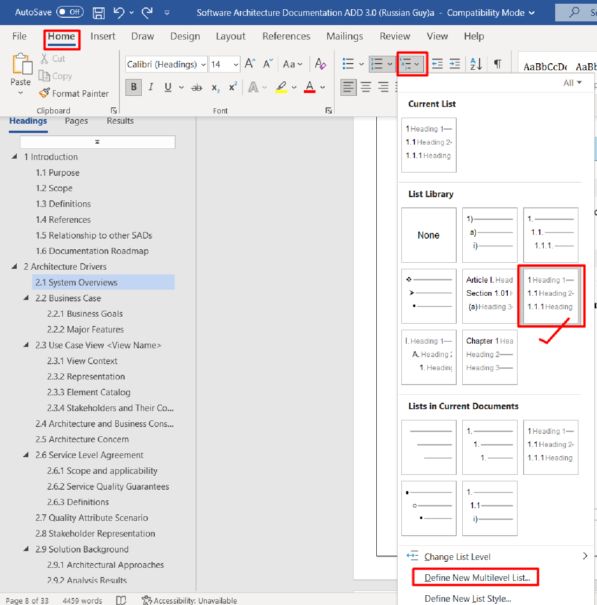
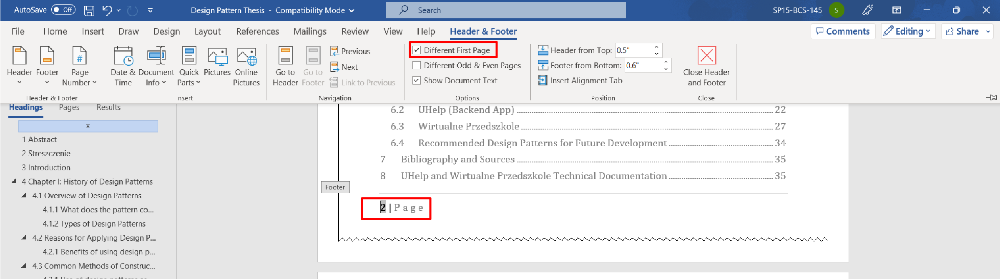

:toc:

:toc-title: AI Tools to increase productivity

== https://beebom.com/best-chatgpt-chrome-extensions/[Best ChatGPT Chrome Extensions (2023)]

=== 1. WebChatGPT

*_https://chrome.google.com/webstore/detail/webchatgpt/lpfemeioodjbpieminkklglpmhlngfcn[Get] WebChatGPT_*

=== 2. ChatGPT for Google

*_https://chrome.google.com/webstore/detail/chatgpt-for-google/jgjaeacdkonaoafenlfkkkmbaopkbilf[Get] ChatGPT for Google_*

=== 3. ChatGPT Writer – Write Mail and Messages with AI

*_https://chrome.google.com/webstore/detail/chatgpt-writer-write-mail/pdnenlnelpdomajfejgapbdpmjkfpjkp[Get] ChatGPT Writer_*

=== 4. Merlin – OpenAI ChatGPT Powered Assistant

*_https://chrome.google.com/webstore/detail/merlin-openai-chatgpt-pow/camppjleccjaphfdbohjdohecfnoikec/related[Get] Merlin – OpenAI ChatGPT powered assistant_*

=== 5. YouTube Summary with ChatGPT

*_https://chrome.google.com/webstore/detail/youtube-summary-with-chat/nmmicjeknamkfloonkhhcjmomieiodli[Get] YouTube Summary with ChatGPT_*

=== 6. tweetGPT

*_https://chrome.google.com/webstore/detail/tweetgpt/lkjblpoingopdeaofcaapmeoojjjnhnc[Get] tweetGPT Chrome Extension_*

=== 7. Summarize

*_https://chrome.google.com/webstore/detail/summarize/lmhkmibdclhibdooglianggbnhcbcjeh[Try] Summarize_*

=== 8. ChatGPT Prompt Genius

*_https://chrome.google.com/webstore/detail/chatgpt-prompt-genius/jjdnakkfjnnbbckhifcfchagnpofjffo/[Try] ChatGPT Prompt Genius_*

=== 9. Promptheus – Converse with ChatGPT

*_https://chrome.google.com/webstore/detail/promptheus-converse-with/eipjdkbchadnamipponehljdnflolfki[Get] Promptheus – Converse with ChatGPT_*

=== 10. Fancy GPT

*_https://chrome.google.com/webstore/detail/fancygpt/meonalmakdjaojaoipfhahcfccoecegk[Try] Fancy GPT_*

=== 11. Merlin GPT

https://chrome.google.com/webstore/detail/merlin-openai-chatgpt-pow/camppjleccjaphfdbohjdohecfnoikec/related?hl=en&gclid=Cj0KCQiAiJSeBhCCARIsAHnAzT_Nt14bs-X7u6j0Kd5DOkiMv50mNq4U1eWRc09WR7Tpzy_jwLtyp-8aAklREALw_wcB[*_Try_*] *_Merlin - OpenAI ChatGPT powered assistant_*

=== 12. Chrome extension GPT

https://chrome.google.com/webstore/detail/chatgpt-chrome-extension/cdjifpfganmhoojfclednjdnnpooaojb/related[*_Try_*] *_Chrome extention GPT_*

=== 13. Promptheus - Converse with ChatGPT

https://chrome.google.com/webstore/detail/promptheus-converse-with/eipjdkbchadnamipponehljdnflolfki/related[*_Try_*] *_Promptheus - Converse with ChatGPT_*

=== 14. [.line-through]#WritingMate - #1 ChatGPT writing assistant#

https://chrome.google.com/webstore/detail/writingmate-1-chatgpt-wri/iihamopomflffiecicbgelncanmfionp/related[*_Try_*] *_WritingMate - #1 ChatGPT writing assistant_*

=== 15. YouChat AI for Google

https://chrome.google.com/webstore/detail/youchat-ai-for-google/fadggkehmhkhahfcdeoghpepnpnhilhg[*_Try_*] *_YouChat AI for Google_*

=== 17. ChatGPT Assistant - Use AI Everywhere

https://chrome.google.com/webstore/detail/deepl-translate-reading-w/cofdbpoegempjloogbagkncekinflcnj/related[*_Try_*] *_DeepL Chrome extension_*

=== 16. Translate faster with DeepL for Windows

https://www.deepl.com/en/app/[*_Try_*] *_DeepL for Windows_*

This app also has a desktop application which is excellent. Works exactly like desktop grammarly.

=== 17. DeepL Translate: Reading & writing translator

https://chrome.google.com/webstore/detail/deepl-translate-reading-w/cofdbpoegempjloogbagkncekinflcnj/related[*_Try_*] *_DeepL Chrome extension_*

=== #18.# Microsoft Word translate audio/video into text service
* *_step one:_* convert the whole audio/video into the text.
* *_step two_*: use Chat-gpt to summarize the text.
* *_step three:_* use [.underline]#_**chat gpt, AntCoc or manual process**_# to apply the *_##OOAD techniques##_*.

1. https://www.youtube.com/watch?v=ZPwp1fIHRv8&list=LL&index=6[Save Word Document as PDF with Bookmarks]
2. https://www.youtube.com/watch?v=W6_EXHUOZ2s&list=LL&index=12&ab_channel=MinhNguyen[How to select and edit all headings at once in Word] and embed colors

3. https://www.google.com/search?q=page+number+in+word&oq=page+num&aqs=chrome.2.69i57j0i512l9.3794j0j7&sourceid=chrome&ie=UTF-8[How to insert page number in word]

4. https://www.youtube.com/watch?v=WbuICoJV9lQ&ab_channel=EverydayDocuments[How to insert Numbered Headings and Subheadings]

** https://www.youtube.com/watch?v=lYvcwGc5FQs&ab_channel=UPLibrary[MS Word: How-to use heading styles and automated numbering]

.How to insert Numbered Headings and Subheadings

. https://www.youtube.com/watch?v=oemfiAUpgNU&ab_channel=Computergaga[*_Automatically Insert your Chapter Headings into your Document Header_*]
.

.Start page numbering later in your document Or from page number two or do not give page number to cover page.

=== 18.1 Behaviour Driven Development (#BDD#) template

1. It is a workshop you carry out with stakeholders
2. Share the link with the stakeholder,
give him a 5-minute explanation of what we are going to do with template and how it works,
before the start of the workshop
3. **__Also, stay connected on the audio call, on Skype, Whatsapp or google-meet, Zoom, Slack, MS Teams etc.__**

https://docs.google.com/document/d/1yBJZUMnXvuQWVgM9HTpH0VHwaUutjbFmHIjZrzKLMVA/edit[*_TRY BDD_*] Google doc link

1. https://cucumber.io/blog/bdd/better-requirements-by-harnessing-the-power-of-exa/[Better requirements by harnessing the power of examples]
2. https://cucumber.io/blog/bdd/bdd-with-event-mapping/[BDD with Event Mapping]

=== 19. AIPRM for ChatGPT

https://chrome.google.com/webstore/detail/aiprm-for-chatgpt/ojnbohmppadfgpejeebfnmnknjdlckgj/related[*_Try_*] *_AIPRM for ChatGPT_*

=== 20. Google Docs are good for asynchronous calloboratoin, especially with non-technical users

https://docs.google.com/document/d/1uChoFlgzOFVdm4nEaaSuVZbj9vxC1SOFQG72HQhZO-s/edit[*_Try_*] *_Google Docs_*

** it is good, but do documentation in IDE with markdown, ascidoc, git, latex, plantuml, draw.io. Why? because it is best with these tools, it improves the productivity lot.

=== 21. CopyLeaks

https://copyleaks.com/features/ai-content-detector[*_Try_*] *_Copy Leaks AI content detector_*

=== 22. AI Content Detector

https://writer.com/ai-content-detector/[*_Try_*] *_Copy Leaks AI Content Detector_*

=== 23. Jasper-AI same like chatgpt open ai

https://www.jasper.ai/[*_Try_*] *_Copy Leaks AI Content Detector_*

=== 24. ChatGPT Writer - Write mail, messages with AI

https://chrome.google.com/webstore/detail/chatgpt-writer-write-mail/pdnenlnelpdomajfejgapbdpmjkfpjkp/related[*_Try_*] *_ChatGPT Writer - Write mail, messages with AI_*

=== 25. QuillBot for Chrome (like grammarly)

https://chrome.google.com/webstore/detail/quillbot-for-chrome/iidnbdjijdkbmajdffnidomddglmieko/related?hl:%20en-US&utm_source=quillbot.com&utm_medium=referral&utm_campaign=side_navbar-link[*_TRY_*] *_QuillBot for Chrome_*

=== 26 Chat GPT - Pass Detection 100% Human Written With This Prompt

+++
<iframe width="560" height="315" src="https://www.youtube.com/embed/Xgc-d7SO4OQ" title="YouTube video player" frameborder="0" allow="accelerometer; autoplay; clipboard-write; encrypted-media; gyroscope; picture-in-picture; web-share" allowfullscreen></iframe>
+++

[.underline]#*_Write AI-Detector-free content with the help of Chat-GPT_*#
#Given below is starter prompt#

1. I want you to rewrite a few sentences for me in the human voice. Do you understand?

2. When it comes to writing content, two factors are crucial, *"perplexity" and "burstiness."* Perplexity measures the complexity of text. Separately, compares the variations of sentences.  Humans tend to write with greater burstiness, for example, with some longer or complex sentences alongside shorter ones. Al sentences tend to be more uniform. Therefore, when writing the following content I am going to ask you to create, I need it to have a good amount of perplexity and burstiness. Do you understand?

3. *Prompt:* using the concepts written previously, rewrite #[this article]# with a high degree of *"perplexity and burstiness."*
						OR
4. *Prompt:* Using the concepts written previously, rewrite #[the sentences]# given below with a high degree of *"perplexity and burstiness."*

5. *Sentences:* [#Write your sentences or paragraph here.#]

=== 27 Bito AI - Use #ChatGPT# to write code, fix bugs, create test cases
* this extension is for:
** IntelliJ IDEA
** https://chrome.google.com/webstore/detail/bito-ai-use-chatgpt-to-10/afchmofckbnlkpnjkdikdkgnjelhlbkg/related?hl=en[Chrome]

=== 28 Notion AI

* https://youtu.be/HwFocSWDgs0[How to Use Notion AI with Examples]
* https://www.notion.so/Getting-Started-73269958f12b4ddc8971d2c3fef2ad07
** I've used gmail account login

== https://beebom.com/best-chatgpt-alternatives/[8 Best ChatGPT Alternatives (Free and Paid)]

Estimating project cost and time can be challenging, especially if you're new to freelancing. Here are some general tips that may help:

[arabic]
. Break down the project into smaller tasks: Before estimating the cost and time, try to break down the project into smaller, more manageable tasks. This will help you get a better idea of the amount of work required for each task.
. Estimate the time required for each task: Once you have broken down the project into smaller tasks, estimate the time required for each task. Be realistic and take into account any potential roadblocks or challenges you may face.
. Determine your hourly rate: To estimate the cost, you need to determine your hourly rate. Consider your level of experience, the complexity of the project, and the market rate for similar projects when setting your rate.
. Calculate the cost for each task: Once you know your hourly rate and the estimated time required for each task, you can calculate the cost for each task by multiplying the hourly rate by the estimated time.
. Add up the costs for all tasks: After calculating the cost for each task, add them up to get the total cost of the project.
. Include a buffer: It's always a good idea to include a buffer in your estimate to account for unexpected delays or revisions. This buffer can be a percentage of the total project cost, depending on the size and complexity of the project.
. Communicate your estimate clearly: When presenting your estimate to your clients, make sure to communicate it clearly and in writing. Include a breakdown of the costs for each task and the estimated timeline for the project.

Remember that estimating project cost and time is not an exact science, and it's normal to revise your estimate as the project progresses. Be transparent with your clients and communicate any changes or delays as soon as possible.

====
If a client insists for the cost and time,
without providing a project scope,
then tell them that I have completed the project ranging 500$ to 40000$ in this category lasting for 10-day to 3-months.
====