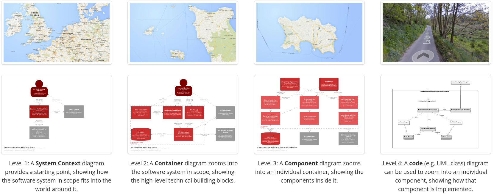

= We need to shift our thinking away from [underline]#"diagrams"#, and towards [underline]#"views of a model"#. That's the essence of "diagrams as code 2.0"

* https://dev.to/simonbrown/diagrams-as-code-2-0-82k[*Diagrams as code 2.0*]

* https://www.codecentric.de/wissens-hub/blog/architecture-documentation-docs-as-code-structurizr-asciidoctor[*Architecture docs as code with Structurizr &amp; Asciidoctor. Part 1: Workflow and tooling*]

* https://dev.to/simonbrown/software-architecture-isn-t-about-big-design-up-front-4hol[*Software architecture isn't about big design up front*]
* https://c4model.com/#DeploymentDiagram[*The C4 model for visualising software architecture*]

== Modelling vs Diagramming

Now that we've covered the different types of C4 diagrams, there is one more important concept to cover - *modeling vs diagrams.*

*Modeling* is the act of describing your system. We can describe the actors, systems, containers, components and their relationships. _*But modeling can be viewed as the data without the presentation.*_ Modeling does not determine, how we will depict this data.

*Diagramming* is essentially *drawing pictures* to visually represent our model.

This distinction becomes powerful when we can *create a single model* and reuse different elements of it in different diagrams. This allows us to apply the DRY principle to our diagrams.

.4+1 View Model
image:/home/mehmood/IdeaProjects/Documentation-as-Code-DaC/docs/uml/diagram-as-code-2-0/images/img.png[]

You've highlighted an important distinction between modeling and diagramming in the context of C4 diagrams. Modeling involves creating a structured representation of your system, describing its components, relationships, and other relevant details. *It's essentially about defining the underlying data and structure of your system.*

On the other hand, *diagramming* is the process of visually representing the *model* you've created through *drawings or diagrams.* It's about presenting the information in a graphical format that's easier for people to understand. Diagrams serve as a visual tool to communicate the details of the model effectively.

.4+1 View Model
image:/home/mehmood/IdeaProjects/Documentation-as-Code-DaC/docs/uml/diagram-as-code-2-0/images/img_1.png[]

The advantage of this separation is that you can create a single comprehensive model and then generate different diagrams from it to *suit various purposes.* This promotes the "Don't Repeat Yourself" (DRY) principle, where you avoid duplicating information and ensure consistency across your diagrams. It also allows for easier maintenance and updates since changes to the model can propagate to all associated diagrams.

In summary, *modeling* is about *defining the system's structure and data,* while *diagramming is about visually representing that model.* Combining both approaches helps in creating clear, consistent, and reusable system documentation.

For any given software system, you create a *System Context diagram* that describes how the system fits into the world around it. You then zoom in to the system boundary to show the *containers* inside it *- not Docker;* a container is a *_deployable, runnable thing, like a single-page application running in a web browser, a server-side web application, a microservice, a database schema, etc._* These top two levels are often sufficient for many teams. If useful though, you can then zoom further into a container to show the *components* inside it. Finally, and again optionally, you can zoom into each component to show the *code level* elements (classes, interfaces, functions, objects, etc) it's composed of. *_The C4 model is notation independent, and although I tend to use a simple "boxes and lines" notation, you can certainly use UML or ArchiMate._*

.C4 Model resemblence with other models or concepts
image:/home/mehmood/IdeaProjects/Documentation-as-Code-DaC/docs/uml/diagram-as-code-2-0/images/C4-model.drawio.png[]

.C4 Model Overview with the zooming
image:/home/mehmood/IdeaProjects/Documentation-as-Code-DaC/docs/uml/diagram-as-code-2-0/images/c4-overview.png[]

== Maps of your code

The C4 model was created as a way to help software development teams describe and communicate software architecture, both during up-front design sessions and when retrospectively documenting an existing codebase. It's a way to create maps of your code, at various levels of detail, in the same way you would use something like Google Maps to zoom in and out of an area you are interested in.

The C4 model is an *"abstraction-first"* approach to diagramming software architecture, based upon abstractions that reflect how software architects and developers think about and build software. The small set of abstractions and diagram types makes the C4 model easy to learn and use. Please note that you don't need to use all 4 levels of diagram; only those that add value - the System Context and Container diagrams are sufficient for many software development teams.

=== Abstractions
In order to create these maps of your code, we first need a common set of abstractions to create a ubiquitous language that we can use to describe the static structure of a software system. A software system is made up of one or more containers (applications and data stores), each of which contains one or more components, which in turn are implemented by one or more code elements (classes, interfaces, objects, functions, etc). And people may use the software systems that we build.

== A minimal approach to software architecture documentation

=== The code is the truth, but not the whole truth

As *Grady Booch* will tell you though, "the code is the truth, but not the whole truth". Although we should definitely strive for highly modular code, and naming that expresses intent rather than relying on comments, the code doesn't tell you things like:

* What is the context of the thing we're building?
* Who are the people using the project/product?
* What interfaces does it have with other software systems, inside and outside of the organization we work for?
* Where is the software system deployed?
* How do we support it?
* What were the drivers that led the team to building the software system in the way they did?
* What led to the early decisions being changed? etc.

=== Describe what you can't get from the code

With this in mind, and remembering that time is precious, here's my suggestion for a minimal set of software architecture documentation.

* A System Context diagram
* A Container diagram
* One or more Deployment diagrams
* Some lightweight Markdown/AsciiDoc documentation (e.g. software guidebook, or arc42)
Architecture decision records (ADRs)

Consider this a starting point, and it should ideally be stored alongside the source code. If you need a few code level diagrams to document parts of your codebase, feel free to add some UML Class or Sequence diagrams. If you need to document business processes, then add some UML Activity diagrams, or perhaps take a look at ArchiMate. Ditto wireframes, entity relationship models, domain models, state charts, API definitions, etc.